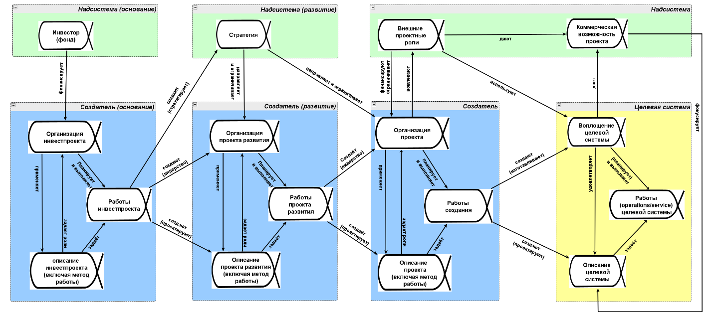
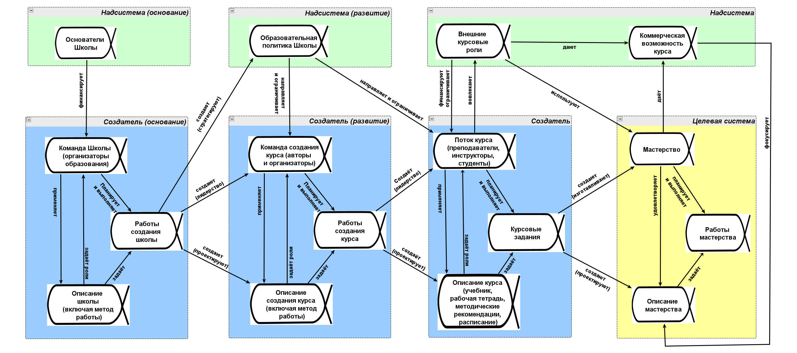
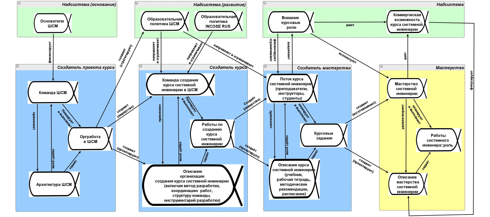

Понимание системной инженерии можно разбить на три основных уровня
прикладности/специализации/конкретизации (не путать с системными
уровнями), каждый из которых можно далее разбивать на подуровни.

**1.** **Уровень специализации безмасштабной** **системной**
**инженерии**

Этому уровню и посвящён наш курс. Он приложим ко всем масштабам
системноинженерного стека и описывает многоуровневую работу системного
инженера. Если вы хотите проложить трамвайный маршрут по городу, вам
придётся как инженеру учитывать и общественное мнение, и особенности
городского планирования и налаживания пассажиропотока, и особенности
электротранспорта и его технической инфраструктуры, и особенности
вагонного парка, включая отслеживание трендов по беспилотному транспорту
(включая особенности беспилотности рельсового транспорта, который не
может «уклониться» от внезапно появившегося сбоку препятствия). Это
типичная задача системного инженера (это роль, исполняется человеком или
организацией из многих людей), который будет работать с самыми разными
прикладными инженерами (роль, будет исполняться человеком или
организацией из многих людей) для этих самых разных предметных областей.
Системный инженер будет выстраивать проектную коммуникацию для
согласований по всем этим вопросам.

На этом уровне вы будете отслеживать объекты внимания в проекте на
основе обобщённой схемы альф инженерного проекта из OMG Essence так, как
она показана в курсе методологии. Именно так в общем случае и
организована деятельность по изменению мира, с учётом довольно длинных
цепочек (на самом деле, конечно, графов, а не линейных цепочек)
создания:

Система тут --- просто «целевая система», без особой конкретизации,
описание системы (включая «метод её работы», описание практики
функционирования, хотя об этом довольно трудно говорить для «неживых»
или «социальных» систем, но довольно просто для личностей и
организаций), а описание проекта включает метод работы организации
проекта. Даже такое общее представление о проекте изменения мира к
лучшему позволяет точнее планировать (включая и agile «планирование на
лету») и вести многомасштабный инженерный проект. Многомасштабный ---
это признание того факта, что вам не удастся охватить своим проектом
улучшение мира на многих масштабах, и придётся ограничиться несколькими
масштабами из всех эволюционных. Но не одним!

Ещё эту диаграмму лучше бы считать

-   или диаграммой общего жизненного цикла, надолго застревающей на
    состоянии воплощения системы «80% сделано» (и каждый день там будет
    что-то доделываться новое и что-то удаляться из уже не нужного, а
    ещё рекомендуемый норматив времени на работу с так называемым
    «техническим
    долгом»^[<https://en.wikipedia.org/wiki/Technical_debt>] ---
    20%, так что в любой момент времени оказывается, что готово только
    80%, а ещё 20% нужно «отдать должок»). В жизни часто всё ещё менее
    однократно: представьте себе, что вы готовите круглосуточный
    шведский стол в курортном пансионате (не только подачу в этом
    стиле^[<https://www.hospitality-school.com/buffet-meaning-table-setting/>],
    но вместе с работой кухни, «под ключ». Ни в один момент времени вы
    не можете сказать, что закончили работу: что-то подъели, и нужно
    приготовить дополнительную порцию, что-то наоборот, испортилось
    несъеденное, и нужно убрать. А ещё нужно планировать сезонную смену
    меню, отвечать на жалобы тех, у кого болит живот (ни у кого не
    болит, а вот у этого одного заболел!) и кто нашёл жучка в тарелке
    (никто не нашёл, а вот этот один нашёл!) и следить, чтобы не уносили
    слишком много еды с собой. Это явно не описывается движением кейса
    «шведский стол» к приёмке-сдаче системы. Закрытие кейса --- это
    будет как раз неуспех! Трудно представить, но операционная система
    Windows это примерно такой же «шведский стол». И к этой модели
    стремится огромное число других систем. Даже если вы делаете
    революцию в обществе, это тоже будет только «открыть двери накрытого
    шведского стола», а потом этот кейс нельзя будет считать закрытым,
    закрыть после этого двери --- это неуспех проекта, аварийная
    ситуация.
-   или диаграммой, описывающей кейс одной фичи, на каждом звене цепочки
    создания. Это много ближе к современному прочтению такой диаграммы.
    Кто-то что-то захотел изменить в системе, описал это, воплотил в
    жизнь, ввёл в эксплуатацию. Продолжаем и продолжаем. То есть в
    случае шведского стола это «давайте заменим крем в эклерах, будет и
    вкуснее, и дешевле, и готовить его быстрее». Lead time тут будет от
    появления этой идеи до момента, когда первый клиент откусит эклер с
    новым кремом, только в этот момент «ввели новую фичу в
    эксплуатацию».

Мы ещё много раз вернёмся к этой идее шведского стола как современной
метафоре разработки. Уровень специализации безмасштабной системной
инженерии как раз и нужен для того, чтобы вы понимали одинаковость
инженерии шведского стола, инженерии ракет, инженерии корпоративного
софта, генной инженерии, инженерии сообществ. Вот это всё нужно сделать,
пополнить, проследить, чтобы не было просрочено, что-то доохладить,
что-то держать горячим, а ещё нужно сделать так, чтобы всем желающим
хватило, чтобы не нужно было долго ждать, и затем ещё быстро убрать
объедки, не забывая при этом про улучшение раскладки и найм персонала.
Это и есть современная инженерия, нацеленная на непрерывный ввод в
эксплуатацию, continuous delivery:

**2.** **Уровень специализации инженерии** **систем одного системного
уровня.**

В многомасштабном проекте, тем не менее, на каждом системном уровне
нужно каким-то образом вести свой локальный проект создания успешной
системы, использующий практики системной инженерии с их особенностями
для объектов данного уровня. Воплощение системы оказывается или
веществом, или киберфизической системой (или её частью, например,
компьютерным софтом), или личностью (или её частью, например,
мастерством), или организованной группой людей (организацией или её
частью, например, департаментом), и так далее.

Безмасштабная и непрерывная системная инженерия при этом уточняется и по
факту становится **прикладной (к определённому масштабу систем, но
всё-таки непрерывной) инженерией**. Так, классическая системная
инженерия --- это (прикладная) инженерия киберфизических систем,
развивавшаяся главным образом на примере информационных систем
(компьютеры и операционные системы), аэрокосмических систем (гражданская
и военная авиация и ракетная техника) и других транспортных систем
(автомобили, поезда, военный транспорт). Или программная/software
инженерия, занимающаяся информационными системами как компьютерными
программами (без включения аппаратуры в программно-аппаратном
комплексе). Или инженерия предприятия, часто понимаемая как менеджмент
(с операционным менеджментом как эксплуатационной инженерией).

Все эти отдельные виды (прикладной) инженерии имеют свою специфику, свои
учебные курсы, но все следуют одному и тому же образцу/нормативу
инженерного действия, взятому из безмасштабной системной инженерии. Хотя
исторически было ровно наоборот: это безмасштабная системная инженерия
была сформулирована главным образом на базе инженерии киберфизических
систем, когда пришлось включать в эту инженерию людей, заниматься
системноинженерным менеджментом и поэтому формулировать инженерную
практику в наиболее общем виде. Но потом эти общие безмасштабные идеи из
*системной инженерии/systems* *engineering* пошли в самые разные
прикладные *инженерии систем/engineering* *of* *systems*.

Скажем, если взять целевой системой мастерство как часть личности, то
можно представить себе модификацию системной схемы проекта для проекта
учебного курса:

В этой схеме уже не абстрактное «воплощение системы», а
конкретизированное «мастерство», не абстрактная «организация проекта», а
«поток курса», не просто «описание, включающее метод работы в проекте»,
а «описание курса, включающее методические рекомендации».

Этот проект создания мастерства может быть как частью какого-то
многомасштабного проекта (например, вы хотите в проекте создания
предприятия как проекте создания системы уровня организации научить
людей работать по-новому, то есть внести в головы людей какое-то
мастерство работы на новом типе станков или новым программным
обеспечением, то есть хотите предпринять проект создания системы уровня
части личности сотрудника). Системный инженер должен провести
безмасштабное рассуждение, чтобы увязать эти проекты разных уровней.
Понятно, что человек в роли такого системного инженера будет рассуждать
на языке системной инженерии, общем для всех проектов создания чего бы
то ни было.

Опять же, схема должна рассматриваться двумя путями:

-   Создание целевого мастерства как чего-то конечного (при полном
    понимании, что конечным оно никогда не будет, всё время надо будет
    чему-то доучиваться, что-то переучивать, а что-то срочно забывать
    как «уже не SoTA»). В этой модели «готового мастерства» не бывает,
    но оно вполне себе может одновременно и разрабатываться (пишутся
    новые материалы курса), и изготовляться (будет идти обучение), и
    эксплуатироваться (обученный мастер будет вести работы).
-   Создание одного конкретного умения в рамках полного мастерства,
    одной «фичи» мастерства. Придумали чему-то конкретному научить --- и
    научили, «ввели кусочек мастерства в эксплуатацию». И это введение в
    эксплуатацию разных новых и новых фич будет происходить долго-долго
    в ходе проекта, «непрерывный ввод в эксплуатацию».

Проект создания мастерства должен предусмотреть и более-менее автономное
рассмотрение системы целевого уровня (а часто и не только целевого). И
тут окажется, что для такого сорта систем как мастерство, даже если
принять «инженерный подход к делу», а не «педагогический» или
какой-нибудь менее определённый «культурных изменений» или чего-то более
размытого в плане указания на цели и способы работы, есть много
особенностей. Чтобы научиться такой «инженерии уровня личности», нужно
освоить какую-то довольно специфическую практику инженерии (инженерия
мастерства, которая даже называться будет «обучение», а не «инженерия»).
Обучение, в свою очередь, как метод изготовления мастерства, будет
разбито на множество разных практик. Это практики культуртрегерства как
создание концепции использования мастерства в его «личностном окружении»
(начало разработки --- старт проекта, культуртрегер тут как
product-manager), методологии и методики как разработки мастерства,
преподавания как DevOps (изготовление и проверка частей, сборка из
частей и проверка целого, введение в эксплуатацию --- вынос в жизнь),
мастерского выполнения деятельности как эксплуатация мастерства. И это
не разовое прохождение жизненного цикла: нужно ещё и обновлять
мастерство в уже выученных мастерах, как сейчас обновляют прошивки
телефонов в давно изготовленных телефонах.

Эта адаптация методов системной инженерии для самых разных её приложений
происходит для всех масштабов систем, всех видов систем одного масштаба.
Концепция использования, а также use cases к театральной постановке,
ледоколу, парламенту будут обязательно нужны (и это говорится в
системной инженерии, мы особо отметим это в нашем курсе), но они и
называться будут все по-разному, и разрабатываться по-разному (и это
будет говориться в прикладных «инженерных» курсах. Слово «инженерный»
тут в кавычках, чтобы напомнить: не все эти инженеры будут соглашаться
на то, что они будут называться именно «инженерами». Но мы будем их
называть именно так).

По каждой такой конкретизации/адаптации, в каждом приложении системной
инженерии к какому-то виду целевых систем нужно владеть прикладной
практикой инженерии, часто называемой «инженерия таких-то систем» в
случае уровней косного вещества и киберфизических систем (например,
инженерия систем управления, control systems engineering, и помним, что
systems engineering отличается от engineering of
systems^[If there is an issue between SE and EoS, it may
be semantic, rather than grammatical. Classically, the first word
moderates the second: so, in SE, \'systems\' appears to moderate
(describe the type or flavour of) engineering; and in EoS,
\'engineering\' appears to moderate (describe the type and flavour of)
systems. --- из prof. Dereck Hitchins, «SYSTEMS ENGINEERING VS.
ENGINEERING OF SYSTEMS - SEMANTICS?»,
<https://systems.hitchins.net/profs-blog/systems-engineering-vs.html>])
и уж совсем по-разному в случае более высоких системных уровней.
Например, курс по инженерии мастерства (с неминуемым охватом не только
ведения учебного процесса как создания мастерства, но и создания
учебного курса со всеми его материалами как системы в цепочке создания
мастерства) является именно конкретизацией/адаптацией курса системной
инженерии. Пример такой конкретизации для курса инженерии нового
мастерства как части общего мастерства уже образованных людей доступен в
Школе системного менеджмента под названием «Образование для
образованных». Конечно, эта конкретизация тоже не «законченный продукт»,
курс постоянно обновляется, «непрерывная инженерия».

**3.** **Уровень специализации инженерии** **конкретной системы**

Даже при том, что безмасштабная и непрерывная системная инженерия
конкретизируется для какой-то прикладной инженерии систем определённого
масштаба и вида (авиация, образование, медицина, фермерство,
госполитика), для каждого конкретного проекта будет ещё одно уточнение
для того конкретного типа системы, который будет создаваться и затем
развиваться в единичном экземпляре или выпускаться серийно (включая
особенности разных провайдеров сервиса). Так, легко представить себе,
что конкретизации инженерии мастерства для мастерства системного
фитнеса, мастерства игры на фортепиано, мастерства решать
дифференциальные уравнения при помощи программ компьютерной алгебры и
численных методов, мастерства безмасштабной системной инженерии
(кругозорный курс по которой вы сейчас проходите) будут совсем разными
для конкретных учебных проектов.

Скажем, игра на фортепиано --- это мышечная практика и по факту она
может быть надстроена над мастерством системного фитнеса, но не
только --- в это мастерство входит как минимум ритмика, которой нет в
системном фитнесе и можно ещё обсуждать промежуточную практику
музицирования, которая неразличима для вокала, игры на фортепиано и игры
на скрипке, и учёт всех этих особенностей даст совсем разные практики
игры на фортепиано, которые по-разному могут преподаваться в музыкальных
школах, но неизбежно приведут к более-менее похожим результатам. Помним
про неустроенности и эволюцию: есть множество выживающих почти
одинаковых вариантов оптимизаций для межуровневых конфликтов, а резкие
улучшения довольно редки. Это означает, что есть множество самых разных
вариантов «инженерии музыки на инструментальной базе фортепиано», они
дают все примерно одни и те же результаты, плохие варианты рыночно
вымрут, а улучшения будут, но крайне редки. Скажем, улучшение типа игры
на клавишном синтезаторе, или магнитофон, а затем и плеер, который
позволяет не играть пьесу каждый раз, а просто воспроизводить
записанное. Эволюция практик происходит постоянно, а практики --- это и
есть деятельности/виды труда, и они же --- виды инженерии. И если
какая-то команда занялась инженерией такого вида систем, то она будет
заниматься этим видом систем непрерывно, подстраивая варианты целевой
системы под изменения окружения и используя всё новые появляющиеся
альтернативы по концепции системы как способы реализации функций
какими-то интересными новыми конструктивными элементами.

На этом уровне специализации инженерии конкретной системы можно
использовать или общую схему проекта и альфы с их подальфами,
адаптированную для уровня метаУ-модели (предметная область какой-то
инженерии «как в учебнике») с предыдущего уровня, или всё-таки
конкретизировать эту общую схему проекта для создания конкретного вида
киберфизической системы (авиалайнера конкретной модели или игрушечного
самолёта определённой модели), создания конкретного предприятия
(конкретного стартапа на пять человек или конкретного агропромышленного
холдинга), создания конкретного мастерства у конкретных людей
(мастерства игры на фортепиано или мастерства безмасштабной системной
инженерии, и ещё тут разница --- на уровне хобби/кругозора, или
профессиональном уровне). Все эти уточнения потребуют адаптации
системной схемы проекта, использования самых разных практик работы в
рамках одного конкретного метода создания конкретной целевой системы.

Скажем, для создания текущего курса «Системная инженерия» можно
использовать конкретизированную схему «образовательного
проекта»::«проекта создания»/«инженерного проекта» (и тут даже приведены
названия конкретных организаций, которые связаны с проектом, ШСМ и
INCOSE RUS, при этом в области интересов надсистемы/окружения могут
находиться альфы, как-то связанные с разными системами в окружении,
например альфы и связанные с ШСМ, и связанные с INCOSE RUS):

Эта схема также может читаться двумя способами:

-   создание и непрерывное ведение курса (иногда такое называют «вечная
    бета») в целом, со всеми его версиями
-   создание и введение в эксплуатацию какого-то одного **инкремента**
    курса в порядке его развития. Тогда при желании можно выполнить ещё
    такт адаптации, дав название этому инкременту. Помним, что диаграммы
    в части их модификации --- это зло, поэтому такие схемы в жизни
    будут существовать в табличном виде, и каждый инкремент легко может
    получить своё название. С диаграммами такое не пройдёт, если вы
    выпускаете по паре инкрементов в день, просто сил на перерисовку не
    хватит!

Если вы будете создавать «систему найма сотрудников»::«проект
оргразвития», то это третий уровень конкретизации, конкретный проект в
организации, ситуационная мета-модель уровня стандарта предприятия и
модель конкретной проектной ситуации с учётом экземпляров (операционным
учётом). На втором уровне конкретизации (культурная мета-модель) это
будет предметная область на каком-то достаточно абстрактном уровне
учебников менеджмента как прикладной дисциплины инженерии предприятия,
то есть «проект оргразвития»::«проект создания»/«инженерный проект». А
сам «проект создания»/«инженерный проект» --- это самый общий уровень,
наименее конкретный, безмасштабный/фундаментальный, то есть создание
чего угодно, уровень рассмотрения нашего курса системной инженерии,
уровень мета-мета-модели. И не путайте системные уровни (отношение
часть-целое) и уровни абстракции (отношение принадлежности к классу,
конкретизация как противоположная направленность абстрагирования как раз
тут).

Такой подход многоуровневой конкретизации инженерного метода решает и
традиционные проблемы классического подхода к инженерии как отдельной от
менеджмента. В классической системной инженерии как инженерии сложных
киберфизических систем обычно вынуждены описывать менеджмент проектов
создания самолётов и подводных лодок как «системноинженерный
менеджмент». Если понимать, что речь идёт об инженерии организации,
которая будет заниматься созданием киберфизической системы, то это
просто описание двух инженерных проектов в цепочке создания: создание
киберфизической системы (самолёта или подводной лодки --- концепция
использования, use cases для них, архитектурные решения, и т.д.) и
создания организации проекта (стратегия этой организации как концепция
использования и use cases
организации/команде/коллективу/предприятия/«производственной кооперации»
проекта, решения по концепции системы, архитектурные решения для
предприятия как архитектурные решения по организации проекта, и т.д.).
Эти проекты существенно связаны в части архитектуры целевой системы и
организации (через закон Конвея и обратный манёвр Конвея), и эту связь
реализуют архитекторы. Архитекторы целевой системы и организации
согласуют их архитектуры и меняют их по мере развития целевой системы.

А чему учить тогда системных инженеров, например, классических
киберфизических систем? Учить нужно так же многоуровнево:

-   общей безмасштабной и непрерывной системной инженерии, это и есть
    предмет нашего курса.
-   затем инженерии киберфизических систем (кругозорный уровень
    предметной области для какого-то эволюционного уровня),
-   затем конкретизации этой инженерии для самолётов (конкретная
    предметная область, и это будет весьма разная инженерия для
    одномоторного одноместного самолёта и авиалайнера на три сотни
    пассажиров --- domain), и доводят это до узкой практики, которая
    используется в конкретном проекте (и тут говорят про ограниченную
    предметную область, workflow/practice как bounded domain).
-   и обязательно менеджменту, то есть организационной инженерии с
    конкретизацией для инженерных организаций в авиации.

При этом есть всегда надежда, что при знании общего подхода к инженерии
(например, хорошего понимания дисциплины безмасштабной системной
инженерии) обучение каким-то особенностям для какого-то класса систем не
только займёт меньше времени, но и пригодится, когда будут происходить
события техноэволюции. А они будут происходить! Скажем, когда самолёты
вдруг будут заменяться или электросамолётами для ближних рейсов, или
многоразовыми ракетами для дальних рейсов: основное знание «как создать
киберфизическую систему» останется, но придётся поменять представления о
том, что там нужно будет делать конкретно для изменившегося вида систем.
А когда пойдут организационные изменения (а они обязательно будут!), то
у инженера-авиастроителя будет понимание происходящего, хотя бы в общих
чертах.
