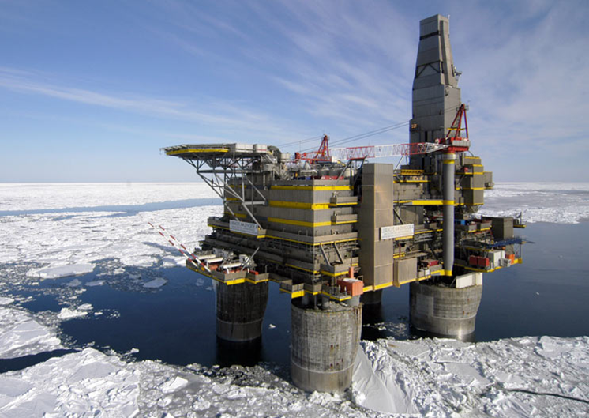

Ответственность за всю систему на многих уровнях как целое (whole
system) и связанная c этим
фундаментальность/трансдисциплинарность/transdisciplinarity подхода к
другим инженериям (механической, электрической, программной, предприятия
и т.д.) отличают системную инженерию от всех её
частных/предметных/domain конкретизаций. Представим себе ледовую буровую
платформу:

Сотни тысяч тонн металла, бетона, пластмассы, компьютеров (самих по себе
сложно устроенных) и оптоволокна, необходимых расходных материалов,
обученная вахта должны собраться вместе далеко в море среди льда. В
строго определённый момент эта огромная конструкция должна начать
согласованно работать --- и не просто работать, а приносить прибыль и
обеспечивать безопасность в части загрязнения окружающей среды и
здоровья находящейся на платформе вахты, а также в чётком согласовании
со службами берегового обеспечения (нефтепереработка, провайдеры связи,
метеорологические службы, государственные надзоры по самым разным линиям
и т.д.).

Какая инженерная/деятельностная/практическая/трудовая дисциплина должна
учесть результаты работ всех других инженерных дисциплин, работающих на
самых разных системных уровнях --- собрать в единое целое данные ледовой
обстановки, санитарных норм в помещениях для обслуживающего персонала,
обеспечение электричеством попавших туда компьютерных серверов,
необходимые характеристики этих серверов и программное обеспечение с
нужными функциями и нужной надёжностью? Кто озаботится учётом в
конструкции платформы изменений в длине металлоконструкций за счёт
разницы суточных температур и одновременно установкой акустических
датчиков на трубах, которые прослушивают шорох песка, чтобы по этому
шороху нейросетевые алгоритмы определяли износ труб и предлагали редкий
и нужный «ремонт по состоянию» вместо относительно частого и
бесполезного «планового/профилактического ремонта»?

Системная инженерия как раз и является той дисциплиной, которая
ответственна за обеспечение целостности в инженерном проекте: именно
системные инженеры в их разных ролях проектируют нефтяную платформу как
изменяющее мир к лучшему или хотя бы просто успешное (безопасное,
надёжное, прибыльное, ремонтопригодное и т.д. --- разным внешним
проектным ролям нужно от этой платформы разное) целое, потом раздают
части работы «прикладным инженерам»/«инженерам по специальностям»
(инженерам-строителям, машиностроителям, инженерам-электрикам,
компьютерщикам/айтишникам и т.д.), а затем собирают результаты их работ
так, чтобы получить работоспособную и надёжную систему. Агенты,
исполняющие роли прикладных инженеров самых разных специализаций по
факту владеют на каком-то (кругозорном) уровне и системной инженерией,
чтобы понимать происходящее в проекте как в части его целевой системы,
так и в части организации проектной работы.

Это главный признак, отличающий **системных** инженеров «по роли» от
всех других **прикладных** инженеров: они отвечают за целевую систему в
целом, как в части деталей-частей (разные системные уровни требуют
разных практик для работы с типовыми для них системами --- с
микросхемами работают не так, как с компьютерами, а с компьютерами не
так, как с системами управления, в состав которых входят компьютеры),
так и в части использования детальных знаний отдельных инженерных
практик (разные свойства систем какого-то типа требуют знания разных
практик: если вам нужно сделать корпус компьютера, то нужны и знания
инженера-механика, чтобы корпус был прочным и лёгким, и знания
инженера-теплотехника, чтобы компьютер не перегревался и корпус
обеспечивал достаточную вентиляцию). Главная задача системного
инженера --- чтобы не было пропущено какой-нибудь мелочи, ведущей к
провалу.

Авиалайнер --- это много-много кусков металла и пластика, синхронно
летящих вместе с людскими телами и чемоданами на скорости 900км/час
(0.85 от скорости звука, это типовая скорость Boeing 787 Dreamliner) на
высоте 11км. Системный инженер в его прикладной специализации
«авиационный системный инженер» --- это тот::роль, кто придумал, как
обеспечить их надёжный и экономичный совместный полёт, увязав самые
разные интересы самых разных ролей (грузоподъёмность, расход топлива,
дальность полёта, шум при взлёте и посадке, ограничения по длине разбега
и посадки, необходимость лёгкого обслуживания на земле, отсутствие
обледенения, безопасность людей на борту, и т.д. и т.п.), при этом эти
интересы отстаивались самыми разными исполнителями внешних проектных
ролей, представлявшими самые разные профессиональные и общественные
группы исполнителей тех или иных практик (экологи, военные, урбанисты,
коммерсанты, и т.д., и т.п.). Для авиалайнера примерно шесть миллионов
деталей замысливаются, проектируются, именуются, изготавливаются,
проверяются, доставляются в одно место, собираются в одно изделие,
принимаются как целый авиалайнер и продаются, в аэропорту эти собранные
детали как одно целое обслуживаются, заправляются топливом и едой,
заполняются пассажирами и грузом, диспетчируются на взлёт --- и вот эти
шесть миллионов деталей летят, обеспечивая комфорт пассажирам и прибыль
владельцам.

Но это даже не вся история: авиазавод тоже делает и дальше развивает
системный инженер! Элон Маск не боится компаний, которые делают
прототипы электромобилей. Даже для ракет создать серийное производство
ракет вдесятеро трудней, чем создать саму ракету. Для автомобилей
создать производство автомобилей в сто раз трудней, чем создать
автомобиль^[\"It\'s relatively easy to make a prototype
but extremely difficult to mass manufacture a vehicle reliably at scale.
Even for rocket science, it\'s probably a factor of 10 harder to design
a manufacturing system for a rocket than to design the rocket. For cars
it\'s maybe 100 times harder to design the manufacturing system than the
car itself. The issue is not about coming up with a car design --- it\'s
absolutely about the production system,\" Musk said. \"You want to have
a good product to build, but that\'s basically the easy part. The
factory is the hard part.\" ---
<https://www.businessinsider.com/elon-musk-says-building-factory-100-times-harder-than-making-car-2019-3>].
Это тоже делают (системные) инженеры::роль. Для любого производства
киберфизической системы нужно учесть потребности внешних проектных
ролей, разработать концепцию использования и концепцию системы, принять
архитектурные решения, создать информационную модель с детальностью,
достаточной для изготовления, далее выполнить все закупки комплектующих,
построить завод, запустить/наладить его оборудование, нанять и обучить
людей, потом управлять тем, чтобы этот завод работал «как машина»
(несмотря на то, что работают на нём не только машины, но и люди). Это
всё требует многоуровневого (системного) учёта мельчайших деталей нижних
уровней.

Если где на конвейере завода неудачно выпадет винтик из-за того, что
что-то там было плохо спроектировано, потом плохо смонтировано, поломка
плохо диагностирована, может неожиданно остановиться весь завод. Ну, или
работники завода могут забывать вести учёт изменений оборудования этого
завода --- и будет непонятно уже, какое там стоит оборудование, и как
его ремонтировать. Это кажется не таким важным для автомобильного
завода, но в США как-то была закрыта атомная станция из-за того, что
состав оборудования «в жизни» через несколько лет работы стал
существенно отличаться от состава оборудования «по документам»: никто не
давал гарантии, что будет понятно, как быстро отреагировать на
проблемную аварийную ситуацию, разобраться «по чертежам» уже стало
невозможно, эксплуатацию сочли далее очень опасной, атомную станцию
закрыли. Это проблема в организации труда инженерной бригады, и в
конечном итоге это тоже проблема инженерии, но инженерии предприятия,
называемой обычно «менеджментом» («организационным менеджментом» в части
создания и модификации/модернизации организации, «операционным
менеджментом» в части эксплуатации созданной организации).

Всё то же самое относится к «нежелезным» системам. Если вы работаете с
генной инженерией, то используете вирусы. Это означает, что вам нужно
соответствующим образом простроить работу исследовательской лаборатории,
работу производственных мощностей, организовать работу с персоналом и
ещё отвечать на многочисленные вопросы по биоэтике, а также делать это
достаточно долго, всё не закончится первым же продуктом, будь он удачным
или не очень удачным. То есть работать нужно отнюдь не только с самими
вирусами! Это всё проблемы «системного инженера»::роль (роль, а не
«должность»!). Такую роль могут выполнять десятки людей в большом
проекте. Системный инженер держит все (и в окружении, и в цепочках
создания) системы в проекте взаимоувязанными, ибо именно у него (или у
них, если проект большой) в голове и компьютерах (основной
инструмент --- моделер для системного моделирования) практика раскладки
всей сложной производственной системы в её окружении на уровни, а также
раскладки рассмотрения разных интересов в рамках одного уровня на разные
практики, многоуровневой оптимизации решений для удовлетворения всех
интересов (конфликтов/противоречий между решениями разных уровней
избежать нельзя, нужно проявлять изобретательность, и всё равно в
результате будет неустроенность/неустаканенность в конструкции системы,
будет проявляться субоптимальность в решении этих конфликтов). В помощь
системным инженерам тут компьютеры, позволяющие удерживать всю эту
сложность в усиленной компьютером памяти, проводить имитационное
моделирование для экономии времени и материалов по сравнению с пробами и
ошибками в реальной жизни. Компьютеры помогают удерживать коллективную
собранность: проявлять коллективное внимание к каждой мелочи нижних
уровней разбиения систем, не теряя коллективного внимания ко всему
огромному целому на верхних уровнях, глубоко уходящих в окружение, и это
коллективное внимание будет удерживаться компьютерами также и на этих
верхних, надсистемных уровнях окружения, а также по необходимости на
всех уровнях систем и их окружения по цепочке создания. Ответственный за
организацию коллективного многоуровневого внимания к самым разным
системам как раз системный инженер. «Системный» тут как раз отсылает к
многоуровневости внимания, в отличие от внимания прикладных инженеров к
одной предметной области какого-то одного системного уровня для систем
какого-то одного вида.
