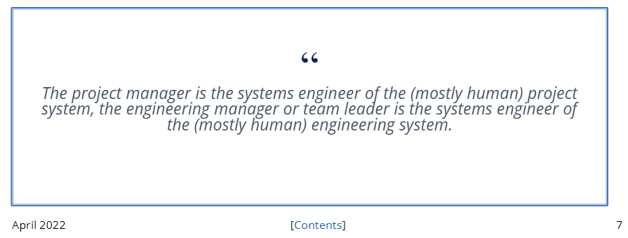

Все рассуждения про роли и агентов/IPU как
актёров/деятелей/практиков::«исполнителей ролей» полностью применимы к
системным инженерам как деятелям/практикам, занимающимся практиками
системной инженерии. Причём для системных инженеров как
«деятелей/практиков вообще» будет два вида конкретизации, если нужно
разбираться с ролями в жизни:

-   **Конкретизация по линии** **масштабов и** **видов систем** **в
    каждом масштабе.** *Системный инженер* обычно занимается несколькими
    масштабами системы/продукта в её окружении, а *прикладные*
    *инженеры* по конкретным системам занимаются каким-то одним видом
    системы, одной предметной областью. То есть системный инженер ---
    инженер-робототехник (скажем, должность «ведущий робототехник»),
    врач (инженер человеческого организма, чаще всего на стадии
    жизненного цикла «ремонт» и в случае паталогоанатома --- «вывод из
    эксплуатации»), инженер предприятия (скажем, на должности «директор
    по развитию» или «менеджер проекта»), инженер общества (скажем,
    должность «депутат Госдумы»). Эта конкретизация требует, конечно,
    обучения особенностям каких-то конкретных систем, в приведённых
    примерах нужно хорошо разбираться с дисциплинами, объясняющими
    работу роботов, предприятий, общества. Если ограничиваться только
    общими знаниями по безмасштабной системной инженерии (например,
    знанием текущего курса) и ничего не знать про особенности целевой
    системы, то будет «хотели как лучше, а получили как всегда». Уже
    давно нет «врачей вообще», ровно так же как и «инженеров вообще»
    (хотя сто лет назад были и просто врачи, и просто инженеры) а есть
    врачи по отдельным подсистемам человеческого организма:
    отоларинголог, уролог, стоматолог, клинический психолог или даже
    психиатр. Ещё есть варианты тоже по линии изменения состояния
    целевой системы (педиатры, патологоанатомы), или состава целевой
    системы (семейный врач). Вот это деление врачей по их целевым
    системам, как ни странно, ровно такое же, как и инженеров по их
    видам целевых систем (подсистем: например, специалисты по фюзеляжам
    самолёта или инженеры-двигателисты в авиапромышленности). Врачи ---
    это тоже инженеры, они тоже меняют физический мир к лучшему!
-   **Конкретизация по линии** **разных видов** **инженерных практик**
    **для одного и того же сорта систем** --- и вот тут системные
    инженеры занимаются не столько разработкой (это делают прикладные
    инженеры-разработчики, часто разрабатывая отдельные модули системы,
    ответственные за реализацию отдельных функций, максимально независмо
    друг от друга), сколько архитектурой, которая позволяет трудам
    прикладных инженеров-разработчиков интегрироваться в надёжную,
    масштабируемую, производительную, легкодоступную, выдерживающую
    случайные отказы (это мы всё перечисляем разные предметы интереса
    архитектора, об этом будет отдельный раздел нашего курса), также
    многочисленными практиками непрерывного ввода в эксплуатацию,
    начиная с управления конфигурацией и заканчивая организацией
    разворачивания результатов работы команд разработчиков и обеспечения
    доступа пользователей к системе (transfer, ввод в эксплуатацию).
    Этих системных инженеров называют DevOps, о них тоже будет большой
    раздел.
-   У врачей тоже есть подобное разделение. Например, по типам практик
    вмешательства (стадия «изготовление»): терапевт (неинвазивные
    вмешательства и сборка разных других видов вмешательств в работающее
    целое, «ввод в эксплуатацию»), хирург (инвазивные вмешательства),
    врач функциональной диагностики (нет вмешательства, только
    диагностика как часть проектирования будущего вмешательства). И тут
    обычно обязательно будет добавляться вид системы, ибо вид
    вмешательства/изготовления существенно может отличаться в
    зависимости от вида целевой системы. Без того, с какой системой
    работаешь, о практике мало что можно сказать, хотя и тут можно
    вывести за скобки немало. Так, хирург лет двести назад ещё не был
    ярко выраженной подролью врача, это была просто одна из врачебных
    практик, лет пятьдесят назад хирургия была уже отдельной практикой,
    а сейчас практически независимо практикуется нейрохирургия и
    кардиохирургия, да и в целом уже не встретишь «хирурга общего
    профиля», кроме самых захудалых сельских больниц. Конечно, на
    какой-нибудь подводной лодке можно встретить даже «врача» по всем
    вопросам, а в деревне «фельдшера» (даже не совсем врача, но тоже по
    всем вопросам), но это уже не типичная ситуация, не отражает «лучших
    известных на сегодня практик»/state-of-the-art (SoTA). В инженерных
    проектах по созданию киберфизических систем можно встретить
    инженера-электротехника, инженера-теплотехника,
    инженера-электронщика, но в маленьком стартапе на трёх человек можно
    встретить и просто «инженера», а исполнитель этой роли ещё будет
    прихватывать и другие роли --- продавца, проектного менеджера и даже
    уборщика помещения. Так и в системной инженерии бывает «просто
    системный инженер», а бывает системный архитектор или девопс
    (по-старинке иногда называемый системным администратором, хотя он
    давно уже ничего не администрирует, а создаёт «автоматического
    администратора»).

Всё разнообразие ролей, которые получаются конкретизацией по обеим
линиям (масштабов и видов систем, а также видов инженерных практик)
будет выполняться какими-то агентами (обычно людьми и их организациями),
имеющими должности или составляющими какие-то оргзвенья. Не нужно
думать, что системный инженер будет называться именно так. Он может быть
на должности «ведущий инженер», может называться «завуч» в случае
образовательных учреждений, может быть «координатором», смотреть нужно
на содержание его деятельности/практики. Если это практика, описанная в
нашем курсе как архитектурная или DevOps, то она идёт с целой системой,
так что это системный инженер.

Чтобы сочетать самые разные инженерные роли, делают гибридные должности
типа «продакт-менеджер» или сокращённо «продакт», который с одной
стороны ответственный за реализацию бизнес-модели проекта (грубо говоря,
«чтобы проект деньги зарабатывал, а не проедал»), а с другой стороны
озабочен связью с инженерами, которые должны реализовать его идеи по
поводу концепции использования системы. Поскольку концепция
использования системы связана с целой системой, то часть деятельности
продакт-менеджера --- это системная инженерия (про него мы ещё упомянем,
когда будем говорить про концепцию использования). Но часто он и инженер
предприятия (ибо именно он должен организовать разработчиков, выполняет
практики организационного менеджмента, собирает команду) или даже
операционный менеджер (например, разработчиков организовал не он, а
какой-нибудь TeamLead, но именно он определяет загрузку разработчиков,
так что он «инженер по эксплуатации группы разработчиков»). Всё это
вариации ролей системного инженера, поэтому не так страшно их
объединение в одном лице. И помним, что по поводу всех этих терминов
никакого согласия нет, в разных организациях и разных предметных
областях они означают совершенно разное (TeamLead в веб-разработке и
где-нибудь в лесотехническом машиностроении может означать очень разные
обязанности, ещё и существенно зависящие от страны и организации, а
также от года, в котором ведётся обсуждение: в прикладных видах
инженерии, включая инженерию предприятия всё стремительно меняется,
включая «модные» и «локально правильные» названия типовых должностей).

Позиция единства инженерного взгляда как минимум на инженерию и
менеджмент уже давно признаётся системными инженерами. Вот в журнале
«Project Performance Engineering Systems Engineering News» в апреле 2022
это даётся на седьмой странице обведённым в
рамочку^[<https://issuu.com/ppisyen/docs/ppi_syen_111_april_2022/29>],
чтобы системные инженеры об этом не забывали:

Человек на должности инженера может сутки напролёт играть роль
менеджера, планируя работы, и наоборот, человек на должности менеджера
может сутки напролёт разбираться в инженерных задачах. Элон Маск
сообщает о себе, что 70% времени занят решением инженерных задач «по
железу», то есть играет роль инженера киберфизических систем, и даже
необязательно системного инженера, но и просто инженера-разработчика,
который что-то изобретает и принимает трудные проектные решения по
концепции системы. Элон Маск --- это агент/актёр, и оказывается, что
роль предпринимателя и менеджера (он ведь CEO и в Tesla, и в SpaceX) он
исполняет меньше времени, чем роль инженера «по железу»! Да и эти 30%
«менеджмента и предпринимательства» оказываются инженерией предприятий,
то есть инженерией всевозможных цепочек создания.

Если вы понимаете, как устроена инженерия на самом высоком уровне
абстракции (наш курс как раз про это), вам будет легче разобраться в
неизбежном разнообразии видов деятельности по созданию самых разных
видов целевых систем и их частей в сложно устроенном окружении, в
длинных и запутанных цепочках создания этих систем. Оказывается, все
виды деятельности по созданию чего бы то ни было, если брать их в
более-менее субоптимальном варианте (SoTA, а не любом варианте!),
выдержавшем эволюционный отбор, похожи друг на друга, это просто
варианты безмасштабной непрерывной системной инженерии, которую вы
проходите в нашем курсе. Те же объекты внимания, те же операции с ними,
хотя и по-разному называемые и данные в некотором разнообразии. Разные
виды одного рода!

Вовсе не факт, что вы в жизни будете встречаться с классическими
«железными» проектами инженерных систем или даже не такими классическими
проектами программной инженерии. Если вам встретится какой-нибудь
детский садик Монтессори или организация выборов в какой-то
профессиональной ассоциации или даже муниципалитете, вы сможете
разобраться быстрее, если будете понимать, что это проекты по изменению
мира, то есть инженерные проекты. Практики, которые вы будете выполнять
в этих «неинженерных проектах» --- это таки инженерные практики, а не
какие-то особые экзотические практики, которые дано понять только
посвящённым людям. Даже если будет казаться, что проект состоит только
из практик по описанию мира (реверс-инженерия уже существующей в мире
системы в её окружении, или даже будущей системы, которую только потом
нужно изготовить), а не изменению, это будет просто часть какого-то
проекта по изменению мира, то есть часть какого-то инженерного проекта.
В любом случае, вы сможете задать правильные вопросы к проекту,
разобраться в происходящем. **Все** **сегодняшние** **проекты** **по
изменению мира к лучшему различаются и по их форме, и по их**
**содержанию, но** **одновременно** **и все проекты оказываются** **в
чём-то** **одинаковыми: они являются разными вариантами
системноинженерных проектов.**

Если оказалось, что речь идёт не о проектах по изменению мира к лучшему
(то есть не об инженерных работах), то такие работы выполнять не нужно.
Скажем, инженерная ли работа, в которой я поднимаю штангу по вечерам?
Да, это проект инженерии себя. Можно пообсуждать, как распределены
инженерные роли между мной, врачом, тренером, диетологом и внешними
проектными ролями --- включая внешние проектные роли тех, кто
воспользуется результатами этого инженерного проекта, в число этих людей
можете попасть не только вы, но и члены вашей семьи, а если ваша работа
связана с физической культурой, то и рабочее окружение. Если вы
художник, или политик, или музыкант, то тоже полезно задумываться, что
вы меняете в окружающем мире, и происходят ли эти изменения к лучшему.
Никакие названия должностей, ролей (и связанные обычно с названиями
ролей названия профессий и квалификации), названия практик и
«исторически сложившиеся традиции» не должны препятствовать такому
инженерному взгляду на мир.

Конечно, в этом разделе мы кратко описываем ещё и процесс непрерывного
углубления разделения труда, ибо появляются всё новые и новые способы
изменить мир к лучшему --- инженеры придумывают всё новые и новые
способы удовлетворять интересы, которых раньше и не было. Так, у
неандертальцев не было интереса к мастерству системной инженерии, да и
самой системной инженерии ещё не было, а затем появилась «просто
инженерия», потом в середине прошлого века появилась системная
инженерия, в конце 20 и начале 21 века она сосредоточилась на
киберфизических системах, а в последний десяток лет оказалось, что речь
идёт об огромном разнообразии прикладных инженерных практик для самых
разных масштабов и видов систем. Развилась методология, и стало
очевидно, что все эти практики изменения мира чем-то похожи (как
минимум, все они работают с какими-то системами), но в чём-то и
радикально непохожи. Это происходит и у «железных» инженеров, и у
программных инженеров, и у врачей, и у деятелей искусства. Достаточно
посмотреть на титры какого-то кинофильма, чтобы оценить масштаб
разделения труда в киноискусстве. Конечно, при создании «железных»
систем разделение труда не меньше, просто не принято так подробно
выписывать участников инженерной работы, как это принято в
кинопроизводстве.

Так что число инженерных практик и связанных с ними инженерных ролей
будет продолжать непрерывно расти, но можно смело опустить слово
«инженерных»: число практик (инженерных, то есть изменения мира) и
связанных с ними ролей будет продолжать расти. Тем более важно понимать,
что в их основе лежит системная инженерия, все эти практики являются или
модификациями системной инженерии для какого-то сорта систем (скажем,
селекция и производство коров как для производства молока, так и для
производства мяса в политической оппозиции веганам --- и в этой части
это будет социальная инженерия), или частями общей практики системной
инженерии (скажем, той частью, которая занимается архитектурой, для
каких бы систем эти архитектурные решения ни принимались и как бы ни
назывались).
