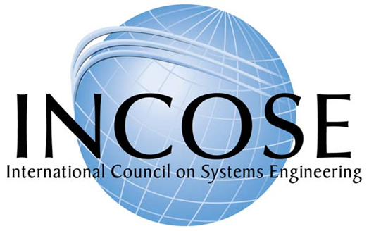

Системные инженеры-генералисты в отличие от инженеров по более узким
инженерным специальностям должны технически направлять инженерные
коллективы, так прописано в документах системных инженеров для
киберфизических систем. Врачи-терапевты как системные инженеры уровня
существа (а с учётом клинической психологии и уровня личности) должны
быть лидерами во врачебных коллективах с врачами более узких
специальностей. Они поделят врачебный труд (направят к хирургу и на
ЛФК), обеспечат стык этих практик, оттестируют и выпишут из клиники, а
потом ещё и будут «вести» несколько лет всю семью (непрерывная
инженерия).

Политики «по всем вопросам» должны быть лидерами в политических
коллективах (партиях), где могут быть политики с более узкой
специализацией --- это всё одно и то же.

Понятие **технического лидерства** (technical leadership, отличается от
**организационного лидерства**, organizational leadership) означает
помощь в организации коллективной мыслительной работы по отношению к той
или иной технической идее: все участники проекта должны делать одну и ту
же систему, а не разные. Отличия **технических лидеров** от «технических
евангелистов»: евангелисты --- это проповедники чужих идей на предмет их
воплощения в самых разных проектах инженерной компании или даже отрасли,
а системные инженеры как технические лидеры --- сами себе «технические
иисусы христы» в отдельных конкретных проектах, они сами поставщики тех
технических решений, в которых потом они должны уметь убедить других
людей в их конкретном проекте. Системные инженеры не просто берут идеи
от одних инженеров, а потом убеждают других инженеров их принять.
Системные инженеры генерируют технические идеи самостоятельно, и чаще
всего это архитектурные идеи и идеи организации непрерывного выпуска.
Системные инженеры в отношении надзора и менторства по отношению к
инженерам-разработчикам. Они принимают решения, разъясняют их
инженерам-разработчикам, проверяют выполнение этих решений, менторят
инженеров-разработчиков, если тем трудно выполнять решения.

Организационные лидеры занимаются тем, что помогают людям занять свои
роли в организации, они катализируют сотрудничество, делают организацию
целой. Технические лидеры делают целевую систему целостной. Какую
целевую систему? Разных уровней. Политические лидеры как технические
лидеры уровня общества должны делать общество целостным, чтобы оно
функционировало без каких-то существенных коллизий.

В давней (это статья 2009 года. Помним, что первый iPhone появился в
2007 году. В инженерии 2009 год --- это очень давно! Всё в инженерии
происходит быстро, и не только в железной инженерии) статье «Наука и
искусство системной
инженерии»^[<http://www.worldscinet.com/srf/03/0302/free-access/S1793966609000080.pdf>],
отражающей опыт космической системной инженерии NASA, приводится
сравнение системного инженера со специально обученным и талантливым
дирижёром симфонического оркестра, который творит Симфонию. Системный
инженер, как дирижёр, налаживает работу «симфонического оркестра» из
многих инженеров-разработчиков, и даже часто не отдельных
людей-разработчиков, а целых команд разработчиков. Это одновременно и
правда, и неправда. **Правда в том, что системные инженеры ---** **это
технические лидеры. Неправда в том, что системный инженер ---** **это
один человек,** **«рулящий»** **огромными коллективами других
инженеров.**

Как в инженерии произошло разделение на инженеров по специальности
(механиков, электриков, программистов, теплотехников и т.д.), как в
западной медицине произошло разделение врачей по разным врачебным
специальностям, и врачи редко работают поодиночке, так подобное
**углубление**^[Обычно deep, «глубина» в речи означает
рост числа уровней какой-то иерархии. Скажем deep learning --- это
многоуровневое обучение, то есть обучение нейронных сетей с числом
скрытых уровней/слоёв больше одного. В углублении разделения труда речь
идёт об увеличении числа уровней иерархии по *отношению специализации*
(род-вид) между практиками.] **разделения труда** уже
произошло и в самой системной инженерии киберфизических систем, и во
многих других областях более высоких системных уровней, в которых слово
«инженерия» не употребляется. Системных инженеров разной специализации
может быть в одном проекте целая команда, которая делится, как мы помним
и по видам подсистем (у самолётов это могут быть двигателисты, у
организации --- бухгалтеры. То, что подсистема в одной системе, на
другом уровне имеет свою целостность и будет требовать архитектурной
проработки и какой-то организации введения в эксплуатацию), и по
практикам (прежде всего это деление на разработчиков, включая
занимающихся функциональностью системы в целом, архитекторов, отвечающих
за архитектурные характеристики, девопсов, отвечающих за минимизацию
времени ввода в эксплуатацию каждого инкремента системы, который сделали
разработчики).

Вспомните ситуацию начала времён WWW, когда появилась и начала бурно
развиваться профессия веб-мастера в середине 90х прошлого века. Трудно
уже вспомнить, но всего двадцать лет назад был один человек, который
занимался для вебсайтов всем: программировал движок, разрабатывал
арт-дизайн, пришивал его к движку, наполнял вебсайт материалом,
продвигал его в Сети и т.д. Один человек, который совмещал в себе всё
разнообразие прикладной инженерии для сайтостроения. Сейчас «вебмастера»
уже нет, а есть отдельно программисты CMS (content management system)
или программисты бэк-энда, дизайнеры, верстальщики (которых уже так не
называют, это программисты фронт-энда), тимлиды и DevOps, редакторы (в
вариантах editor и content manager, причём второго уже и редактором не
называют, а раньше называли), администраторы, модераторы, специалисты по
пользовательским интерфейсам и по пользовательскому опыту (раньше их не
различали, теперь даже пишут UI/UX), SEO (search engine optimization) и
после этого появившиеся спецы по SMM (social media marketing), и это еще
не полный список (вы заметили, что в этом списке не хватает архитектора?
Он обязательно должен быть!).

При развитии практически любой профессии она дробится на различные
профессиональные/деятельностные/инженерные позиции, которые
соответствуют различным практикам, которые играются какими-то
профессиональными/деятельностными/организационными/проектными ролями.

**Один человек, даже если он гений, не в состоянии удержать
целостность** **в современных сложных проектах: целостность удерживается
в современном мире только** **командно** **и уж точно не людьми, а
хорошо налаженными компьютерными моделями, которые точно не забудут ни
одной детали, ни** **одной строчки** **ни одного документа.** От
играющих самые разные роли и поэтому имеющих самые разные интересы людей
в инженерном проекте требуются две вещи:

-   **Согласовывать свои решения. Не договорились ---** **не делаем!**
    Если делаем ракету, то нужно договориться, сколько у неё
    ступеней --- две или три. Если делаем рыбу, то нужно договориться,
    какой она должна вырастать длины. Если делаем общество, то нужно
    договориться, какое именно общество (при этом договариваться в
    случае общества нужно не только со своей командой социальных
    инженеров!). И хорошо бы разделить проблемы так, чтобы нужно было
    поменьше согласовывать решения (например, диаметр болтиков на плате
    и цвет корпуса прибора можно не согласовывать между собой, эти
    решения могут принимать разные команды разработчиков независимо, но
    если болтиком занимаются две команды, то их решения придётся между
    собой согласовывать). Этим занимаются инженеры-архитекторы.
-   **Дисциплина всё записывать/учитывать: договорились и делаем ---**
    **записать, о чём договорились,** **что делаем, что сделали, чем
    обосновывали.** **Не записали ---** **это не договорились, так
    что ---** **не делаем!** **Памяти не верим, верим записям.**
    Современная инженерия без компьютеров не делается! Внимание людей к
    деталям проекта и целокупности проекта поддерживается компьютерами!
    И личная собранность и организационная/командная/коллективная
    собранность сегодня держится не на биологической памяти, а на
    компьютерной памяти! Голыми руками и голым мозгом не работаем! То,
    что «все ходы записаны» и легко разобраться в ситуации, за это
    отвечают девопсы (управление версионированием и конфигурацией у
    них).

Есть ли «системный инженер» в сайтостроительстве как отдельная
должность? Может быть (хотя называться он может как-нибудь по-другому,
например тимлид или «архитектор проекта», а иногда и «ведущий аналитик»,
у которого и права принимать решения нет, только «право давать
рекомендации начальникам»), а может и не быть. Есть ли «системная
инженерия» в сайтостроительстве? Безусловно, есть: это и обсуждение
сайта как целого (создание концепции использования), и практики создания
сайтовой архитектуры, и практики технического и организационного
лидерства как поддержки совместного технического творчества инженеров
как в технической части, так и в организации труда этих инженеров (это
практика DevOps).

Это сравнение системного инженера с дирижёром можно прокритиковать и с
другой стороны. Метафора симфонического оркестра соответствует
административной модели управления, «писанной музыке», и чуть ли не
«руководству» как буквально «руками водству». Может возникнуть
впечатление, что системный инженер --- это человек с должностными
полномочиями командовать какими-то «несистемными» инженерами, то есть
прикладными инженерами-разработчиками разных специализаций, которые
слыхом не слыхали о системных уровнях, архитектуре и непрерывном вводе в
эксплуатацию. Вроде как это такой «дирижёр», который прямо диктует
музыкантам, когда и какую ноту играть каждому, как это происходит иногда
в симфонических оркестрах с авторитарным дирижёром, заботящимся о каждой
ноте, чтобы она соответствовала именно его авторскому замыслу. И да,
раньше и в инженерии (помните Туполева, Королёва, Мессершмита?), и в
политике (вождизм --- это как раз от этого, несменяемые цари-диктаторы
как раз таковы) так и было. Но ведь ещё в прошлом, XX веке музыка по
факту пошла другими путями:

-   в симфонической музыке за счёт компьютерной поддержки композитора
    оказались выкинутыми и дирижёр, и его оркестр, а «симфонические»
    фонограммы к современным фильмам и играм готовятся самим
    композитором буквально в одиночку --- но на компьютере. Компьютер
    настолько увеличивает возможности одного человека, у которого есть в
    голове полный замысел, что других людей можно смело выкинуть из
    процесса. Музыка оказалась несложной, умещается в одной голове, если
    ей помогает компьютер. Симфонический оркестр с нотной записью
    партитуры для каждого музыканта и дирижёром по факту оказался не
    нужен.
-   в музыкальной мейнстримной живой культуре сегодня преобладает джаз,
    подразумевающий совсем другие принципы коллективного творчества:
    импровизация плюс взаимоподстраивание (рок --- это развитие того же
    джаза, ибо в рок-группах никакого «дирижёра», а вместо «нот»
    используется звукозапись);
-   симфонические оркестры остались как очень дорогое средство
    антикварного хранения традиции, и от них никакого развития музыки не
    ожидается. Эпоха великих композиторов и великих дирижёров
    окончилась. Развитие музыки и музицирования идёт, при этом идёт
    достаточно бурно, но в совершенно других формах. Например, дети
    массово заканчивают сегодня не столько музыкальную школу, сколько
    школу диджеинга --- и там игра идёт не отдельными нотами, а более
    крупными блоками (сэмплами, треками), и на выходе не только «треки»,
    но и отдельные «сеты» (аналоги альбомов звукозаписи или концертных
    программ в живой музыке).

Если посмотреть на то, что происходит в инженерии (в том числе и
программной, и «железной», и инженерии организации, и врачевании, и
социальной инженерии как политике, и любых других видов инженерии), то
тренд к «джазовой» организации деятельности несомненен. Все движение
agile --- это движение именно в эту сторону «джазовости» как
импровизационности и согласованию деятельности «на лету». Это и
понимается как «гибкость», непредзаданность последовательности шагов,
уменьшение размера планируемой заранее работы по принципу small batch
size^[См. доклад Влада Свяжина рассуждениями об этой
идее, с 1:04:11,
<https://www.youtube.com/watch?v=lpgpnCoV14w&t=3851s>],
введение не всей системы с тысячей функций одним шагом (и этот шаг с
подписанием акта приёмки-сдачи будет последним шагом проекта), а
инкрементами, функция за функцией. Как ни странно, такой «постепенный»
подход заодно улучшает скоростные характеристики разработки за счёт
того, что раньше получается отклик от задействования целевой системы в
её окружении и поэтому раньше исправляются ошибки, меньше тратится
времени на проработку заведомо неудачных идей.

Все остальные примеры новинок в организационных дисциплинах (например,
переход от акцента на administration/management к leadership,
предложение блокчейна в финансовой инженерии) тоже идут именно в эту
сторону отсутствия «единоличного лица, принимающего все ответственные
решения». Ситуация, при которой все главные решения принимаются одним
лицом, которое всеми «дирижирует», опасна. «Дирижёр всего» потенциально
создаёт угрозу появления в проекте «бутылочного горлышка», существенно
замедляющего принятие инженерных решений (ибо решений много, дирижёр
один, все решения он не то что скоординировать --- он просто
познакомиться с ними не успеет толком)! Но главное тут даже не в
замедлении работы: одному человеку иметь образование и опыт во всех
дисциплинах, в которых принимаются важнейшие решения по проекту
невозможно: гений в одних вопросах вполне закономерно может быть полным
идиотом в других вопросах. Метафора «великого вождя» в системной
инженерии не соответствует духу времени.

Это соответствует и идеям, о которых говорит John Doyle в его работах по
системам
управления^[<https://ailev.livejournal.com/1622346.html>]:
для устойчивого (не срывающегося в широком разнообразии режимов)
скоростного и точного управления нужно иметь большое разнообразие
датчиков, актуаторов, обработчиков информации, которые организованы
многоуровнево, системно. В этой структуре при этом множество самых
разных обратных связей, сложно устроенных (и просто устроенных прямых
связей, команды «просто исполняются», а вот информация от датчиков
обрабатывается сложно). Крупные быстрые элементы дают скорость, мелкие
медленные --- точность, и компромисс между скоростью-точностью будет
только при сочетании достаточного числа вот этих разных масштабов,
появлении множества мест принятия решений. По большому счёту именно
такое и происходит в «джазовом» проекте, в котором непрерывно меняется
как будущее окружение (его оценки! Его же ещё нет, системы ещё нет!),
так и в ответ на это структура целевой системы (которая только-только
проектируется и изготавливается, её тоже зачастую ещё нет), так и в
ответ на это цепочка создания (по мере изменений целевой системы
требуется изменять и практики её создания, то есть менять создателей).

Системные инженеры как люди, занимающие позицию в проекте в
профессиональной роли отвечающего за какую-то целокупность всей системы
(помним, что мы говорим о системе самых разных уровней --- это может
быть бактерия для генного системного инженера, или городской квартал в
«умном городе» для инженера-строительного девелопера, или общество
какой-то страны для политика) специализируются тем самым до лидеров
инженерной разработки/development (самый верхний уровень, концепция
использования и самые верхние уровни концепции системы), и часто на этом
самом верхнем уровне это неотличимо от работы инженеров-разработчиков,
инженеров-архитекторов и DevOps (разработчиков инфраструктуры
непрерывного введения в эксплуатацию, аналог «управления жизненным
циклом» в ситуации множественности этих жизненных циклов). Системные
инженеры не руководят («руками водят», то есть дают поручения на
выполнение работ по развитию системы) прикладными разработчиками, но
принимают решения по принципам их работы и структуре
развиваемой/evolving разработчиками системы, а также создают условия (в
том числе инфраструктуру) для работы всех разработчиков. Это не
руководство или управление/management, это governance.

Команды системных инженеров не столько руководят специализированными на
работе в каких-то прикладных инженерных областях (domains) людьми,
выполняющими ещё более узкие инженерные практики, сколько организуют их
взаимодействие по поводу разделения их труда, выполняя свой кусок
инженерной работы в части целевой системы и технологий, используемых в
проекте создания (прежде всего технологии непрерывного ввода в
эксплуатацию).

Вместо «дирижёрской» поэтому лучше использовать «джазовую» метафору
описания деятельности, это подробней будет изучаться в курсе системного
менеджмента/инженерии предприятия. Так, звукорежиссёр из записанных в
студии разными музыкантами в разное время отдельных треков делает
окончательную запись. Но он не предписывает, какую музыку играть
музыкантам. Звукорежиссёр тут --- DevOps. Или руководитель джазового
ансамбля, который выбирает, какую мелодию будут играть --- но он не
командует кому, когда и что играть, и не выдаёт точные ноты мелодии, не
указывает точную гармонию или ритмический паттерн. Это разработчик
концепции использования. Или художественный руководитель, который
определяет, кто вообще будет играть в ансамбле и устраивающий разнос
музыкантам по поводу плохого качества их игры. Это архитектор. Люди,
исполняющие роли системных инженеров в команде тоже имеют различающиеся
функции, в самых разных их сочетаниях. Но как музыкантов из ансамбля
называют «музыкант» (исполнителей ролей музыкантов, отождествляя их с
ролями), так и мы системных инженеров из команды/коллектива проекта
будем называть «системный инженер» для краткости. Курсы «Моделирование и
собранность», «Системное мышление», «Методология» помогут вам тут
разобраться с различиями ролей, должностей, исполнителей ролей (как
отдельных людей, так и организованных в плане распоряжения своим и чужим
трудом, инструментами и материалами групп людей). В курсе системного
менеджмента как инженерии организации вы получите дополнительный опыт
того, как строить системы из людей так, чтобы в их состав входили все
нужные виды инженеров (входили люди, исполняющие все необходимые для
создания целевой системы практики, исполняя все нужные инженерные роли,
включая роли в системах цепочек создания).

Разные виды системных инженеров имеют и разные акценты в их образовании.
Так инженер-архитектор знает множество архитектурных паттернов для того
вида целевых систем, который развивается в проекте. И ещё он имеет опыт
разработки, чтобы не отрываться от реальности и не требовать от
разработчиков невыполнимого. DevOps хорошо понимает в операционном
менеджменте, ибо его главная задача --- уменьшать Lead Time (этих Lead
Time есть ещё и много разных вариантов), в общем случае определяемого
как время от момента, когда появилась идея очередного инкремента системы
(например, реализующего какой-то запрос клиентов на новую фичу) до
момента, когда потребители смогут воспользоваться этим инкрементом в
составе эксплуатируемой системы, и всё это должно происходить быстро, но
без роста числа дефектов эксплуатирующейся системы (да, это умение
выполнять модернизацию двигателя автомобиля не выключая двигатель, и
даже не прекращая движения! И тут только доля шутки).

По большому счёту, такие акценты в образовании, какие нужны архитекторам
и девопсам (впрочем, и разработчикам, им же нужно изобретать в рамках их
рабочих обязанностей!), не помешают каждому человеку, ибо рано или
поздно в своей жизни каждый человек столкнётся с необходимостью быть
системным инженером, то есть с необходимостью отвечать за всю систему в
целом (даже если это маленькая подсистема в составе какой-то большой
системы).

И инженеры-разработчики, и инженеры-архитекторы должен владеть какими-то
практиками перевода проблем (которые непонятно, как решать) в
последовательность задач (которые понятно как решать) в ходе
многоуровневой оптимизации неизбежных конфликтов между системными
уровнями в разрабатываемой системе: архитектура ведь подразумевает
модульный синтез, который вовсе неочевидно как сделать, ибо учитывать
приходится минимально четыре разных описания системы (функциональное,
конструктивное, размещение, стоимостное), да ещё и на многих системных
уровнях, да ещё и по цепочке создания. В настоящем курсе будет дано
представление о таких практиках разработки как практиках системного
творчества и об архитектурных практиках как достижении оптимального
значения так называемых архитектурных характеристик (в том числе и такой
характеристики, как возможность менять систему без полной её переделки,
evolvability).

Главным же критерием отнесения какой-то инженерной специальности к
(безмасштабной/фундаментальной/трансдисциплинарной) системной инженерии,
а не (прикладной) инженерии систем является то, что системный инженер
думает о всей системе на многих системных уровнях в целом, а не о
каком-то её аспекте (механическом, электрическом, программном и т.д.) на
каком-то одном системном уровне. Именно этот критерий даёт основание
David Firesmith относить инженеров по безопасности и защите (вроде как
прикладных инженеров) к системным инженерам: несмотря на то, что
инженеры по безопасности имеют свои ВУЗы, профессиональные организации и
конференции, они думают обо всей системе в целом, и на этом основании их
вполне можно считать системными, а не прикладными инженерами. В нашем
курсе не обсуждается их практика, но она оказывается в чём-то похожа на
практику архитекторов, только набор характеристик там другой (не
архитектурные, а безопасности и защиты). Всё это, конечно, более-менее
условно, в том числе и потому, что в проекте люди обычно выполняют
множество ролей и быстро переключаются между ними.

В любом случае, название «системный инженер» будет использоваться в
курсе как название роли (тип мета-мета-модели, объект из нашего курса, а
не из жизни), но нужно учитывать, что в жизни в разных предметных
областях (культурная мета-модель, отражающая domain и ситуационная
мета-модель, отражающая принятый способ работы в конкретном проекте) вы
будете слышать самые разные другие имена и ролей и тем более должностей.
Вы должны будете догадаться, что речь идёт о системной инженерии
(вообще-то **всегда** идёт речь о системной инженерии!), и тогда вам
пригодится знание материала нашего курса, в самых разных проектах. И это
может быть отнюдь не SoTA версия инженерии, то есть инженерия в вашем
проекте может оказаться не системной, не безмасштабной, не непрерывной
(зато люди будут гордиться, что они заняты «искусством», проявляют
находчивость и изобретают велосипеды, а лучшие из них будут считать себя
«ремесленниками», а не инженерами. Десяток лет в программной инженерии
такое отношение к методам собственной работы было даже модно, сейчас об
этом предпочитают не вспоминать).

В мире существует несколько профессиональных организаций системных
инженеров, из них наиболее значительной является международный совет по
системной инженерии (INCOSE, International Counsil of Systems
Engineering, <http://incose.org>).

В этой организации есть индивидуальное членство (\$50-\$160 в год) и
корпоративное членство (\$4750-7250 в год), в 2022 году примерно 19
тысяч индивидуальных членов во всех стран
мира^[<https://www.incose.org/about-incose>].

Цели INCOSE --- распространять знания по системной инженерии,
обеспечивать международное сотрудничество и обмен опытом системных
инженеров, устанавливать стандарты профессионального мастерства и
проводить сертификацию системных инженеров на соответствие этим
стандартам, обеспечивать поддержку корпоративных и правительственных
образовательных программ в области системной инженерии.

Деятельность INCOSE проходит главным образом в рамках деятельности
региональных (уровня штата или города в США, страны или даже группы
стран в Европе и Азии) отделений.

Есть Русское отделение INCOSE (INCOSE Russian Chapter). Русское --- это
название по языку, а не по стране. Члены этого отделения из России,
Украины, Белоруссии. Это похоже на Немецкое отделение (INCOSE German
Chapter), где члены из Германии и Австрии. Русское отделение входит в
INCOSE EMEA sector (отделения INCOSE из стран Европы, ближнего Востока и
Африки). Русское отделение INCOSE проводит заседания раз в две недели,
на этих заседаниях заслушиваются доклады о современных практиках
системной инженерии, прорабатывается использование русской терминологии,
ведётся обсуждение исследований^[Исторические
видеозаписи этих заседаний и демонстрирующиеся там слайды можно найти на
<http://incose-ru.livejournal.com/>, сегодня работа ведётся главным
образом в телеграм-канале <https://t.me/incose_rus>.].
Раз в год в подмосковном Бекасово проходит трёхдневная Рабочая встреча
Русского отделения INCOSE по проблемам системной инженерии (до 2022 года
было проведено 12 таких встреч^[На 12 встрече как раз
обсуждался и текущий курс, см. заметки об этом:
<https://ailev.livejournal.com/1623518.html>]).

INCOSE разработало этический кодекс системных
инженеров^[<https://www.incose.org/about-incose/Leadership-Organization/code-of-ethics>],
активно участвует в разработке международных стандартов, сертифицирует
системных инженеров (по факту --- инженеров киберфизических систем, хотя
это явно не декларируется).

Тем не менее у этой организации есть существенные проблемы:

-   Исторически там собрались системные инженеры киберфизических систем,
    и значительная часть их занимается государственными
    инфраструктурными и военными проектами. Это означает, что меньше
    всего там используются принципы lean, ведущие к минимальному
    дублированию работ (госбюджет заплатит! Это не рынок!) и agile
    (государство строго планово! Никакого «планирования на лету» и тем
    более «неудачных экспериментов»!). По факту варианты системной
    инженерии, поддерживаемые этой организацией, базируются на идеях
    «водопада» и не учитывают идей непрерывной инженерии (в общих
    словах --- признают и учитывают, но при рассмотрении сути практик в
    публикуемых учебниках, документах, стандартах --- нет). Ровно по
    этой причине частная компания SpaceX смогла за несколько лет сделать
    в космических проектах больше, чем все традиционные контракторы NASA
    (достаточно сравнить проект Starship с проектом SLS по скорости
    разработки и новациям). И таких «частных компаний» в организации
    явно недостаточное представительство, больше представителей компаний
    с крупными военными проектами. SpaceX активна в INCOSE была где-то в
    2007 году, но не сейчас.
-   INCOSE признаёт, что системная инженерия безмасштабна и используется
    для всех системных уровней (это ясно видно по INCOSE Vision
    2035^[<https://www.incose.org/about-systems-engineering/se-vision-2035>]).
    Но исторически всё равно центрируется на системно-эволюционном
    уровне киберфизических систем как основных для членов этой
    организации.
-   Также INCOSE признаёт, что «инженеры систем» и прикладные инженеры
    по отдельным прикладным инженерным практикам (электрики,
    теплотехники, метрологи) по факту тоже используют системное
    мышление, и произошло проникновение системной инженерии во все
    «другие инженерии». Но всё равно организация поддерживает главным
    образом инженеров-генералистов для киберфизических систем
    (робототехников, автостроителей, авиастроителей, ракетостроителей).

Повторим, что совсем необязательно называться системным инженером, чтобы
им быть. Так, архитекторы софта (software architects) вполне себе
системные инженеры, специализированные на программных системах.
Архитекторы предприятий --- системные инженеры, специализированные на
организационных системах. Дело совсем не в названии должности или
практики, не в членстве в ассоциации, дело в содержании инженерной
практики.

Мы тут использовали термин «системная инженерия» в двух разных
значениях, так он используется и в жизни:

-   Любая инженерия, ибо без системного подхода, учёта самых разных
    систем в окружении и цепочках создания, учёта эволюции и непрерывной
    подстройки под изменения нельзя менять мир. Как бы ни называлась
    практика, она оказывается инженерной, тем самым системноинженерной.
    Любой инженер --- это системный инженер. Это соответствует
    определению «**системная инженерия ---** **это практика инженерии с
    системным мышлением в голове инженера**».
-   Те практики системной инженерии, которыми занимались люди,
    считавшиеся системными инженерами в инженерии киберфизических
    систем: на сегодня это главным образом архитекторы и DevOps, а также
    создатели концепции использования (ConOps, OpsCon). Эти люди
    получают специальное обучение по своим поддисциплинам. Это
    соответствует определению «**системная инженерия ---** **это
    практика** **поддержания целостности системы, в отличие от
    прикладных инженеров-разработчиков, системный инженер занимается
    системой в целом, а не какими-то частями системы или прикладными
    особенностями системы**».

Какое значение правильное? Оба, и жизнь покажет, какое из них выживет.
Пока же используются оба значения, в нашем курсе тоже так.
