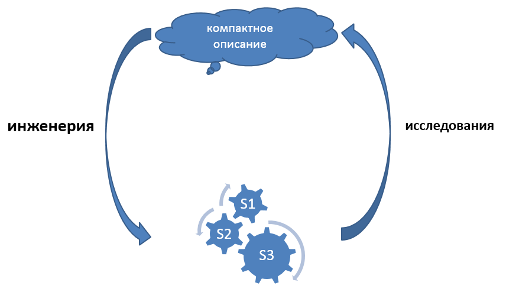
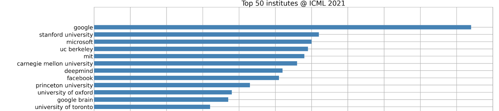

Нельзя путать роли инженера и исследователя. Мы тут говорим слово
«исследователь», а не «учёный» главным образом потому, что
научное/рациональное мышление как построение объяснительных (про
причины-следствия) порождающих (generative, пригодных для «обратного
моделирования», предсказания состояний мира, конкретизации/рендеринга)
теорий сегодня используется отнюдь не только в «науке» как особом роде
деятельности «учёных», но повсеместно в самых разных
деятельностях/практиках/видах труда.

Исследователи (это роли, а не люди!) ровно обратны инженерам: если
инженеры делают реальные материальные вещи, опираясь на какие-то
(необязательно «научные»!) описания, то исследователи делают
объяснительные теории физической и абстрактной (математики как раз
занимаются исследованием поведения абстрактных/ментальных объектов)
реальности. Исследователи получают компактные, понятные и формальные
описания действительности. Слово «реальность» тут означает именно
физический и ментальный мир, а вот «действительность» --- мир,
преломлённый нашими понятиями, отражающими то, что нам об этом мире уже
известно и что мы можем выразить по поводу этого мира (скажем, если
человечество пару веков назад не знало о существовании электронов, то в
реальности они были, а в действительности их не было). Конечно,
инженерия и исследования тесно переплетены:

-   когда инженер получает инженерную систему, поведение которой не
    отвечает его замыслу, он исследует проблему: пытается найти наиболее
    компактное описание работы этой инженерной системы (модель), из
    которого было бы понятно, в чём он ошибся при замысле системы и её
    воплощении. Затем исправляет ошибку: меняет систему.
-   когда исследователь моделирует мир, то есть придумывает новый способ
    его описания (новую модель, мета-модель, мета-мета-модель), более
    компактный и лучше объясняющий мир, чем предыдущие способы, то он
    прежде всего строит догадки о тех понятиях, которые помогут ему
    построить это описание. Затем критикует эти догадки, и в том числе
    проводит эксперименты. Отнюдь не все эксперименты «мысленные».
    Некоторые из них требуют создания весьма и весьма сложных инженерных
    систем (например, ускорители --- это одни из самых сложных на Земле
    инженерных систем, и их строят именно для проведения экспериментов в
    предметной области физики высоких энергий). Когда эксперимент
    проведён, исследователи корректируют свои объяснительные теории в
    зависимости от результатов эксперимента (выбирают лучшую из
    имеющихся, или модифицируют какую-то из них для лучшего соответствия
    их предсказаний с результатами эксперимента).

Тем самым инженерная и исследовательская деятельности оказываются
связаны в цикл, и в каждом исследовательском или инженерном проекте
обычно приходится много раз повторять цикл:

Как только мы что-то делаем в рамках какой-то практики, «выполняем
инструкцию», результаты нашей работы очень скоро начинают расходиться с
предсказаниями наших моделей «из учебника». В этот момент нужно
«включать мозг» в плане силы его общего интеллекта, то есть переходить
на использование фундаментальных мыслительных дисциплин интеллект-стека.
А поскольку наши модели мира несовершенны, а ещё каждый раз находится
что-то, что меняет мир, меняет нас прямо по ходу наших занятий какой-то
практикой, то вот это несоответствие предсказаний мира моделями «из
учебника» и реальной обнаруживаемой в ходе работы ситуацией происходит
постоянно. Нужно постоянно разбираться, что происходит, поправлять наши
модели мира. Исследования/познание оказываются вплетены в жизнь более
тесно, чем можно себе представить. В учебнике написано --- «ударить
молотком три раза, и гвоздь будет забит!». Вы бьёте всего один раз --- и
попадаете не по гвоздю, а по пальцу, или гвоздь гнётся, или гвоздь
забивается по самую шляпку сразу и молоток разбивает ещё и ту
поверхность, куда забивается гвоздь, или оказывается, что вы пытаетесь
вбить гвоздь в камень, или... этот список можно продолжать и продолжать,
и это простейшая практика! Хуже, когда вы даёте человеку лекарство, а
оно работает совсем не так, как описано в инструкции по его применению.
Вы должны стать исследователем, чтобы понять происходящее!

Главное тут --- цель объемлющей деятельности, а не собственно сама
работа «исследований» или «инженерии» и её отнесение к какому-то классу.
Цель этой объемлющей деятельности обычно --- изменение мира к лучшему,
то есть либо появление какой-то материальной системы, приносящей пользу
каким-то внешним проектным ролям, либо появление какого-то компактного
описания/объяснения/«generative model» того, как устроен мир, чтобы на
следующем шаге иметь возможность изменить этот мир к лучшему. В любом
случае, либо инженерия оказывается спрятана в исследованиях/познании,
либо познание/исследования спрятаны в инженерии. Они неразрывны.
Познание деятельно, деятельность познающа.

Эта перепутанность и неразрывность, отражающая связь инженерии и науки,
весьма распространена, и с ней не нужно бороться:

-   В большинстве мультфильмов «учёный» в белом халате меньше всего
    учёный-исследователь, это «инженер-изобретатель». Эти якобы «учёные»
    не ставят эксперименты: они придумывают какие-то необходимые для их
    целей системы, в быту называемые «inventions/изобретения» как
    синоним «будущего продукта», и затем воплощают эти системы в
    реальности как системы-прототипы или системы-опытные образцы. Это
    «лаборатории Эдисона», где «лаборатории» не столько
    исследовательские, сколько инженерные, в которых происходит
    возня/tinkering, инженерная работа путём проб и ошибок, инженеры
    пробуют свои разные «догадки» для физического состава системы так
    же, как исследователи пробуют свои «догадки» в части объяснительных
    моделей. Большинство не срабатывают, но некоторые --- срабатывают.
    Это по факту эволюционный процесс руками инженеров, это не «наука»,
    поскольку не производятся объяснения.
-   «Прикладные исследования» (applied research, прикладная наука) тоже
    не «исследования», несмотря на явное употребление термина
    «исследования». Никаких объяснительных теорий от прикладных
    исследований ожидать не приходится, а результаты НИР
    (научно-исследовательских работ, но в ходе этих работ часто
    создаются не только какие-то описания, но и макеты изделий) и НИОКР
    (научных и опытно-конструкторских разработок, в ходе них создаются
    не просто макеты, но опытные образцы) нацелены на получение в
    конечном итоге «инноваций» как систем, которые определяются как
    новые системы, успешно выведенные на рынок, то есть достаточно
    конкурентноспособные, чтобы продаваться (а не просто любые «новые
    системы»). Это неважно, на какой стадии будет закончена работа:
    документации с описаниями, или макета, или опытного образца, или
    даже полномасштабной разработкой конечного результата. Между
    «работающим прототипом» и «выпускаемым продуктом» могут быть годы и
    годы разработки/development. И это рассуждение работает не только с
    системами уровня косного вещества или киберфизическими системами, но
    и системами других системных уровней, хотя даже о сообществе не
    скажешь «вот мы тут сделали опытный образец, сейчас выведем его в
    серию», приходится адаптировать рассуждение к разным системным
    уровням.
-   Очень часто прикладные исследования (research) и классическую
    разработку вообще не разделяют, отсюда устойчивое сокращение R&D
    (research and development). Есть ли разница? Есть: «лаборатория
    Эдисона» (лаборатория Bell Labs, лаборатория IBM и т.д.) всё-таки
    отличаются существенно по организации труда и проходящим в них
    работам от классической инженерной разработки в конструкторском бюро
    или проектном институте. Но они не отличаются принципиально!
    Оргинженерией (то есть менеджментом) R&D как раз и занимается
    практика technology and innovation management как практика инженерии
    организационной системы, занимающейся разработкой технологий и
    инновациями.

Настоящая «наука», исследования в чистом виде --- это «basic research»,
которые ведутся в условных «лабораториях Эйнштейна». На выходе
исследований не «опытные образцы», а объяснительные теории ---
компактные и как правило довольно формальные описания физического
мира/природы. Но, например, физики-экспериментаторы или
биологи-экспериментаторы --- это хорошие инженеры. По роду деятельности
они как инженеры меняют физический мир (создают различные измерительные
системы, в которых подготавливают измерение какого-то параметра какой-то
системы в заданных условиях --- типично инженерная задача), а как
исследователи-физики или исследователи-биологи --- проектируют целевое
измерение (задают потребность в экспериментальной установке) и затем
интерпретируют результаты эксперимента в части возможного опровержения
какой-то теории, для чего этот эксперимент и задумывается. Ровно из
такого понимания двух ролей физика как инженера-исследователя «в одном
теле» происходит высказывание Фарадея, что «настоящий физик должен уметь
пилить буравом и буравить пилой», то есть настоящий исследователь должен
уметь хорошо выполнять инженерную работу (во времена Фарадея инженер
воспринимался не столько как проектировщик или конструктор, сколько
непосредственный исполнитель практики изготовления, своими или чужими
руками тут уже неважно, но подразумевалось, что всё-таки своими), и
наоборот, настоящий инженер должен уметь исследовать (иметь
естественнонаучное образование, как и все исследователи. Насколько
«все»? Тут отдельно можно обсуждать, насколько изучение личности,
организации, сообщества, общества может быть «естественнонаучным»).

Системная инженерия вполне может включать R&D, изобретения, создание
прототипов. И в ходе занятий системной инженерией вполне можно ожидать
проведения каких-то научных исследований, дающих результатом теорию.
Скажем, в области искусственного интеллекта огромное число научных работ
сейчас делается в лабораториях Гугла, Эппла и других крупных инженерных
фирм. Посмотрите, как соотносится число докладов от университетов и от
коммерческих компаний на конференции ICML по искусственному интеллекту в
2021
году^[<https://www.vinai.io/an-overview-of-icml-2021s-publications/>]:

