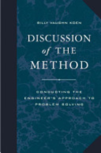

Знания самой инженерии (как надо что-то *делать/практиковать* создателю
целевой системы) и знания об инженерных системах разного вида
(установках, сооружениях, транспортных средствах, компьютерах и т.д. для
традиционной инженерии киберфизических систем, но и существах,
личностях, организациях, сообществах, обществах и даже человечестве ---
как добиться у них каких-то определённых характеристик) могут быть как
научными, так и ненаучными, то есть опираться или на хорошие, или на
плохие объяснения^[О плохих объяснениях рассказывается в
курсе «Создание объяснений», см. также книгу Дэвида Дойча «Начало
бесконечности. Объяснения, которые меняют мир».].

Инженерия рождается и живёт методом проб и ошибок, её знания,
передающиеся из проекта в проект про неё саму (как что-то сделать) и про
её инженерные объекты вовсе необязательно «научны». Так что разные
определения инженерии на основе единственно «принесения научных знаний в
практику» просто неверны, хотя наука (лучшие имеющиеся на сегодняшний
день объяснения закономерностей природы) обязательно используется в
инженерии там, где она доступна. Но где хороших объяснительных
теорий/«научных знаний» нет, они не используются, при этом совершенно
необязательно инженерный проект останавливается. Эволюция работает
независимо от того, разработана ли теория эволюции. Тут мы имеем дело
как раз с техноэволюцией (меметической эволюцией, реплицируются идеи
разных концепций систем и архитектурные идеи как «мемом», это как
«геном» для биологического организма, а видимое разнообразие форм
конечных целевых систем это просто «фенотипы», определяемые
«мемотипами»). В техноэволюции тоже работает основная догма молекулярной
биологии: концептуальные (какие функции какими физическими объектами
воплощаются) и архитектурные (какие принципы объединения физических
объектов в модули и способы взаимодействия модулей) идеи воплощаются в
создаваемых системах непосредственно, но эти системы сами по себе не
вносят изменений в конструкцию и выбранный тип её модульности следующих
систем. Это делают люди, чаще всего изменяя конструкции систем
непрерывными пробами и ошибками, простым запоминанием того, что
работает --- часто даже без поиска объяснений.

Речь идёт не только об инженерии киберфизических систем и традиционно
понимаемой «инженерии», речь идёт обо всех видах инженерии, включая
личное развитие, менеджмент, политику и экономику как социальную
инженерию, и даже искусство, в котором тоже можно отследить какие-то
«течения» и «движения», изучаемые искусствоведами. **Опора на объяснения
(хорошие или плохие, то есть использование порождающих
моделей/generative** **models) может в инженерии как быть, так и
отсутствовать** **(то есть использование чисто
эволюционных/мутационных/случайных идей).**

В книге Discussion of the
Method^[<https://www.amazon.com/Discussion-Method-Conducting-Engineering-Technology/dp/0195155998>]
(2003) исследователь классической инженерии Billy Koen приводил пример:
если бы в средние века к инженеру пришли с просьбой построить мост через
небольшую (или даже большую) речку, а он бы отказался на основании того,
что сопромат изобретут только через 200 лет --- что можно сказать о
таком инженере? Или если бы современный инженер при просьбе построить
ракету, летящую на Луну или Марс, отказался бы от проекта на основании
того, что достаточно подробной «теории Луны» или «теории Марса» ещё не
создано? Или при необходимости создать робота инженер вдруг говорит, что
«теории о том, что делать, чтобы создавать робота пока нет --- поэтому я
не знаю, что в каком порядке делать, поэтому подождём до тех пор, пока у
учёных не появится соответствующего раздела в их объяснениях из
инженерной теории». Или в ещё будущих США вдруг их отцы-основатели
говорят, что «непонятно ещё, как делать процветающее общество, не будем
писать Конституцию и учреждать новое государство, потому как ещё
политологи не создали теории, которая позволяет это сделать надёжно,
понятно и просто». Отказы на таких основаниях не свойственны инженерам,
их не останавливает отсутствие научного знания в том, чем они
занимаются.

Инженерия кроме научных/объяснительных теорий активно использует
эвристики (heuristics) --- это догадки о закономерностях, которые вовсе
необязательно «научны» в традиционном смысле этого слова, т.е. это не
«фальсифицируемая теория» по Попперу и тем более с поправками Дойча про
объяснения и замечаниями, что это должна быть «объяснительная теория,
сформулированная контрфактуально», и поправками Фристона, что это должна
быть «порождающая/generative модель/теория, позволяющая предсказать
будущую ситуацию»: инженер с самого начала знает, что эвристики вполне
могут быть в его случае ошибочны и неприменимы. Плюс обратите внимание,
что инженерные эвристики определяются отличным образом от философской
«эвристики», найдите соответствующую литературу сами. Вот примеры
инженерных эвристик из инженерии косного вещества:

Из Turton, Richard, et al. (2003) *Analysis, Synthesis, and Design of
Chemical Processes*, Upper Saddle River, NJ: Prentice Hall.:

-   Используй вертикальный резервуар на опорах, когда его объем меньше
    3.8м^3^
-   Используй горизонтальный резервуар на бетонных опорах, когда его
    объем между 3.8 и 38м^3^
-   Используй вертикальный резервуар на бетонных опорах, когда его объем
    больше 38м^3^

Большая подборка подобных эвристик для инженерии химических производств
дана тут: <http://people.clarkson.edu/~wwilcox/Design/heurist.pdf>

На эту тему есть хороший анекдот:

Физику, математику и инженеру дали задание найти объём красного
резинового мячика.

Физик погрузил мяч в стакан с водой и измерил объём вытесненной
жидкости.

Математик измерил диаметр мяча и рассчитал тройной интеграл.

Инженер достал из стола свою «Таблицу объёмов красных резиновых мячей» и
нашёл нужное значение.

Есть и другие типы инженерных эвристик, совсем не связанных с
инженерными расчётами и приёмами конструирования-проектирования
киберфизических систем, но связанных с приёмами менеджмента как
конструирования-проектирования организационных систем (проектов как
проектных команд):

-   Внешних проектных ролей (и их исполнителей) всегда на единицу
    больше, чем вы знаете; известные вам внешние проектные роли всегда
    имеют потребность (need) на одну больше, чем вам известно (это
    шестая из основных инженерных эвристик Tom
    Gilb^[<http://www.gilb.com/dl97>]).
-   Порядок бьёт класс (в больших проектах упорядоченная работа команды
    заурядных специалистов бьёт беспорядочную работу высококлассных
    звёзд).

Демократия как замена силовой смены власти диктатора-на-всю-жизнь
выборами диктатора-на-короткий-срок --- это тоже инженерная эвристика,
для организации уровня общества через устройство властных команд в этом
обществе (то есть эвристика, связывающая конструктивы разных системных
уровней: от личности через организацию/правительство и сообщество/партию
до общества). Заметим, что «демократия» --- это инженерная идея, а не
научный объяснительный концепт, объясняющий устройство общественной
жизни. Демократия сама по себе и не порождающая теория, по ней нельзя
предсказать то, что будет при ней происходить. В поддержку или против
демократии может быть положено множество разных объяснительных теорий
социологии, политологии, экономики (с порождающими теориями в этих
дисциплинах сложней, но не будем на это отвлекаться).

Несмотря на то, что наука в инженерии не обязательна, эвристики в более
простых системах по возможности заменяются научными объяснительными SoTA
теориями, в том числе в виде компьютерных моделей (разница: правильно
применённая теория даёт надёжный ответ, а эвристика, возможно, врёт при
малейшем изменении условий её применения), тем самым место для метода
проб и ошибок смещается в сторону систем, которые плохо описываются
наличными научными теориями. Это могут быть и системы уровня вещества
(например, трёхмерная структура белков плохо описывается теорией, но
совсем недавно нейронная сеть
AlphaFold^[<https://en.wikipedia.org/wiki/AlphaFold>]
реализовала эвристики, которые позволяют неплохо предсказать эту
структуру --- и это именно эвристики, а не объяснительная теория).

Формальные (строго следующие законам логики) объяснительные теории дают
описания инженерных систем, которые позволяют: находить ошибки без
создания системы, а часто и вычислять необходимые или оптимальные
характеристики системы (это называется часто «формальный анализ»). Очень
дорогой эволюционный метод проб и ошибок с его бесконечным циклом
догадок и экспериментов при помощи формальных описаний из объяснительных
теорий превращается в совсем другой метод работы, число проб становится
в разы и разы меньше: вычислять много проще, чем изготавливать системы и
смотреть, будут ли они удовлетворять потребности. Источником же полезных
формализмов (методов объяснения, то есть описания причин и следствий в
самых разных явлениях) является как раз наука/исследования.

В целом объём научных знаний растёт, число найденных удачных эвристик
тоже растёт, поэтому со временем растёт и уровень инженерии: успешность
систем, которая тестируется как успешность на многих системных уровнях
(то есть гарантия того, что какие-то системы, создаваемые на нижних
уровнях, например, киберфизические системы, не ухудшат системы более
высоких уровней).

В связи с этим любые достижения в инженерии по предложению Billy Koen
нужно оценивать не по абсолютной шкале, а на конкретный момент времени,
в соответствии с накопленным на этот момент объёмом научного и
эвристического инженерного знания --- и это «текущее состояние
инженерии» Billy Koen предложил называть SoTA (state-of-the-art).
Инженерный проект плох, ежели он не использует всей полноты научного и
эвристического знания, накопленного на конкретный момент времени, то
есть не отвечающий SoTA инженерии проект плох (скажем, если в каком-то
обществе смена правления идёт через силовой захват власти, а не выборы,
то с инженерией этого общества непорядок, это не SoTA. Смена власти на
сегодня вполне обеспечивается несиловыми способами, если применена
современная системная инженерия уровня общества). Со временем объем
знаний растёт, и инженерные проекты становятся более и более сложными,
достигая невозможных для предыдущего времени характеристик. Так, сегодня
вполне возможен полёт вертолёта на Марсе: инженерия киберфизических
систем такого уровня вполне
реальна^[<https://en.wikipedia.org/wiki/Ingenuity_(helicopter>)].
Инженерия искусственных бактерий тоже вполне
реальна^[<https://en.wikipedia.org/wiki/Synthetic_biology>].
