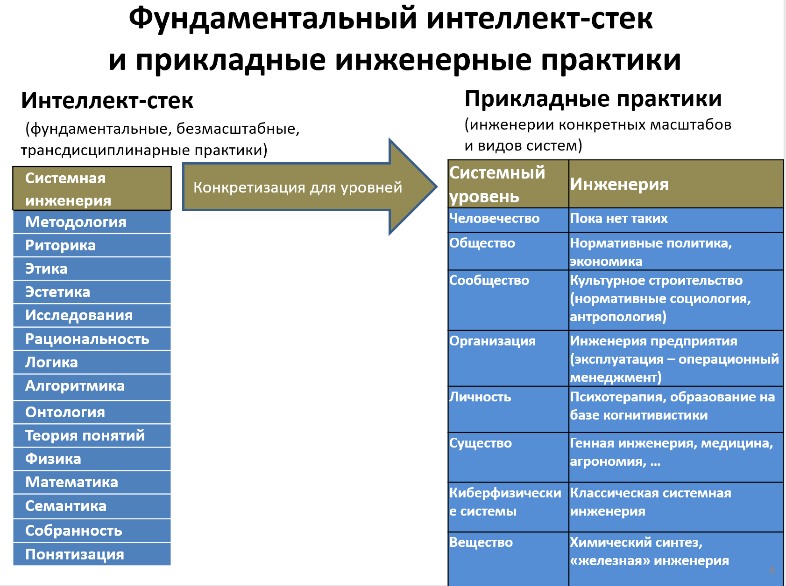

Можно думать о науке, ищущей компактное описание самой инженерии
(engineering science) --- эта наука должна рассказать о том, что делает
системный (да и любой другой) инженер в ходе инженерного проекта.

Отношение к системной инженерии как к науке среди системных инженеров
киберфизических систем обычно отрицательное (хотя они и признают её
полезность). Это отношение связано с тем, что «наука» (объяснительные
теории, научное знание) обычно никогда не рассказывает, как породить ту
или иную идею и потом как эту идею проверить и реализовать. Без «науки»
трудно решать практические задачи, но сама наука обычно ничего не
говорит о том, как породить идею решения. Это просто реализация
асимметричности, свойственной системам с памятью, вариант основной догмы
молекулярной биологии для меметики: если мощная (решающая много проблем,
объясняющая происходящее в сложных ситуациях) идея/мем в форме
объяснительной порождающей теории есть, то можно породить фенотип
системы, учитывающий в себе влияние этого мема. Если мощной идеи по
объяснению каких-то проблем нет, то новая такая идея не может быть
выведена из «опыта жизни системы», она привносится в теорию каким-то
другим способом, «мутациями», то есть догадками, которые строятся на
случайностях и интуиции, проходящих потом сложный отбор критикой.

По факту речь идёт об (инженерной) деятельности, и объяснения того, как
устроена деятельность, какие важные в ней выделить объекты, как описать
деятельность --- это задача методологии, объяснительной теории,
увенчивающей интеллект-стек. Беда в том, что если вам нужно породить
какую-то деятельность, то непонятно как её сделать: как сделать догадки
о важных для инженерии объектах (скажем, как описать целевую систему ---
как догадаться, что она вообще нужна, как догадаться, как она может быть
устроена, как описать это так, чтобы можно было воплотить эту систему в
физическом мире со стоимостью меньшей, чем ожидаемые выгоды от её
применения), как обосновать эти догадки (как сделать инженерные
обоснования), как потом воплотить это всё в жизнь (принять решения на
основе гипотез --- это ещё не сделать, результат действия ведь может
быть неожиданным).

Методология рассказывает о том, какие есть в мире объекты, их
характеристики и отношения друг с другом, что можно с этими объектами
делать. Что с этими объектами делать для решения конкретных задач ---
неведомо. Никакое знание физики не позволяет само по себе решать даже
олимпиадные задачки по той же физике, что уж говорить о решении реальных
проблем. Но без знания физики и олимпиадные задачки, и инженерные
проблемы решать труднее. Наука/исследования аналитичны, они посвящены
критике догадок, их опровержению. Инженерия же связана с решением
проблем (проблема --- когда никто не знает, что делать) и требует
синтеза (прежде всего модульного синтеза, который будет разбираться в
разделах по разработке и принятию архитектурных решений). Это
творчество/изобретательство, его нельзя выполнить алгоритмически
«быстрым выводом по правилу», оно связано с базирующимися на
случайностях и запоминании удачных случаев генетическими/эволюционными
алгоритмами, выполняемыми или компьютерами, или людьми, или гибридно
целыми коллективами людей с их компьютерами.

К сожалению, сведение всей инженерии только к науке («нет теоретического
обоснования --- не инженерия») и «аналитике/критике» без сопутствующих
догадок по синтезу в ущерб практической деятельности по решению проблем,
в том числе с помощью «ненаучных» по своей природе догадок-эвристик
отражено и в учебных курсах по инженерии систем самых разных уровней.
Так, по отношению к киберфизическим системам руководитель NASA Michael
Griffin в речи 2007 г. (и с тех пор мало что изменилось) «System
Engineering and the Two Cultures of
Engineering»^[<http://www.spaceref.com/news/viewsr.html?pid=23775>]
даёт критику расхожего инженерного образования, которое учит
«аналитике/критике/объяснениям», а не инженерии:

I have always loved the view of the engineering profession captured by
the great Theodore von Karman when he said, \"Scientists study the world
as it is; engineers create the world that has never been.\" Less
eloquently, engineers are designers; they synthesize knowledge to
produce new artifacts. Von Karman speaks to what most of us, and
certainly most laymen, would consider the essence of engineering:
engineers create things to solve problems.

But all of us who are engineers know that the engineering profession
also has a rich scientific side, the analysis of these artifacts and the
prediction of their behavior under various environmental and operational
conditions. Adapting von Karman\'s observations, it may be said that
engineering science is the study of that part of the world which has
been created by man.

Sadly, many students have been led to believe that engineering science
is engineering! In a curriculum of 120 or more credits leading to a
bachelor\'s degree in a branch of engineering, the typical student is
required to take one, or maybe two, courses in design. Everything else,
aside from general-education requirements, focuses on the analysis,
rather than the creation, of engineered objects. Graduate education
often has no design orientation at all. So, engineering as taught really
deals with only a part of engineering as it is practiced.

И то же самое можно говорить о создании и модификации систем самых
разных масштабов и видов, включая общественные.

Основное, что должен уметь делать системный инженер --- это *создавать*
материальные объекты, а *анализировать/критиковать/объяснять* их --- это
подчинённая синтезу задача. Упор на квазиоптимальный синтез и
непрерывные попытки его улучшить и вписать результат в непрерывно
меняющееся окружение, а не упор на «строго научный анализ» характеризует
инженера. Нужно учить в том числе и **создавать** (а хоть и опираясь на
генетические/эволюционные алгоритмы), а не только **объяснять** **и
критиковать**!

Примерно такое же рассуждение проводится про образование
менеджеров-предпринимателей как инженеров организационных систем. Henry
Minzberg считает, что выпускников MBA (Master of Business
Administration, оргинженеров) готовят как аналитиков, а не синтетиков.
Из них получаются не столько предприниматели-руководители (организаторы,
инженеры) предприятий, сколько начальники финансовых и прочих
аналитических отделов компаний --- тех подразделений, где основным
продуктом являются «отчёты», описания/объяснения. А потом совсем другие
люди (часто с базовым высшим инженерным образованием --- типа Элона
Маска в Tesla, Дженсена Хуанга в NVIDIA) по этим отчётам принимают
синтетические решения и реализуют какие-то идеи на практике.

В какой-то мере этот тезис примата творчества/синтеза над
аналитикой/критикой подтверждается опытом Школы системного менеджмента:
в неё приходят учиться на курсе системного менеджмента (специализация
курса системной инженерии для целевых систем уровня организации)
выпускники программ MBA, и от многих из них после выпуска независимо
поступают отзывы на курс, что «только сейчас стало понятно, чему учили
на MBA и как это использовать». Всё-таки нужно знать практику
**системной инженерии** (ей посвящён этот наш курс, который вы сейчас
изучаете), и затем желательна конкретизация практики для того типа
целевых систем, которым приходится заниматься в проектах (будь то
вещества, киберфизические системы, существа, личности, организации,
сообщества, общества или даже человечество в целом), то есть нужно будет
проходить ещё и самые разные многочисленные курсы **прикладных**
**инженерий** (программной инженерии, механической инженерии, генной
инженерии, инженерии киберфизических систем, психотерапии, социальной
инженерии, хореографии и т.д., их огромное разнообразие). А поскольку
одному человеку всё это богатство прикладных инженерий для успеха
проекта познать невозможно, то дальше нужно будет думать, как учить
инженерии даже не одного человека, а целую инженерную команду, каждый
член которой будет хорошо выучен фундаментальной системной инженерии, но
потом немного разному набору прикладных инженерий.

Один из системных инженеров NASA привёл пример, в котором сравнивает
инженерную науку (в том числе ту, которой обучают в университетах) с
порнографией: можно сколько угодно тратить времени на «аналитический»
просмотр и обобщение бесконечного числа порнофильмов, но все эти часы и
часы псевдоопыта «изучения» и «аналитики» можно было бы потратить на
получение собственного опыта «синтетики», опыта действия, получив при
этом не меньше удовольствия, чем от «аналитического» просмотра порно.
Ну, и овладение всеми возможными классификациями увиденного, знакомство
с хитрой терминологией и прочие «атрибуты научности/аналитичности»,
почерпнутые из просмотра видео могут абсолютно не помочь (а то и
помешать) в конкретной жизненной ситуации, требующей синтеза. Так что
некоторые сегодняшние системные инженеры NASA предлагают больше уделять
внимания творческой/синтетической работе в проектах, а не заниматься
чтением учебников по инженерной науке типа нашего курса. С этим
сравнением нельзя согласиться:

-   Инженерная наука 2022 года, опирающаяся на современную системную
    методологию третьего поколения (выходящую на масштаб времени
    техноэволюции, а не только жизненного цикла одной версии системы),
    абсолютно другая, нежели даже пять лет назад, когда стало очевидно,
    что революция continuous delivery и в программной инженерии победила
    массово, и в «железной» инженерии. Например, это видно по стилю
    работы SpaceX сначала над Falcon 9, затем над Starlink, затем над
    Starship.
-   Методы образования стали совсем другими. Так, сегодня очевидно, что
    наука даёт типы объектов внимания, которые являются
    мета-мета-моделью к типам мета-модели предметной области
    (общекультурной и конкретного варианта в вашем предприятии), а та в
    свою очередь задаёт типизацию конкретных объектов в конкретном
    проекте в жизни, то есть типизацию (операционной) модели. Вот этой
    работе с типами и нужно учить, в этом залог привязки теории к жизни.
    Вот цитата одного из студентов ШСМ: «Раньше плохо понимал тему
    жизненных циклов и отличия их версий 1.0 от 2.0. Сейчас понимаю, что
    сложности были связаны с тем, что не понимал отличия практики от
    работы. После того, как разобрался, автоматически стало понятно и с
    жизненным циклом. А с практиками не мог разобраться, потому что
    плохо понимал роли, которые в свою очередь не понимал, потому что не
    умел обращаться с объектами ментального пространства. На курсе ОиК
    \[сейчас это «Моделирование и собранность»\] научили думать про ОМП
    \[объекты ментального пространства\] и в результате вся цепочка
    выправилась»^[<https://blog.system-school.ru/2022/06/11/kurs-metodologiya-2022/>].
    То есть применимость знаний системной инженерии непосредственно
    связана с умением обращаться с абстрактными/идеальными объектами,
    они же объекты ментального пространства, но отнюдь не во всех вузах
    инженеров этому учат явно, как и не учат всегда привязывать эти
    объекты к каким-то ситуациям в физическом мире, заниматься
    заземлением/grounding. Отсюда и легенды о «неприменимости знаний в
    жизни». Не «неприменимость», а «неумение применить»!
-   Сама инженерия стала сложнее, и просто «пробовать работать» уже не
    получится: слишком низка вероятность хорошего результата. Нужна
    теория, даже если она и не закрывает 100% проблем. Никакая теория не
    закрывает 100% проблем и всегда нужно подключать фундаментальное
    мышление, а также всегда нужно подключать эволюционные алгоритмы и
    делать какие-то догадки, а не «всё выводить из теории». Но если не
    опираться на теорию, а основываться исключительно на «смекалке и
    натиске», то всё в проекте будет медленно и ресурснозатратно, со
    скоростью естественной, а не «умной» эволюции: системы вы не
    создадите. Мутации должны быть «умными», и желательно максимум их
    порождать из теории, а не только о них догадываться.

Системные инженеры постулируют примат инженерного опыта над инженерной
наукой, хотя также и признают важность науки (ибо без признания важности
науки можно скатиться назад, к древним временам инженерии исключительно
проб и ошибок, не оптимизированной моделированием/теоретизированием
эволюции), просто оформляемый эвристиками инженерный опыт на любой
момент времени много, много больше той территории, которая уже отвоёвана
наукой с её хорошо проведённой критикой удачных догадок, дающих
компактные объяснительные модели.

Наш курс по (безмасштабной и непрерывной) системной инженерии решает
вопрос о балансе инженерной науки и инженерной практики так:

-   Курс активно использует знания о том, как устроено мышление, знание
    об интеллекте. Речь идёт тут о фундаментальных дисциплинах из
    интеллект-стека. Это пререквизит к нашему курсу.
-   Сначала наш курс в первом разделе даёт самую общую объяснительную
    теорию инженерной нормативной науки, включая объяснения границ
    применимости этой теории (объяснения границ применимости --- это как
    раз текущий и предыдущий подразделы курса, которые вы сейчас
    изучаете).
-   Знание принципов освобождает от знания множества фактов. Инженерам
    нужно сразу знать (а не догадываться по ходу проекта), каковы
    основные объекты, с которыми работают инженеры в их основных
    подролях, в чём суть работы тех или иных инженерных подролей и что
    инженерные роли делают с их основными объектами (нормативный аспект
    теории, например, «вы как архитектор должны принимать архитектурные
    решения в вашем проекте, понимая приоритеты в реализации
    архитектурных интересов», и т.д.). Это основной материал курса, он
    изложен в следующих разделах.
-   Курс содержит отсылки к конкретизациям практик системной инженерии
    для отдельных видов систем разных
    системных/эволюционных/системноинженерных уровней. Знакомство с
    конкретными/прикладными инженерными практиками для отдельных видов
    систем крайне важно, но оно происходит на втором шаге и предполагает
    прохождение дополнительных курсов (по программной инженерии,
    инженерии киберфизических систем, системному менеджменту как
    инженерии предприятия, и т.д.): нужно понимать, что мастерство во
    владении отдельными практиками набирается достаточно долго, и по
    каждой прикладной практике и даже их подпрактикам есть курсы даже
    более объёмные, чем наш.

Вот общая схема того, как устроено инженерное знание с точки зрения
нашего курса:

Конечно, это только дисциплины, изучение которых происходит в самых
разных курсах. Обзор фундаментальных дисциплин можно найти в курсе
«Интеллект-стек».

Теоретическое знание нашего курса должно «оживляться» на материале
конкретных инженерных проектов, при этом для простых проектов даже не
предполагается знания по прикладным курсам инженерии каких-то видов
систем.

Для профессиональной работы системным инженером (помним, что эта работа
отнюдь не всегда называется «системной инженерией», а роль «системным
инженером», помним о «коуче», «политике», «агрономе» и т.д.)
дополнительные прикладные курсы обязательны! Кругозорных курсов хватает
обычно только для любительской работы, в крайнем случае --- для помощи в
постановке задачи прикладному профессионалу, который с вами беседует,
чтобы хотя бы примерно понимать, что он будет делать и почему, и какие
его вопросы будут интересовать, и о чём с ним вообще можно говорить, а о
чём нужно говорить с другими прикладными ролями.

Так что наш курс не рассчитан только на «прочтение» и запоминание
указанных в ней типов объектов. Нет, материал курса должен лечь в основу
практической работы, в которой теоретическое знание курса о
мета-мета-модели системной инженерии соединяется с практическим знанием
прикладной предметной области применения этой инженерии в её
общекультурном/кругозорном варианте и варианте, принятом в вашем
предприятии, и далее идёт аннотирование/классификация типов мета-модели
этой прикладной предметной области типами мета-мета-модели. Это описано
в нашем курсе моделирования и собранности, повторено в курсе системного
мышления, подробно на примерах раскрыто в курсе методологии (это всё
пререквизиты к нашему курсу системной инженерии!), а после прохождения
нашего курса системной инженерии будет ещё и уточнено, и потренировано в
курсах программной инженерии, инженерии киберфизических систем, курсе
системного менеджмента (как курсе инженерии организационных систем),
других прикладных курсах.

**Нет ничего практичней, чем хорошая теория, но без занятий реальной
инженерной деятельностью** **в рабочих (не учебных!) проектах** **эту
практичность предъявить нельзя. Тот, кто прочёл много книг по танцам, но
никогда не танцевал сам, вряд ли сможет станцевать при случае. К
инженерам (агрономам,** **менеджерам,** **политикам, кому угодно) это
тоже относится.**
