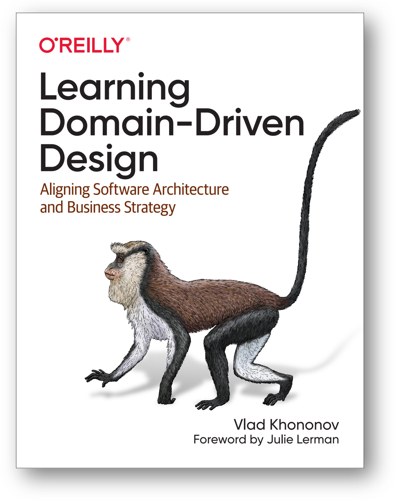
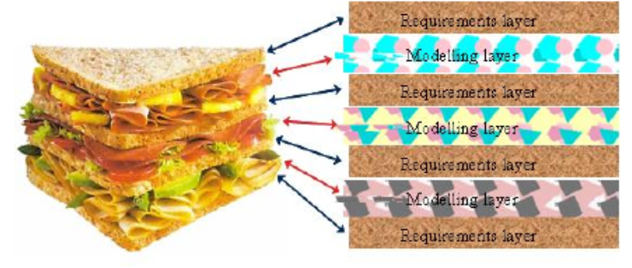
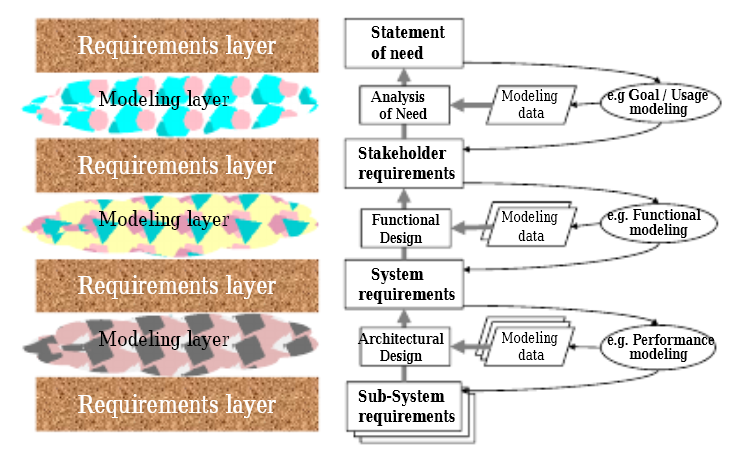
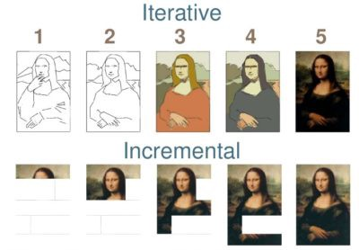

Если бы этот курс писался до примерно 2017 года, то в нём обязательно
была бы раздел по практике инженерии требований как подпрактике
системной инженерии, которой занимался бы инженер по требованиям как
подроль системного инженера. Где-то с 2017 года в литературе по
программной инженерии вдруг перестали появляться новые книги по
инженерии требований, а в 2022 году и в «железной инженерии» такие книги
стали редкостью. Развитие инженерии требований прекратилось, а в работах
по инженерии исчезла и практика инженерии требований. Это очень
контринтуитивно: если система не описана как чёрный ящик в деонтической
модальности (это и есть «требования»), то как архитектор и разработчик
узнают, какую систему нужно делать? Как испытывать систему, если нет
требований? Увы, это всё вопросы, которые осмысленны в уходящем веке
«водопадной системной инженерии», где каждая роль выполняет по очереди
свою практику и передаёт результат дальше по цепочке.

В книге «Learning Domain-Driven Design. Aligning Software Architecture
and Business strategy», 2022, Vlad Khononov рассказывает, что
традиционный ход разработки корпоративного программного обеспечения
(часто называемого «кровавый энтерпрайз» в среде программистов)
представляется как перевод разными людьми какого-то знания об
организации на свой собственный профессиональный язык, а затем передача
текстов и моделей дальше по цепочке --- и это «испорченный телефон»,
детская игра, где не очень разборчиво все говорят какую-то фразу друг
другу на ухо по цепочке, и на выходе получается что-то совсем невнятное.
Вариант этой игры --- попытки передать какие-то стихи через цепочку из
двух-трёх переводчиков на разные языки. Когда итог переводится на язык
оригинала, текст уже невозможно узнать.

Вот эта цепочка:

-   Знание предметной области организации переводится в «аналитическую
    модель» аналитиками
-   Аналитическая модель затем становится требованиями, этим занимаются
    инженеры по требованиям
-   Требования становятся проектом/design программной системы, этим
    занимаются архитекторы (или даже сразу разработчики, в которых
    архитекторов не выделяют)
-   Проект/design системы становится исходным кодом,
-   Исходный код становится изготовленной системой.

И это мы ещё не коснулись тестов, учебных материалов для пользователей и
многих других рабочих продуктов. Нам нужно сделать так, чтобы разговор
шёл на одном языке, поэтому убираем цепочку: разработчики должны
говорить с пользователями и операторами системы на одном языке, языке
предметной области. Если речь идёт о финансах, то это язык не инженерии
программного обеспечения, а язык финансов. Если это софт, помогающий
маркетингу, то это язык маркетинга, но не язык программистов. Никаких
«серверов», «асинхронных передач сообщений», «баз данных» в обсуждениях!
Обсуждается то, что должна делать система.

Второй аргумент в том, что деонтический характер требований как-то не
очень вяжется с коллективным характером мышления в разработке. Любая
разработка сегодня понимается как часть эволюции, часть познания, часть
изучения того, как уменьшить неприятные сюрпризы. И «ты поручил
дурацкое, я тебе сделал дурацкое» тут не очень правильная парадигма.
Более правильный подход тут в том, что мы используем «научный метод»,
который оказывается общим и для науки, и для инженерии. Только в науке
мы делаем гипотезы о том, каковы могут быть лучшие объяснения, а в
инженерии мы ещё и делаем гипотезы о том, какова может быть успешная
система, которая меняет жизнь к лучшему. Какие-то идеи могут быть
удачны, какие-то нет. Поэтому мы критикуем эти идеи, выбираем лучшие из
худших (это особо оговаривается: **оптимальных решений нет, поэтому
всегда выбираем не лучший вариант, а наименее плохой**) и реализуем их,
проверяя уже жизнью. Потом пробуем улучшить эти идеи, а если не
получается улучшить, отказываемся от этих идей и пробуем что-то ещё.

В таком варианте нет требований, но есть какие-то идеи о том, какой
могла бы быть система, меняющая жизнь к лучшему (ну, или хотя бы новое
поведение/функция системы, функциональный объект, его выполняющий
называют feature).

В организационном менеджменте такие идеи называют «предпринимательская
гипотеза» (если речь идёт о выпуске нового продукта или новой «фичи» в
продукте), а в инженерии такие идеи имеют специальную форму и их
называют «концепция», для системы в целом это могут называть
пользовательская концепция (operations concept, OpsCon) или концепция
использования (concept of operations, ConOps), причём разные школы
инженерии или находят нюансы в различении этих понятий, или наоборот,
считают одним и тем же. Мы будем следовать предложениям книги «Systems
Architecture. Strategy and Product Development for Complex Systems»,
2016, и говорить о просто концепции/concept использования, без нюансов
различения.

Эта книжка уже не про программную архитектуру, а системную (прежде всего
киберфизических систем, типа ледовой буровой платформы или космического
корабля) архитектуру, но в подзаголовок и в одной книге, и в другой
книге вынесена «стратегия»: ожидаемое поведение фирмы, которое должно
привести к успеху. В принципе, и «стратегию» можно было бы считать
архитектурными требованиями к предприятию, но этого слова «требования»
избегают, чтобы не быть обвиняемыми в следовании старому подходу
«испорченного телефона», когда внешние проектные роли общаются с
командой проекта через специально выделенных инженеров по требованиям,
которые отсекают много важной для разработчиков информации. К тому же и
слово «архитектурный» для важных требований устарело: «архитектурный»
теперь относится не ко всему важному, а только к архитектурным
характеристикам, о чём будет подробней в следующем разделе. «Стратегия»
это не столько долженствование/требования::деонтическая модальность,
сколько концептуальная гипотеза/догадка::доксическая модальность.
Требования выполняют, гипотезы проверяют. Реализация стратегии --- это
не выполнение требования, ведущее к гарантированному результату. Это
подтверждение предпринимательской гипотезы, ведущее к возможному, но не
гарантированному успеху. Это означает, что стратегия может быть
подправлена. И несмотря на то, что книжка описывает вроде как «водопад»,
много внимания в ней уделяется идее постепенного уточнения концепции в
ходе работы над проектом.

**Концепция** **системы ---** это описание основной идеи модульного
синтеза: каким образом какой-то набор конструктивных частей целевой
системы исполняет роли функциональных частей системы, чтобы в конечном
итоге выдать требуемый от системы сервис на уровень надсистемы.
**Архитектура системы** при этом накладывает на концепцию системы
ограничения: говорит о такой разбивке на модули, которые дают
необходимые архитектурные характеристики: высокую скорость
развития/evolvability для времени создания системы, возможность
масштабирования как увеличения производительности по мере роста
потребности в сервисе системы, собственно самой производительности
системы, и т.д.

**Концепция использования** --- это описание основной идеи модульного
синтеза **надсистемы**: каким образом целевая система как конструктивная
часть играет в надсистеме функциональную роль, позволяющую достичь
нужных функциональных и/или архитектурных характеристик надсистемы, то
есть удовлетворить потребности внешних проектных ролей.

В упомянутой книге концепция системы характеризуется просто как
«основная идея», а вот архитектура даётся по-старинке, как дополнение и
расширение концепции в сторону прозрачного ящика, причём учитывается уже
не только функциональное и конструктивное разбиение системы для
выполнения целевой функции, но и размещение, стоимость как другие
основные аспекты системного рассмотрения, а также достижение каких-то
важных архитектурных характеристик/-ilities/-остей (надёжность,
ремонтопригодность и даже изменяемость в ходе развития). То есть
архитектурные решения по книге просто детализируют концепцию системы в
части модульного синтеза, учитывая множество дополнительных соображений
кроме «вот эти функции можно реализовать вот такой конструкцией, чтобы
добиться вот таких сервисных характеристик системы-модуля в целом». В
современном подходе архитектурные решения не столько детализируют
решения концепции, сколько накладывают ограничения на концепцию: «вот
эта конструкция должна быть разбита на вот такие части-модули, чтобы
добиться вот таких-то архитектурных характеристик».

В книге для рассказа используется диаграммная техника OPM
(object-process modeling), в которой есть объекты, связанные друг с
другом отношениями. И среди этих объектов выделяют функции (поведение),
которые выполняются некоторыми инструментами (конструктивными объектами)
над некоторыми пассивными объектами («молоток бьёт по гвоздю»). В курсе
«Системное мышление» отмечался такой подход: в некоторых инженерных
традициях не принято говорить о функциональных объектах, а принято
говорить о поведении/функции, само же поведение-функция приписывается
потом сразу конструктивным объектам, функциональные объекты при этом
подразумеваются. Конструктивные объекты в упомянутой книге по системной
архитектуре называют «формами». То есть вместо «камень::конструктив
играет роль забивала::функциональный объект, а забивало
забивает::функция связыватель::функциональный объект, роль которого
играет гвоздь::конструктивный объект» говорят короче:
«камень::форма/конструктив забивает::функция гвоздь::конструктивный
объект». Таким образом, весь рассказ о забивале довольно легко понять:
концепция использования это архитектурная работа (функциональная
декомпозиция и модульный синтез), как она обычно понималась раньше в
системной инженерии, только на буквально один уровень, это уровень
берётся в надсистеме (забивало нужно там), но сегодня это уже не
называют архитектурной работой, ибо архитектурная работа оказалась про
архитектурные характеристики, а не про реализацию целевой системой
функции в надсистеме.

Раньше о концепции использования предпочитали не говорить:

-   Кто-то приходил с идеей, затем кто-то разрабатывал концепцию
    использования, и это был «мутный вопрос», в учебники по системной
    инженерии он не попадал. Скорее, это был вопрос маркетологов,
    политиков, предпринимателей, кого угодно, но не инженеров. Они могли
    общаться с инженерами, но в формальный жизненный цикл это не
    попадало. Только некоторые школы системной инженерии соглашались,
    что разработка концепции использования входит в жизненный цикл
    инженерного проекта, в большинстве других школ в этом месте просто
    говорилось, что «надо написать текст на несколько страниц с основной
    идеей», не прояснялось как это делать и кто это делает. Когда
    приходят к инженерам, то уже кто-то сформулировал концепцию
    использования. Если это и делали инженеры, которые искали себе
    работу, а потом «продавали» идею предпринимателям, то это не
    акцентировалось. Это не было «работой инженера». Инженеры дальше
    могли предлагать концепцию системы.
-   Концепцией использования дальше занимался инженер по требованиям. Он
    делал реверс-инженерию надсистемы и документировал в виде
    спецификаций требований описание целевой системы, которая должна
    будет удовлетворить потребностям. Разработчики системы (прикладные
    инженеры, архитекторы, специалисты по инженерным обоснованиям) тем
    самым отсекались от общения с внешними проектными ролями. Это
    пытались исправить ходом на «модели требований», где кроме
    собственно формулировок требований пытались отметить, что кто из
    внешних проектных ролей говорит, на чём настаивает (переход на язык
    предметов интереса и интересов вместо языка конкретных значений, а
    также указание ролей, высказывающих свои интересы и их конфликтов,
    которые нужно как-то решать).
-   Требования передавались системным инженерам, которые принимали
    решения по поводу концепций на следующих уровнях, и уже они
    формулировали требования на уровень ниже. Скажем, идея нового
    самолёта приходила откуда-то «из бизнеса» (хотя неформально активно
    обсуждалась с инженерами), потом составлялись требования, потом
    архитектор делил проект на части и формулировал требования к
    двигателю, выбирая его концепцию: реактивный он будет,
    турбореактивный, или двигатель внутреннего сгорания для приведения в
    движение пропеллера. Эта «концепция следующего уровня» так даже не
    называлась, а архитектор просто выступал инженером по требованиям по
    отношению к архитекторам следующего уровня (архитектор самолёта
    выступал инженером по требованиям по отношению к архитекторам
    авиадвигателя).

В жизни всё работало совершенно не так, но обсуждалось именно так. И
главным документом были «концепция использования» (ConOps и OpsCon, с
попытками их различения и наоборот, неразличения) в виде текстов
спецификаций требований. Ключевая модель концепции системы (с верхним
уровнем как концепции использования) выглядела как «модель
сэндвича»^[<https://www.researchgate.net/publication/285405191_712_The_Systems_Engineering_Sandwich_combining_requirements_models_and_design>],
2004 год.

Хлебом как раз были «слои требований». А поскольку требований
оказывалось много разных, они начали получать разные названия:

Проблема была в том, что в этих картинках требования считались
неизменными (раз и навсегда определяемыми), а моделированию позволялось
изменяться по ходу всё лучшего и лучшего понимания предметных областей.
«Заказчик» вроде как обязывался быть стабильным (как будто он сам не
инженер! Как будто он обладал изначально совершенным знанием того, что
ему нужно!), а модельеры каждого уровня могли только торговаться по
поводу удовлетворения этих стабильных требований. Эти спецификации ещё и
ограничивали, как выяснилось, генерацию изобретательских
идей^[<https://www.researchgate.net/publication/343999144_How_Formal_Requirements_Specifications_Inhibit_Creativity_in_Software_Engineering>,
и то же самое про шаблонизированные требования
<https://www.researchgate.net/publication/354528878_How_Templated_Requirements_Specifications_Inhibit_Creativity_in_Software_Engineering>.
Эта тема «иллюзии требований» разрабатывается с 2013 года,
<https://www.researchgate.net/publication/255831240_The_Illusion_of_Requirements_in_Software_Development>].

Требования в жизни оказались непрерывно изменяющимися на всех уровнях,
но это не отражалось ни на каких диаграммах, в головах был «водопад».
Включая требования самого верхнего уровня. Время проекта идёт, и
одновременно меняются все требования.

Основное время проводилось за самыми разными моделями «чёрных ящиков»
(не показаны на диаграммах сэндвича! Все эти use cases, концепции
использования, разные варианты сценариев, списки внешних проектных ролей
считались просто вспомогательными для получения требований), которые
рассматривались в их связи с моделями прозрачных ящиков (показаны как
modeling layer), по которым потом генерировались требования для передачи
дальше по цепочке «испорченного телефона». Так, знание use cases, из
которых и извлекались требования, дальше по цепочке от инженеров по
требованиям никуда от них не попадало, передавались только требования.
Встречи разработчиков с агентами, исполняющими внешние проектные роли
считались злом, отвлекающим от работы, общаться предлагалось только
инженерам по требованиям. Разработки при этом шли, но очень медленно и
дорого, при этом много действий происходило в проекте неформально, вне
всяких регламентов и предписаний методологий разработки. Любое изменение
в понимании системы и её окружения становилось адом: изменять часто
нужно было требования, которые представлялись всем незыблемыми. То есть
«изменение незыблемого» было постоянно, ощущалось это как непрерывная
авария, непрерывный пожар в проекте.

Главным инструментом моделирования для получения требований стали
краткие текстовые описания того, как ведёт себя система (концепции
использования) и use cases: сценарии, по которым система как целое (или
части системы как целое) взаимодействуют со своим окружением. Напомним,
что в use cases некоторые акторы/агенты (живые и неживые, просто
способные к взаимодействию) как-то взаимодействуют с системой, и
показываются реакции системы, её поведение, которое и оказывается
функциями системы. А требования? Они появлялись в результате
документирования как-то уторгованного среди разных внешних и внутренних
проектных ролей понимания того, как ведёт себя система (или подсистема)
в разных вариантах взаимодействия с окружением.

В итоге было признано:

-   Важны не требования, а непрерывно уточняющиеся поведенческие модели
    (модели изменения состояний в ходе функционирования), то есть
    сценарии использования. Эти модели отражают непрерывно меняющийся
    набор гипотез о том, что должна делать успешная система. Поскольку
    вопрос об успешности системы (успешности подсистемы, и т.д. по
    уровням), то в этих моделях должны учитываться и внешние проектные
    роли (а внутренние проектные роли вполне могут быть внешними
    проектными ролями для подпроектов: разработчик самолёта будет
    внешней проектной ролью по отношению к разработчику авиадвигателя).
-   Этими моделями должны заниматься сами разработчики без посредников в
    лице «аналитиков» или инженеров по требованиям. Прикладные
    разработчики, или архитекторы --- это уже не так важно, главное, что
    без «испорченного телефона».
-   Если «требования изменились», то их нет --- и нечему меняться.
    Меняется (уточняется!) понимание, отражаемое в моделях. А модели
    (чёрного ящика и прозрачного ящика) меняются штатным порядком. Люди
    при этом меняют своё мнение, аргументы берутся из моделей и
    основываются на результатах моделирования и проводимых
    экспериментах. Любая реализованная версия системы объявляется
    прототипом для следующей улучшенной и дополненной новыми «фичами»
    версии, даже если это всего один экземпляр: никакой экземпляр в
    эволюционной разработке не является последним. Если летит ракета на
    Марс, то это не единственная попытка. Будет получено новое знание, и
    модели для следующей ракеты поменяются. Каждая следующая ракета
    будет лучше!

Что же сегодня предлагается «вместо требований»? Набор
постепенно/инкрементально уточняющихся и изменяющихся моделей и других
описаний «чёрного ящика» (а иногда и «серого ящика», то есть на
несколько системных уровней), по которым и ведётся разработка полной
архитектуры. Важно, что не постепенно/итеративно, а
постепенно/инкрементально уточняющихся моделей. Вот картинка, которая
поясняет разницу:

Видно, что при итеративной разработке мы с самого начала представляем,
чего хотим, и потом потихоньку уточняем детали на каждой итерации (и нет
собственно «инкрементов» в продукте, есть просто повышение детальности).
В инкрементальной разработке мы сразу не очень понимаем, чего хотим, и
добавляем какие-то кусочки --- и всеми этими кусочками можно
пользоваться. Если мы делаем карандаш, то в итеративной разработке на
первой итерации мы делаем карандаш из глины и угля в бумажном пакетике,
затем потихоньку меняем глину на пластик, уголь на графит, пакетик на
картонную коробку. В инкрементальной разработке даём пользователю
шикарный современный графитовый (или тоже пластиковый) грифель, он им
пользуется, но пачкает руки. Добавляем пластиковый корпус к грифелю, но
пачка карандашей рассыпается по столу и неудобно продаётся. Добавляем
картонную коробку. Понимаем, что можем положить в коробку и точилку,
чтобы её покупали у нас, а не у конкурентов --- и делаем её той же
расцветки, что и коробку, чтобы уж точно не путали «наше» и «не наше».

Модель карандаша при этом существенно меняется, при этом поначалу и
карандаша нет как продукта, а потом карандаш становится только частью
продукта.

Требования в инкрементальной разработке тем самым получаются вроде как к
каждому инкременту, но они достаточно малы, чтобы делать отдельную
спецификацию и быстро меняются. Проще использовать модели, по которым
эти требования раньше разрабатывались. А теперь будем разрабатывать по
этим моделям сразу продукт и тесты для обоснования его успешности
(включая понимание продаж как тестов по определению успешности гипотезы
самого продукта).

Как устроен это набор моделей? Как сэндвич, где эти модели вместо
требований? Нет, от сэндвичей как общего принципа тоже начали
отказываться, ибо там нет строгой слоёной структуры: есть и модели
«монолитные» для маленьких систем, есть и «слоёные» (тот самый сэндвич),
но есть и сетевые/mesh, самые разные. Модель разработки предлагается
выбрать из архитектурных соображений, и этим выбором озабочены
архитекторы. Это мы рассмотрим подробней, когда будем заниматься
архитектурой в следующем разделе.

А как проводить испытания, если нет требований? По итогам моделирования
проводятся замеры определяемых в ходе моделирования характеристик
системы (необязательно «достижение характеристик»), и дальше
обосновываются на их основе или изменение проектных решений, или
признаётся, что система успешна. То есть требований нет, а вот тесты
есть.

Почему же тогда тесты не назвать требованиями? Потому что это не
требования, а тесты (и раньше тесты разрабатывались на основе
требований, они ведь отличались от требований и назывались
тесты/испытания, были программы испытаний). Ровно так же use case это
use case, а не требования (они ведь и раньше различались): проблема не в
переименовании, а в том, что перестали делать продукт «спецификация
требований», который отражает описание чёрного ящика в деонтической
модальности. Делаются гипотезы по поводу возможных таких описаний, эти
гипотезы документируются в виде набора самых разных моделей и текстов,
они тем самым не очень «требовательны», но «предположительны» и
предполагают постоянное изменение по мере изменения общей проектной
ситуации (внешние изменения в мире, изменения в бизнесе, изменения в
понимании инженеров, учёт новых изобретений и т.д.).

Этот подход (беседа с разработчиком, документирование гипотез
разработчика предложением тестов вместо требований) был использован даже
для «неживых программистов», а именно для генератора кода
TiCoder^[<https://arxiv.org/abs/2208.05950>]
(test-driven interactive coder), который был разработан на основе
больших языковых моделей. В этой работе уточняли намерение
человека-программиста, подтверждая или опровергая предложения TiCoder и
получили соответствие кода намерениям в 90.4% случаев. Практику/workflow
назвали TDUIF (test-driven user-intent formalization). Код
компьютер-разработчик напишет лучше программиста-кодера, но для него
нужно поставить задачу. Формализовать задачу до уровня, достаточного для
однозначного решения задачи в форме кода программы можно в ходе диалога
(непрерывное уточнение задачи), а не просто написав какие-то требования!

Конечно, рассказанная здесь история произошла главным образом в
программной инженерии (включая, как видим, и работы по автоматизации
работы программных инженеров), в меньшей мере инженерии киберфизических
систем, ещё меньше в строительстве, а во многих других сферах оказалось,
что «когда караван поворачивает, хромой верблюд оказывается впереди»:
там не наладили работу по требованиям, поэтому отказа от требований и не
будет. Другое дело, что в проектах стало нужным разработчикам кроме
моделирования самой системы «от границы внутрь» моделировать и внешнее
поведение системы в плотном контакте с внешними проектными ролями,
которые знают поведение системы «от границы наружу» (стандартный ход
системного мышления: сначала смотрим функцию «наружу», и только потом
конструкцию «внутрь»). В этом плане в огромном числе прикладных
инженерий (скажем, в медицине, образовании, политике) отсутствие
требований не означает современного (SoTA, state-of-the-art) состояния,
ибо нет и моделирования, нет создания концепции.

В жизни вы сегодня увидите и отсутствие каких-то моделей и требований
(«доинженерное» состояние в какой-то прикладной инженерии), и работу с
требованиями (скорее всего, в классической «железной инженерии») и
современную ситуацию с моделированием концепции-как-гипотезы вместо
требований (скорее всего, во фронтирных IT-компаниях). Это как
пелетон/пелотон, когда велосипедисты вдруг растягиваются на несколько
километров --- и у первых из них одни проблемы, у плотной серединки
другие проблемы, а у плетущихся в хвосте полное непонимание и проблем
лидеров, и проблем «середнячков», они безнадёжно отстали и им бы просто
не сойти с дистанции.

Вам же нужно понимать, в каком месте пелетона вы очутились, и не
удивляться, если в разных подпроектах будут приняты разные решения по
поводу методологии разработки: где-то доисторические «ещё до требований»
(и без моделей), где-то «всё только с требованиями», а где «после
требований, с гипотезами».

-   Что касается обучения практикам системной инженерии: если целитесь
    попасть в середину пелотона, то учиться нужно фронтирным практикам.
    Пока выучитесь, как раз в середину и попадёте. Если учитесь
    практикам середины пелотона, «мейнстриму», то в момент работы будете
    уже в хвосте. И помним: нужно разобраться с мета-мета-моделью
    фундаментальных практик, чтобы с их помощью уже разбираться с
    винегретом мета-моделей прикладных практик уровня культуры
    предметной области («из учебников прикладной инженерии» типа
    цитируемых в текущем разделе учебников инженерии киберфизических
    систем и программной инженерии) или даже уровня культуры одной
    организации («из руководств и стандартов фирмы», даже если это
    какая-то очень крупная фирма, например NASA или MITRE с их
    существенно отличающимися руководствами по системной инженерии). Не
    так важно, что вы делаете (помним, что эволюция, в том числе
    эволюция практик, приводит к множеству очень похожих по
    характеристикам субоптимальных решений), как важно, что вы
    понимаете, что именно вы делаете и почему именно так, и почему вы
    уверены при этом в успехе дела --- что вы попадёте в текущий
    субоптимум, или даже следующий уровень субоптимума, а не просто
    провалитесь в какой-то из прошлых давно забытых субоптимумов.
