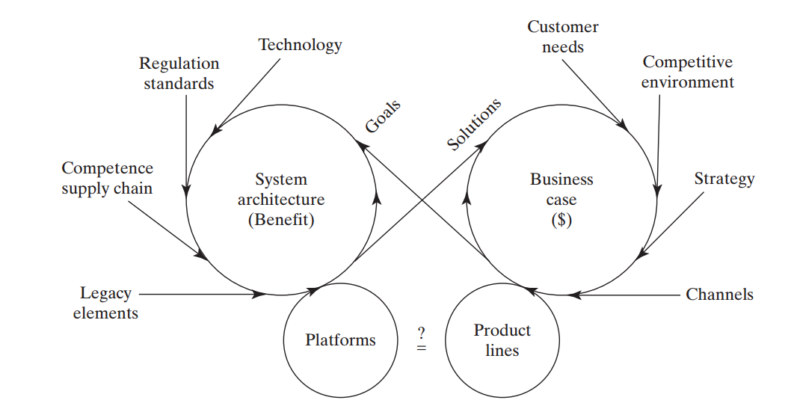

Верхнеуровневая концепция/концепция использования разрабатывается
прикладными инженерами-разработчиками и архитекторами совместно с
менеджерами-стратегами предприятия (иногда их называют разработчиками
бизнес-архитектуры, разработчиками бизнес-модели, менеджерами продукта).

Вот как это изображается в книге ««Systems Architecture. Strategy and
Product Development for Complex Systems»:

Концепция тут только идея, которая постепенно детализируется в
архитектуру. При этом разработчики и бизнесмены (business case можно
считать вариантом бизнес-модели, «архитектура выкачивания денег из
проекта») должны достичь соглашения по концепции: денег должно хватить
на разработку и изготовление плюс прибыль, а свойств системы
(пользовательской функциональности плюс архитектурных характеристик, о
которых будет чуть позже отдельный раздел по архитектуре) должно
хватить, чтобы запросить эти деньги у клиентов. И всё это, разумеется,
гипотеза: реальные клиенты могут заплатить или не заплатить (или
продавцы могут не найти клиентов, «плохой маркетинг»), реальная система
может соответствовать или не соответствовать ожиданиям клиентов (плохо
спроектировали, криво изготовили, не смогли наладить в эксплуатации).

В любом случае, хорошо видно, что концепция продукта (или сервиса в
сервис-ориентированном предприятии) разрабатывается совместно командой
инженеров целевой системы и менеджеров как инженеров предприятия и
маркетёров как инженеров сообщества клиентов. При этом разговор идёт про
роли, а не про агентов. Концепция может прийти и извне фирмы, от её
клиентов, ей может озаботиться какой-то основатель стартапа, работающий
сразу во множестве ролей, она может быть вычитана в прессе, подсмотрена
у конкурентов --- и далее просто улучшаться-дорабатываться в какую-то
конкретную архитектуру. Это самое важное: творчество не имеет
конкретного источника, нет ролей, назначаемых на творчество.

Идея о том, какие конструктивные объекты могут выполнить ту или иную
функцию, приходит в голову отнюдь не только «стратегам» или
«архитекторам». Она приходит в голову любым инженерам: людям, которые
пытаются что-то сделать, как-то приспособить для своих целей предметы
окружающего мира. Нет роли, приватизировавшей творчество,
приватизировавшей предпринимательство. И первичные тесты на полноту
системного описания (какая функция в надсистеме требуется --- какой это
будет функциональный объект, какой сервис какое сочетание конструктивных
объектов может выдать на базе каких физических принципов, как это будет
расположено в пространстве, какие стоимостные ограничения, и помним, что
кандидат в продолжение системного описания --- это выход в цепочку
создания, какие работы нужно будет выполнить, чтобы это сделать) может
сделать любой человек (со своими компьютерами), любая организация из
нескольких человек, хотя речь может идти не обо всей системе, а только о
части системы, ограниченной предметной областью практики этого агента.

В современной системе разделения труда появилось множество должностей
(иногда их называют «ролями в кросс-функциональной команде», что вносит
дополнительную путаницу), в букет профессиональных проектных ролей
которых входит работа с детализацией и уточнением концепции до полной
архитектуры на уровне системы в целом. Прежде всего это

-   product manager, он отвечает больше за business case (он инженер
    предприятия, «менеджер»! Он отвечает за то, чтобы можно было
    получить деньги за сделанное инженерами. Если это «лучшая в мире
    система», но она никому не нужна настолько, чтобы за неё платили, то
    это провал в работе product manager),
-   прикладной разработчик (инженер в какой-то предметной области ---
    чаще всего это предметная область клиента плюс предметная область
    самой разработки. В программной инженерии это программист/software
    engineer, который разобрался ещё и в предметной области, которую
    поддерживает его софт, то есть в business domain. Функциональные use
    cases более-менее подробно прорабатывает именно он, все концепции на
    эту тему --- у него.
-   архитектор, который прорабатывает те части концепции, которые
    отвечают не столько за функциональные характеристики, сколько за
    архитектурные --- всякие -ости/-ilities, в том числе и за такие
    характеристики, как возможность что-либо быстро поменять в самой
    архитектуре (evolvability) или независимость в работе отдельных
    групп прикладных разработчиков, если их предметы немного
    различаются.

И тут в классической «железной» инженерии ситуация отличается от
ситуации в современной программной инженерии. У «железячников» (вернее,
создателей киберфизических систем, там «железо» с софтом) концепцию в
части выполнения функциональных требований (в большинстве школ
классической «железной» системной инженерии допускают существование
требований до сих пор, там в голове «водопад» и «испорченный телефон»)
до архитектурных подробностей выполняет архитектор, а дальше его работу
подхватывают и детализируют архитекторы более низких системных уровней
или прикладные разработчики по инженерным дисциплинам. В разработке
корпоративного софта эти роли разошлись по разным людям: с
функциональными характеристиками системы и соответствующие решения по
концепции разбирается прикладной разработчик, а архитектор отслеживает
только соблюдение архитектурных характеристик, в том числе координирует,
чтобы подсистемы, которыми занимаются несколько команд прикладных
разработчиков могли взаимодействовать друг с другом. Так что роль
архитектора понимается в разных инженерных практиках по-разному, и нужно
уточнять:

-   Или архитектор занимается разработкой концепции, а затем всей
    архитектурой, и потом раздаёт задания прикладным разработчикам. Это
    в киберфизических системах, и там лаг отставания по сравнению с
    программной инженерией в десяток лет.
-   Или архитектор занимается разработкой концепции в плане
    удовлетворения архитектурных характеристик, а затем архитектурой в
    части удовлетворения архитектурных характеристик и отслеживает
    (надзор, governance), работы прикладных инженеров-разработчиков на
    предмет удовлетворения заданных им архитектурных характеристик и
    заданного им крупного разбиения системы на модули (не функциональные
    объекты!), а всем «пользовательским» (функциональным) занимаются
    прикладные разработчики. Скорее всего, к этому пониманию придут
    через несколько лет во всех остальных инженерных практиках.

В разделе про концепцию поэтому мы рассказываем о том, как
агенты/практики/инженеры/деятели принимают решения по концепции ---
независимо от того, эти агенты в жизни называются по их должностям
инженерами-разработчиками, архитекторами или продакт-менеджерами. А
практику архитектуры мы дадим отдельно, по её самому современному
состоянию: как обеспечивающую успех по архитектурным характеристикам
проекта, а не по всем вообще (архитектурным, функциональным в части
предметной области разработки/business domain, характеристикам
безопасности).
