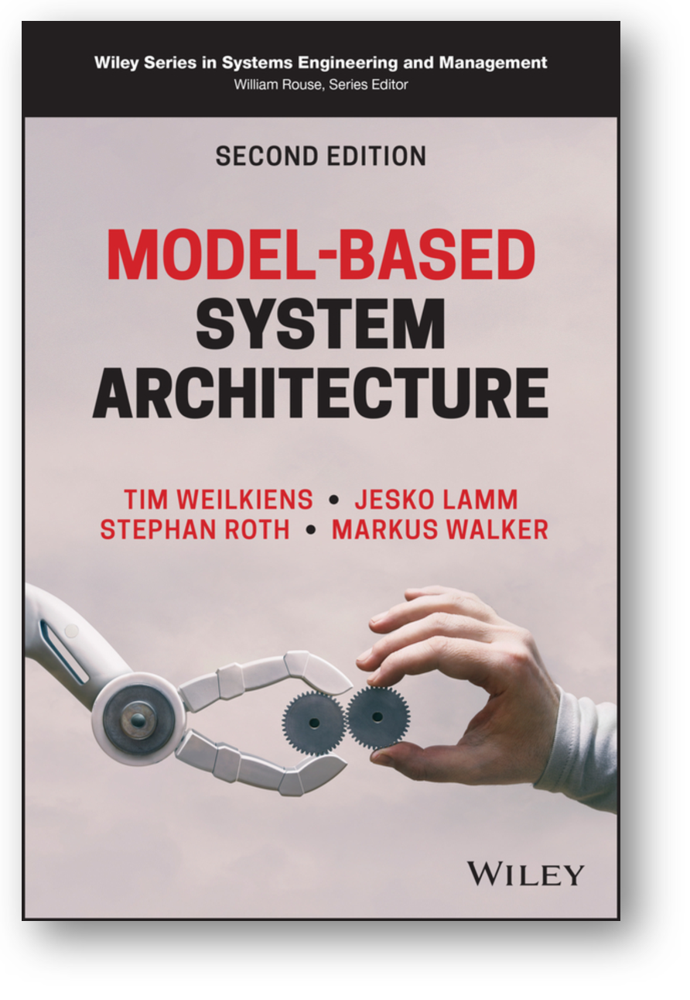
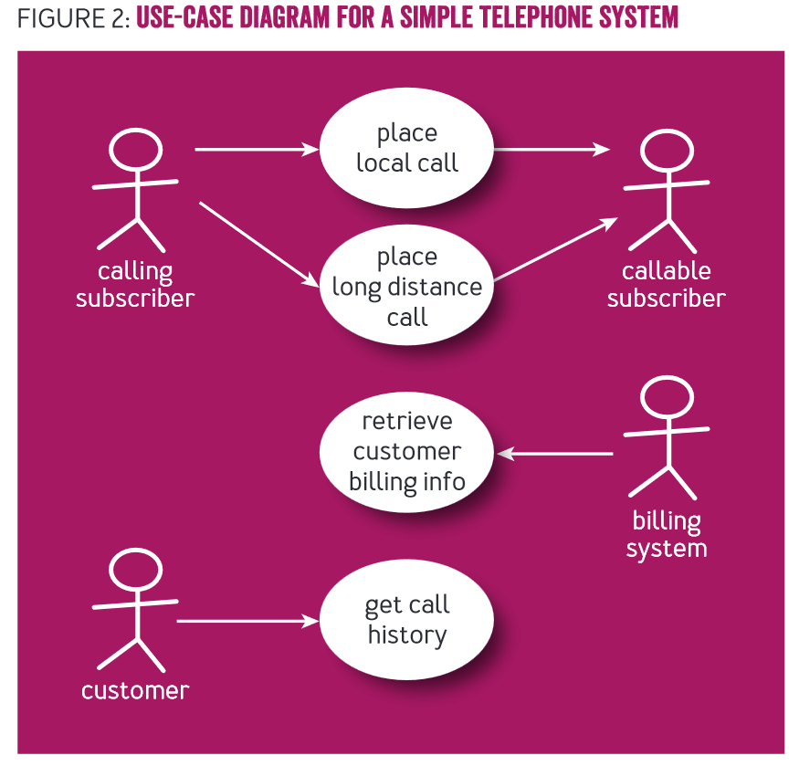

Люди очень трудно учатся думать о функциях как поведении какого-то
функционального объекта, ибо это требует абстрагирования от
конструктивного объекта или их совокупности, которые играют роль
функциональных объектов. В курс «Методология» было добавлено довольно
много материала только для того, чтобы пояснить понятие «практика» как
поведение организационной роли.

При создании концепции первая стадия --- это определить функцию, которую
потом нужно будет реализовывать конструкцией.

Понятие кейса (случая, дела, case, как-то разворачивающийся в жизни
сценарий и он же как «папка дела» или чуть более развёрнуто case file) в
инженерии идёт от судебных и медицинских дел/cases. У этих кейсов есть
предмет, с которым они работают, для use case это целевая система,
определяемая как функциональный объект, который в мир демонстрирует
какое-то поведение-функцию. Если мы говорим о кейсах/сценариях
использования (use cases), то речь идёт об использовании какой-то
системы в абстрагировании от её разбиения на части. В практиках use
cases описание системы как чёрного ящика идёт в терминах действий самой
системы, а окружающие систему предметы (и даже люди) выступают как
пассивные (хотя они вполне могут вызывать какое-то поведение системы).
Например, человек-пользователь нажимает кнопку «пуск», система в ответ
на это пускает дым (это может быть даже не шуткой: дымогенераторы
массово используются как оборудование в танцзалах, барах, театрах). Вот
это поведение пуска дыма системой и моделируется. Далее можно обсуждать,
греется ли после этого система, чтобы испарять какое-то вещество в
качестве дыма, или взрывает источник дыма, или просто передаёт сигнал в
какой-то внешний сервис, который вызовет дым, или ещё что там будет
происходить. Это всё альтернативы реализации, которые могут породить
какие-то дополнительные особенности поведения системы, но для начала
нужно всё-таки определиться, что нам нужно поведение какой-то
системы-дымогенератора, нам нужно «дымить». Если нам нужно «вышивать
гладью», то всё будет по-другому (можно будет думать о швее,
автоматическом вышивальном станке, закупке всего вышитого и устройстве
автомата по выдаче очередного уже готового изделия, 3D-печати рельефного
изображения вышивки гладью и т.д.). Но сначала таки --- что и в каком
окружении делать, а потом уже варианты реализации. Вот use case как
раз --- про то, кто будет инициировать и затем использовать
поведение/функцию системы.

Несколько вариантов методов use case обсуждаются в книге «Model-Based
System Architecture», второе издание 2022 года:

Эти методы имеют продолжение в работе над созданием функциональной
архитектуры как функциональной декомпозиции системы, ибо функции
концепций верхнего уровня, взятые из use cases далее декомпозируются до
так называемой «функциональной архитектуры», которая затем используется
для модульного синтеза. В книге описан метод FAS (functional
architecture for systems). По факту это не столько «архитектура» как
принятые архитектурные решения по разбиению системы на модули (решения
по модульному синтезу), сколько именно функциональная декомпозиция. И в
разных традициях по-разному понимается, кто этим разбиением занимается:
то ли это дело всех разработчиков (и мы придерживаемся тоже такого
мнения, это более современный взгляд на вещи), то ли именно архитекторы.
Конечно, архитекторы тоже этим занимаются, но у них есть свои
соображения для разбиения системы на части, свои соображения, чего
хотеть от архитектуры --- это будет в отдельном подразделе.

Пока же укажем, что методов моделирования use case множество, и в
указанной книжке кратко описываются в главе «10. Model-Based
Requirements Engineering and Use Case Analysis» три, а заодно даётся
краткий понятийный/онтологический анализ самого понятия use case, при
этом нужно учесть особенности этой книги. Так, авторы придерживается
классического «водопадного» взгляда на системную инженерию
киберфизических систем, поэтому в полной мере представлена опора на
требования, и use cases (сценарии использования) даются как важные для
разработки требований, а не сами по себе важные. В книге много
исторических рассказов, много обсуждений разницы в употреблении
терминов, но эти рассказы обрываются там, где заканчивается история
«водопада», переход к современной гибкой разработке того типа, который
повсеместно в развитых компаниях используется для программных систем в
книге только-только намечается. Не то чтобы этого перехода не случилось,
он случится, но как обычно: новые идеи разработки сначала обкатываются в
программной инженерии, и только потом приходят в самые разные остальные
виды инженерий.

В книге используется диаграммный язык моделирования SysML (в предыдущей
цитируемой нами книге «Systems Architecture. Strategy and Product
Development for Complex Systems» в качестве такого диаграммного языка
моделирования выступал язык моделирования OPM). И SysML и OPM ---
диаграммные нотации. Вовсе необязательно ими пользоваться, у них есть
много недостатков по отношению к недиаграммным методам моделирования.
Есть на эту тему целая книга «Визуальное мышление. Доклад о том, почему
им нельзя
обольщаться»^[<https://ridero.ru/books/vizualnoe_myshlenie/>],
но главный аргумент --- это что диаграммные нотации очень трудно
сопровождать. В книге такие нотации оказываются удобны, ибо их там не
предполагается часто менять, книга совсем не пример происходящего в
реальном современном инженерном проекте! Диаграммные нотации хороши для
однократного «постулирования», но не для постоянных изменений, которые
предполагаются в эволюционной разработке, где система постепенно
развивается/evolve и поэтому постепенно изменяют все её описания.

Сценарии/scenarios в книге считают текстовыми, а сценарии
использования/use cases выражаемыми в какой-то из диаграммных
нотаций --- и тут же признаётся, что сценарии тоже можно считать
сценариями использования, дело не в нотациях. И разные «истории»
(storyboards^[<https://uxdesign.cc/17-reasons-to-use-a-storyboards-in-ux-design-2bc6fea73e20>],
story-telling) тоже можно считать вариантом сценариев использования, они
призваны держать разработчиков интерфейсов и ответственных за «опыт
использования» (IU/UX designers) приземлёнными/grounded, то есть должны
показывать картинки окружающего мира, чтобы те понимали, что работают не
с описаниями, а с физической системой в физическом мире. Для
разработчиков небольших телефонных приложений используются методики типа
JTBD, где фокус перемещается с «хотелок» проектных ролей, выраженных в
виде user stories на контекст этих «хотелок», выраженных в виде jobs
stories^[<https://tilda.education/articles-jobs-to-be-done>].
Мы тоже так считаем, смотреть нужно не на формат документирования, а на
объекты внимания для этих моделей.

Метод Use Case
2.0^[<https://www.researchgate.net/publication/301704896_Use-case_20>]
предложен в 2011 году Иваром Якобсоном (изобретателем самого подхода
моделирования use case) со товарищи. Use case 2.0 предлагает делить кейс
на «кусочки»/slices, которые реализовывать по очереди, чтобы уменьшить
размер одной работы и уйти от «водопада» если не в самой разработке (все
эти кусочки кейса вам придётся всё равно готовить сразу!), то в
реализации. При этом, конечно, вы можете переопределить сценарий и
разбиение на его оставшиеся кусочки, использовав опыт, полученный в
реализации первых кусочков. Это важно, ибо до use case 2.0 общепринятым
было разрабатывать use cases с внешними проектными ролями, которые
как-то взаимодействуют с системой. В самом методе применяется
диаграммная нотация, но это совсем необязательно (можно использовать
табличную нотацию). Вот пример графического моделирования use case
(пример из упомянутого метода Use Case 2.0), там система не показана
вообще, зато показаны действия со стороны акторов окружающей среды,
которые как-то упорядочены во времени, чтобы «рассказать историю».
Предполагается, что система выдаёт во внешний мир функции,
удовлетворяющее показанным воздействиям (они даются глаголом, указывают
на практику актёра кейса, поддержанную целевой системой):

Методы для моделирования и документирования сценариев использования
могут использоваться самые разные, и в каждом из них есть нюансы.
Интересно, что описание всех этих методов --- это небольшие статьи на
десяток страниц. Но вы вряд ли сможете нормально воспользоваться этим
десятком страниц, если не будете понимать роль и место этого десятка
страниц описанной практики во всей практике разработки: это уточнение
функций какой-то системы как чёрного ящика, начало работы по разработке
концепции. Вы определите основные проектные роли, важные для
функционирования системы (прежде всего пользовательские роли, которые
выражают потребности, ведущие к тому, что раньше называлось
«функциональными требованиями», а сегодня ведущие к пониманию функций
системы в сценариях использования/use cases), затем определите поведение
системы.

Когда массово начали пользоваться use cases для разработки требований,
стало понятно, что этот приём моделирования хорошо работает не только
для описания поведения системы с людьми-пользователями, но и для
выражения поведения системы в неживом окружении: акторы могли быть
произвольными, не только людьми. Потом стало понятно, что это совершенно
необязательно делать только для самого верхнего уровня системного
разбиения (для целой системы), но метод отлично работает и для
подсистем. Потом стало понятно, что проще с коллегами (внешними
проектными ролями, разработчиками подсистем и т.д.) обсуждать эти
сценарии использования, дополняя их деталями по мере проработки
концепции (при каждом проектном выборе конструктивного решения
появляются дополнительные вопросы: если мы выбрали чёрный корпус, то
вдруг могут появиться вопросы к температуре корпуса и
пожаробезопасности, ибо внутри кто-нибудь сделал печку с открытым
пламенем для постоянного подкопчения корпуса --- и в сценарии
использования этот вариант не был предусмотрен!).

А требования? Проясняются важные предметы интереса всех проектных ролей,
их интересы (куда двигаем значение важных характеристик), и пытаемся
достичь возможного --- предлагаем сразу решения проблем и говорим,
насколько удовлетворяются интересы. Спецификаций требований как
отдельного рабочего продукта не делаем, но продолжаем обсуждать сценарии
использования как описание функциональности и проектные решения ---
концепции системы и частей системы. Делаем это и для самого верхнего
уровня (стратегирование, «какую целевую систему хотим делать», «как
хотим изменить мир»), и для более низких уровней, переходя к
функциональным декомпозициям и дальше к учёту архитектурных
характеристик.

В программной инженерии в уже упомянутой книге «Learning Domain-Driven
Design. Aligning Software Architecture and Business strategy» говорится,
что объекты предметной области предприятия можно перечислить в каком-то
глоссарии, но этого знания будет совершенно недостаточно: не будет
хватать информации о поведении этих объектов, их функциях. Для
документирования этой информации тоже предлагались use cases. И далее по
этой линии вполне можно говорить о кейс-менеджменте (работе систем
предприятия/создателей над изменением состояния окружающих их
объектов --- помним, что в use cases разговор ведётся о том, что делает
система по отношению к тому, что делают окружающие систему объекты,
моделируем не эти объекты, а систему, разбираемся с функциями системы).

**Итого: сначала нужно понять функцию системы, её поведение.
Моделируется и документируется поведение при помощи** **use** **cases,
для этого есть множество методов (каждый из которых описывается**
**десятком страниц текста). Рекомендуется всячески задержаться на этом
уровне рассуждений, максимально отстраняясь от возможной реализации
этого поведения какими-то конструктивными объектами.** **Сначала понять,
какого хотим поведения системы, что она должна делать в окружении, и
только потом изобретать, то есть разбираться с тем, как добиться такого
поведения.**
