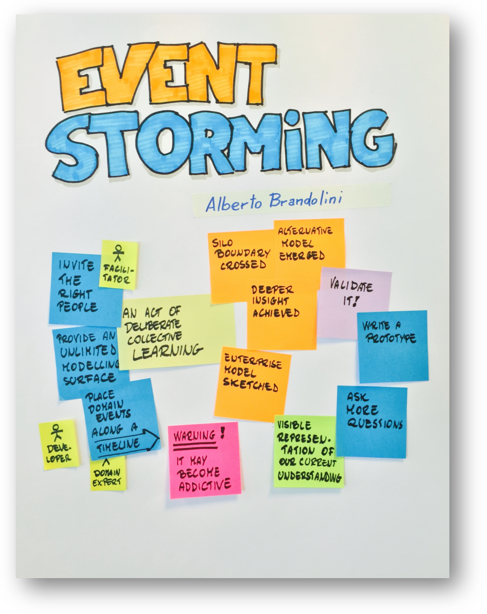
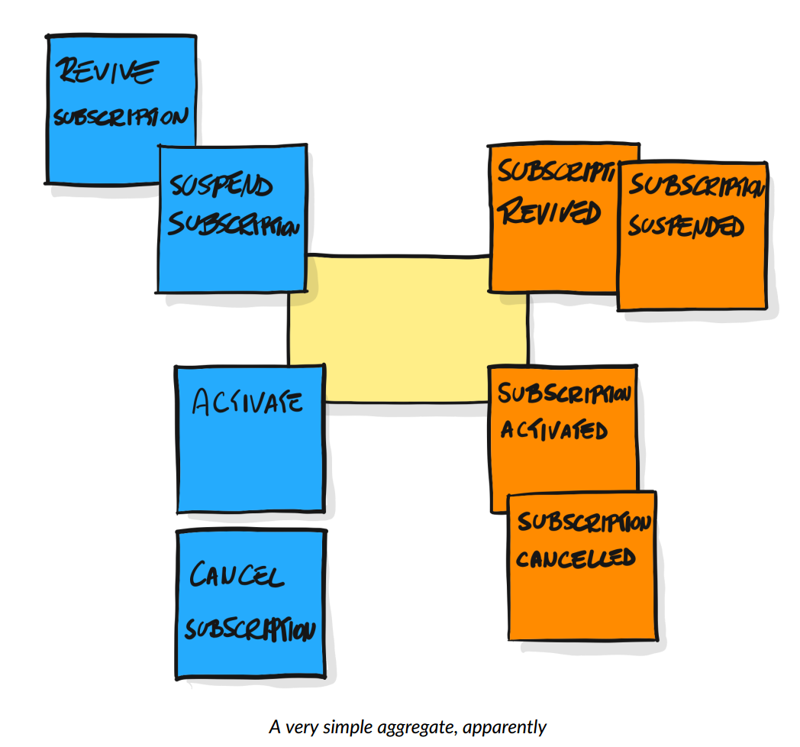
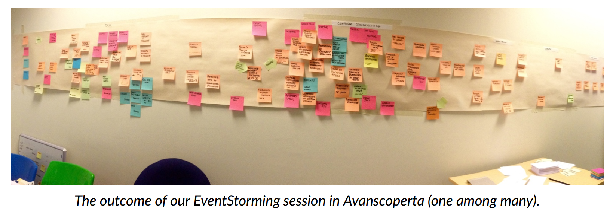
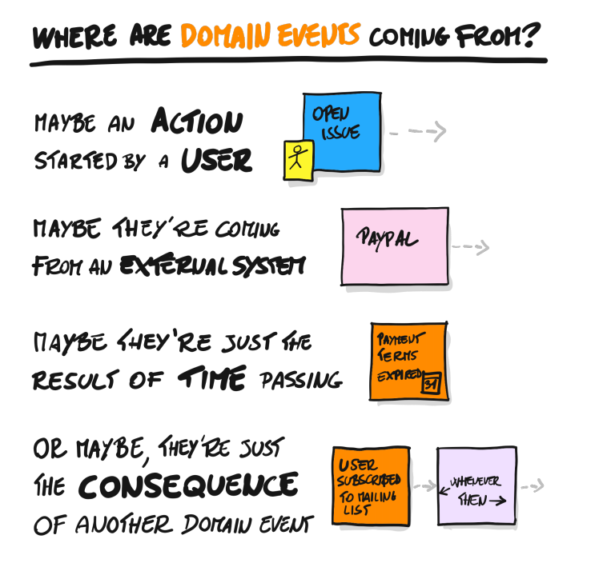

Кейсы/сценарии использования (use cases) и «управление делами» (case
management, иногда так и говорят «кейс менеджмент») в инженерии тесно
связаны. В курсе системного менеджмента (это курс инженерии предприятия,
то есть системной инженерии в приложении для организаций) будет
рассказано, что учёт дел в фирме происходит по линии «кейсов», которые
обобщают процессное (используются шаблоны действий в практиках) и
проектное управление (используется предварительное планирование) на
случай, когда ничего нельзя спланировать заранее в ситуации гибкой
разработки (тогда просто планируется каждое следующее действие «на
лету», а результаты записываются в папку «Дело», то есть в case file).

Кейсом называются работы, которые делаются с каким-то предметом кейса.
Обычно это альфа (подальфа какой-то основной альфы, состояния которой
выражены в ряде рабочих продуктов), а работы переводят эту альфу из
состояния в состояние. Когда альфа находится в первом состоянии, кейс
открывается, а когда в последнем --- кейс закрывается. Помним, что граф
состояний альфы может быть весьма запутанным. Каждое состояние
характеризуется своим названием (дверь закрыта, самолёт летит) и
контрольными вопросами его достижения, которые по сути «подсостояния»,
которых нужно достичь (кейс закрытия двери, предмет кейса дверь,
состояние закрыта, контрольные вопросы/чеклист: щелей между дверью и
косяком нет, замок заперт, ключ из замка вытащен).

В методологии мы научаемся думать о практиках, которые работают с
разными способами достижения состояний каких-то альф. В системном
менеджменте мы приучаемся управлять работами как кейсами по изменению
состояний альф. Для этого нужно выявить (если эти работы уже происходят)
или определить (если вы только проектируете деятельность) альфы и
подальфы с их состояниями и контрольными вопросами, а также практики,
которые переводят эти альфы из состояния в состояние. Если встречается
что-то необычное, то эта работа происходит «на лету», по мере открытия
новых обстоятельств дела/case, ровно как в судебном деле: каждая новая
улика может повернуть дело в совсем другом направлении, но в конечном
итоге дело/case будет закрыто.

В программной инженерии корпоративного софта его концептуальное
проектирование (нахождение функций, которые софт должен выполнять)
предлагается делать в рамках предмето-ориентированного проектирования
(DDD, domain-driven design) так, чтобы программное обеспечение
непосредственно отражало структуру предметной области предприятия. В
системном менеджменте это означает, что нужно выявить (в случае создания
«с нуля» спроектировать, то есть предложить гипотезу/догадку и дальше
докручивать, пока не получится успешность, эволюционный fit/вписанность
в окружение) альфы и подальфы, изменяющие их практики, роли для этих
практик и агентов/актёров, выполняющих эти роли.

Книга «Introducing EventStorm», 2021 (она потихоньку дописывается, там
используется continuous delivery, выходит множество версий/изданий,
немного отличающихся друг от друга --- не «первое, второе, третье», а
просто с какими-то датами последних правок, это соответствует практике
continuous
delivery^[<https://leanpub.com/introducing_eventstorming>])
предлагается ровно такой подход, хотя и в немного другой терминологии:

Можно смотреть на EventStorm и как на практику концептуального
реверс-проектирования предприятия (а именно, выявление функциональных
объектов, альф и оргфункций, которые ими занимаются) в части подготовки
к архитектурному проектированию предприятия, так и как подготовка к
проектированию софта, поддерживающего работу предприятия (что,
собственно, и предполагает практика в её исходном виде).

EventStorm как практика предлагает моделирование, в чём-то похожее на
диаграммное, но всё-таки не совсем: в качестве «тайлов» предлагаются не
иконки на экране, которые потом свяжутся стрелочками, а липкие листочки
с надписями (тип мета-мета-модели кодируется цветом листочка, а тип
мета-модели из предметной области предприятия пишется на листочке). Вот
как выглядит представление альфы «Подписка/Subscription», которая в
EventStorm называется aggregate и кодируется листочком жёлтого цвета (на
картинке название aggregate/alpha не подписано):

Состояние альфы кодируется оранжевыми листочками типа Event, но есть
нюанс: листочки означают момент наступления состояния (событие как
момент времени, разделяющий прошлое состояние и будущее, например
«подписка активирована» означает в EventStorm событие наступления
состояния «подписка активирована», там страдательное причастие
совершенного вида в названии, в английском это передаётся глаголом в
прошедшем времени). Голубые листочки --- это практики, которые ведут к
изменениям состояния, в EventStorm это будут «команды/commands». Так что
на стене вы получаете какую-то модель кейсов предприятия, где предметом
кейса будут альфы, меняющие свои состояния (агрегаты), будут исполняться
какие-то практики (commands) какими-то ролями, выглядит эта модель в
виде сгруппированных приблизительно по линии логического времени
листочков на стене примерно так:

Методика моделирования делает акцент на то, что все события предметной
области (domain events) случаются не сами по себе, а происходят по
основным четырём причинам, и поэтому для каждого события (его легко
обнаружить! «что-то изменилось в ситуации») нужно отмоделировать и
причину события.

Таким образом мы получим более-менее полную модель, пригодную для case
management, основной задачи, решаемой корпоративным софтом: управление
конфигурацией работ предприятия.

Конечно, результат EventStorm не слишком детален, чтобы служить хорошей
концептуальной моделью (например, не делается различий между альфой как
функциональным объектом и рабочими продуктами, которые позволяют судить
о состоянии альфы, то есть нет собственно «концепции» как описания
связки между функциональностью и функциональными объектами и сервисами
как поведением конструктивных объектов, поэтому ситуации типа «ножницы
из режущего блока и ручки и ножницы из двух половинок и винтика»
моделируются исключительно плохо и криво. Но очень часто альфы и
реализующие их рабочие продукты совпадают 1:1, хорошо спроектированные
системы стремятся к такому, поэтому как начало моделирования EventStorm
вполне подойдёт. Вы можете использовать оригинальную терминологию
мета-мета-модели из EventStorm, можете использовать терминологию из
нашего курса методологии (она взята главным образом из стандарта OMG
Essence и системной инженерии киберфизических систем), можете как-то
сами доработать и саму практику моделирования (вместо стены и листочков
использовать универсальные LowCode моделеры типа notion.so, coda.io или
подобные). Главное, чтобы вы понимали, что делаете: вы работаете над
концепцией предприятия, выявляете/реверс-проектируете его поведение, его
практики изменения состояния каких-то объектов. Реализуется это работами
кейсов, что составляет управление кейсами, поддерживаемое разными видами
issue trackers.

Что важно тут, так это понять, что моделирование кейсов для управления
кейсами по факту не отличается от обычного описания use case, только
меняется **позиция восприятия/моделирования:**

-   **Для** **use** **case** **действует система, она** **удовлетворяет
    изменениям** **окружающего мира своим поведением (а не её приводят в
    разные состояния события мира, это она сама приводится в эти
    состояния).**
-   **для кейс** **менеджмента альфа представляет собой «систему,
    которая пассивно меняется под действием практик, выполняемых
    внешними ролями». Деятели снаружи, альфа пассивна.**

Понятно, что при этом речь может идти об одном и том же, чуть только
различаются способы моделирования:

-   В моделировании **use** **case** я буду писать, что система «дверь»
    переходит при взаимодействии с ролью «закрыватель двери» в состояние
    «закрыта» после действия «закрыть дверь» (акцент на то, что будет
    должна делать дверь как целевая система, реагируя на воздействие
    окружающей среды).
-   В моделировании для **case** **management** я буду писать, что
    систему «дверь» практикой «закрытие» роль «закрыватель» перевела в
    состояние «закрыта» (акцент на то, что будет должен делать
    закрыватель двери, чтобы дверь перешла в ожидаемое состояние).

А как надо, какую позицию восприятия надо занять? Надо так, как вам
удобней для вашего проекта. Главное, чтобы вы понимали, что именно
делаете, какую практику моделирования задействуете, и какие были
альтернативы. Понятно, что моделирование case management можно
использовать отнюдь не только для case в менеджменте предприятия, эти
cases/случаи/ситуации можно моделировать хоть в киберфизической системе,
хоть в обществе, хоть в живом организме, хоть в личности: **вы можете
менять позицию восприятия с «с системой активные роли что-то делают в
ходе её создания, она ещё сама ничего сделать не может» (кейс
менеджмент) на «система что-то делает в ходе её эксплуатации» (сценарии
использования).** **В любом случае обсуждаются ситуации**
***взаимо*****действия (готовой или ещё не готовой, это по ситуации)
системы и её окружения.** **И помним, что во многих методах
моделирования в** **полной мере** **не доходят до чёткого представления
обо всех полезных объектах внимания: система как функциональный объект в
момент эксплуатации, альфа как отслеживаемый функциональный объект в
момент создания, агент/актор/актёр как конструктивный объект живой или
не очень живой, роль этого агента в деятельности/практике, рабочий
продукт как конструктивный объект, и т.д.**

**Для того, чтобы детально отмоделировать сложную ситуацию, вам
потребуется выявить (реверс-инженерия) или предложить (прямая инженерия)
довольно много объектов в предметной области (мета-модель) ситуации,
соответствующих самым разным типам мета-мета-модели, в том числе
мета-мета-модели системной инженерии, даваемой в настоящем курсе
(понятия концепции системы, концепции использования, архитектуры и
т.д.).**
