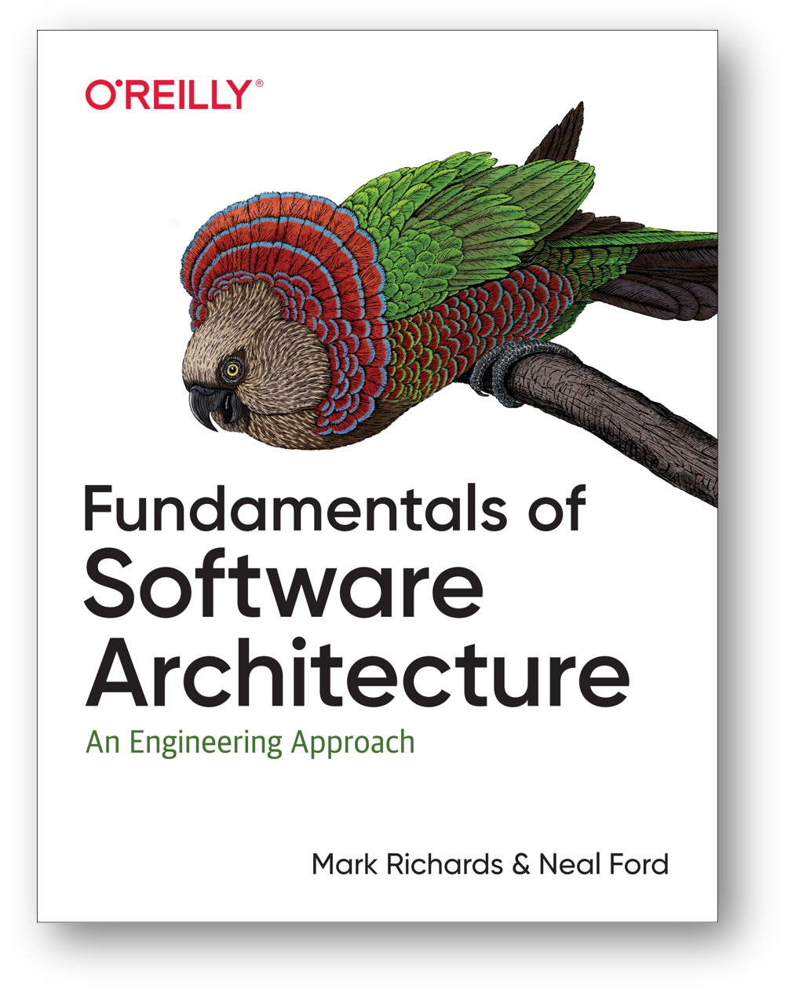
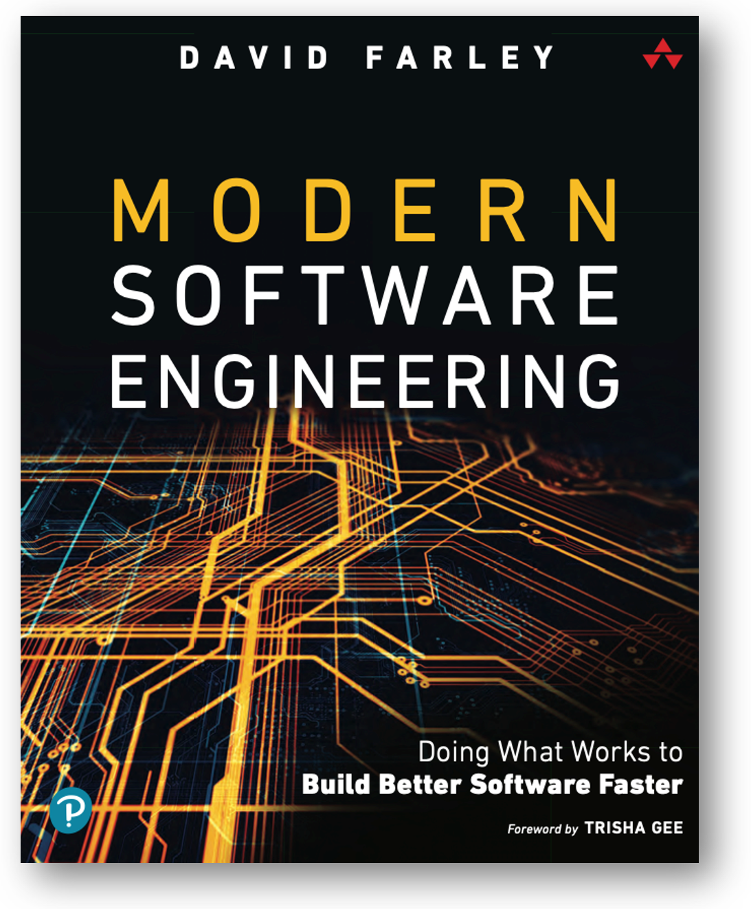

Прохождение развилки по-английски будет trade-off studies, «изучение
компромисса», а про «компромисс» говорят как о заведомом неуспехе: он не
удовлетворяет никого из участвующих в достижении этого компромисса
ролей, в то время как какие-то решения удовлетворяют хотя бы какие-то
роли и сильно не удовлетворяют другие роли. Все компромиссы плохи, и
поэтому решения в концепциях заведомо объявляются не «лучшими из
имеющихся» а «наименее плохими из имеющихся».

Подробно trade-off studies на примерах архитектурной работы даётся в
книге «Fundamentals of Software Architecture»:

Там формулируется первый закон программной архитектуры: «Everything in
software architecture is a trade-off», то есть «всё в программной
архитектуре --- это результат прохождения развилок». И там же приводится
следствие из этого закона: «если вы нашли что-то, что не похоже на
развилку, то вы, скорее всего, просто не подумали об альтернативах». Мы
полностью согласны с этим первым законом, но его значение выходит за
пределы программной архитектуры к вообще архитектурным решениям (по
поводу устройства системы, поддерживающего важные архитектурные
характеристики) и далее ко всем прикладным инженерным решениям в целом,
то есть ко всем концепциям, которые делают и «просто разработчики»
(безмасштабно! Для всех видов систем! То есть и для личностей, и для
предприятий, и для стран!), и архитекторы (которые ответственны за
-ости/-ilities/архитектурные предметы интереса).

Каждый раз, когда вы хотите реализовать какую-то функцию:

Точно определите эту функцию: вы запросто можете ошибаться в постановке
задачи, поэтому попробуйте помоделировать.

Есть более одного варианта, каким образом конструктивно реализовать
функцию (учитывая ещё и варианты размещения, и стоимость, и другие
системные аспекты/перспективы/основные описания).

Если вы считаете, что есть только один вариант, то вы что-то упустили.
Подумайте ещё и вспомните, погуглите или примените приёмы генерации
идей.

-   Затем примите рациональное решение: пройдите развилку, выберите
    между альтернативами, обоснуйте выбор (приведите rationale).

Вопрос в том, что такое «рациональное решение». Принятие решения
базируется на оценке шансов его успешности, эти шансы считаются по
какой-то модели. Тут два
вопроса^[<https://ailev.livejournal.com/1619025.html>]:

Можем ли мы следовать эмпирицизму, то есть выводить этим модели из
данных, или всё-таки модели должны быть как-то предложены --- и именно
это рационализм? Ответ: эмпирицизм вреден, должны быть объяснения,
которые сформулированы контрфактически. Эмпирицизм был полезен в прошлых
веках, но сейчас это не SoTA в части организации познания и инженерии.
Вместо него пришёл рационализм. В хорошей книге «Modern software
engineering» (2022) ставится интересный вопрос о том, что программная
инженерия как-то утеряла свою «инженерность» и теперь эту инженерию надо
в неё вернуть.

Сама постановка вопроса заставляет сформулировать принципы современной
инженерии (задача в чём-то похожа на задачи нашего курса). Но автор
выводит «опору на опыт/эксперимент», эмпирицизм, в качестве основания
инженерии. Это не так, опора должна быть на теории/объяснения, которые
отбираются в том числе с использованием опыта/эксперимента.

Дальше ставится вопрос о принятии инженерных решений: оцениваются
альтернативы. Это как раз предмет теорий принятия решений, которых
оказывается
множество^[<https://ailev.livejournal.com/1611838.html>]:
классических строго логических (увы, не работают в реальной жизни),
байесовских статистических (часто не работают, но именно их считают
сегодня «рациональными» --- с этим не все согласны, ибо заведомо ведь
ясно, что эти теории решений не дают оптимального результата во многих
случаях! Так что их начинают считать «иррациональными»),
квантовоподобные (современные кандидаты на «рациональные» теории
принятия решений, при этом решения получаются не слишком точные --- но
зато они формально возможны и эти вычисления экономны в силу
особенностей квантовоподобной математики. Настолько экономны
(экспоненциально!), что делаются гипотезы об эволюционных преимуществах
таких вычислений в ходе биологической
эволюции^[<https://www.sciencedirect.com/science/article/pii/S0303264720301994?via%3Dihub>]).

И, конечно, для типовых ситуаций (типовых инженерных решений, типовых
концепций) выгодно не вычислять ничего вообще, а использовать заранее
вычисленные значения --- задействовать знание из культуры, «память
вместо вычислений». Но мы всё-таки советуем перед задействованием памяти
проверить: не появилось ли с момента вычислений, результаты которых вы
сейчас достаёте из памяти, какой-нибудь новой альтернативы или новых
данных эксперимента, подтверждающих или опровергающих эти вычисления? И
задействовать память тогда, когда ничего нового не обнаружено (или когда
даже такая проверка более дорогая по ресурсам, чем возможный убыток от
использования нерационально сделанного решения).
