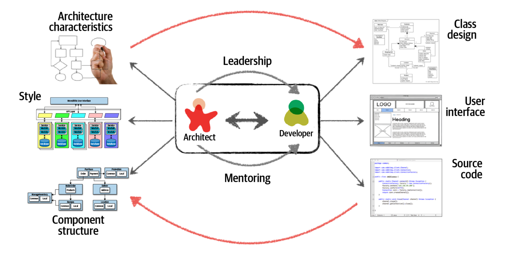
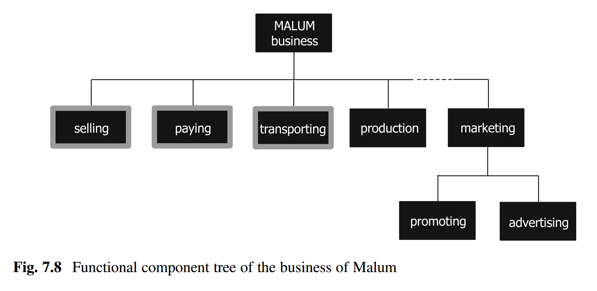
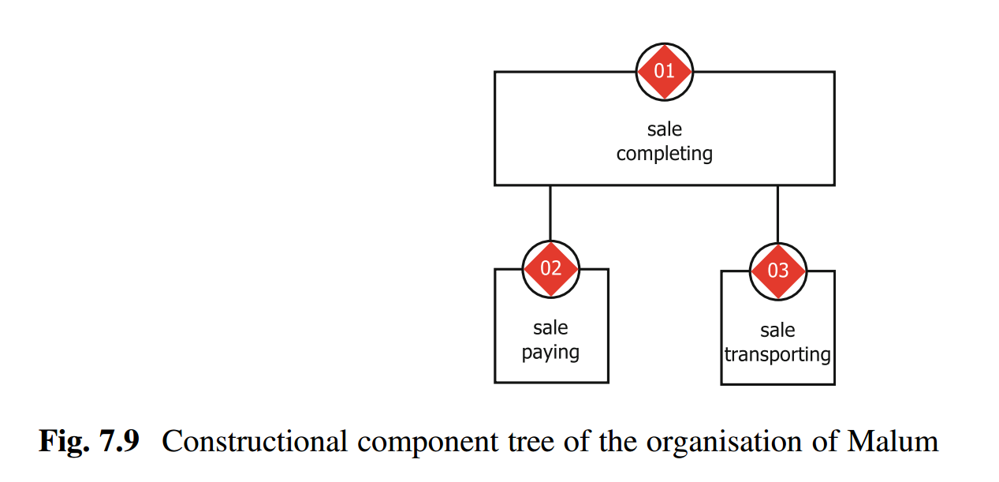
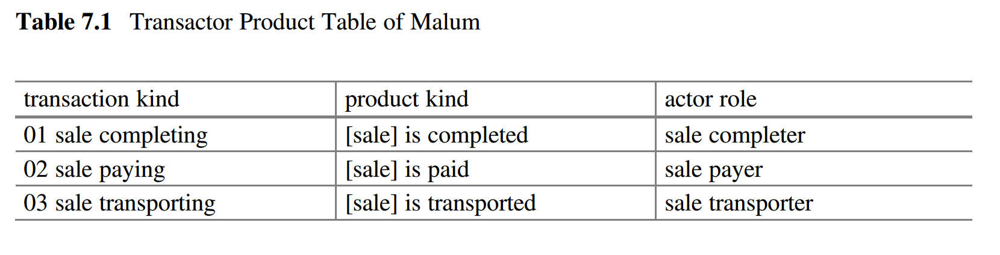
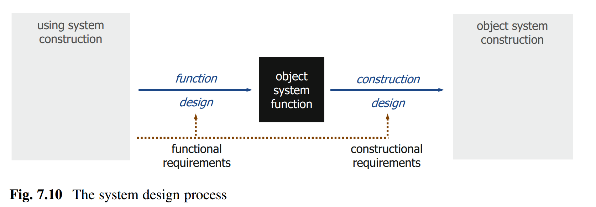

Концептуальное проектирование раньше называлось архитектурным
проектированием, но сейчас архитектурное проектирование стало относиться
не столько к проектированию поддержки конструкцией функции системы,
сколько к проектированию поддержки конструкцией архитектурных интересов
(масштабируемость, ремонтопригодность, развиваемость/evolvobility и
т.д.).

Концепция использования и сценарии использования по факту ---
концептуальное проектирование вверх от границы системы, отвечает на
вопрос «как система выполняет свою функцию», описание чёрного ящика.
Концептуальное проектирование --- оно про «прозрачный ящик», включает в
себя предложение для системы функциональной декомпозиции и последующего
модульного синтеза. Напомним приводимую в «Системном мышлении» картинку
из стандарта IEC 81346-1:2022, она приводилась для демонстрации сути
архитектурной работы, но современное понимание её такое, что она
показывают работу создания концепции системы, концептуального/эскизного
проектирования:

Проводилась функциональная декомпозиция, а потом осуществлялся модульный
синтез, в ходе которого учитывались потом и другие аспекты системного
описания: обязательные (размещение, стоимость, идеи по поводу разбиения
работ как кандидат в обязательные), и далее все остальные нужные для
проекта. В системной инженерии по факту сегодня различают концептуальное
проектирование (изобретение: что вообще из предметов окружающего мира в
их взаимодействии сможет выполнить желаемую функцию в надежде на
успешность) и собственно архитектурное проектирование: как оптимально
разбить систему на модули, чтобы удовлетворить архитектурные интересы.
Невозможно чётко разделить концептуальное проектирование (делают
разработчики/developers, обычно они работают в команде) и архитектурное
проектирование (делают архитекторы/architects, обычно они внешние по
отношению к командам разработчиков, тем более что команд разработчиков
целой системы обычно несколько и архитектор должен как-то заботиться об
их максимальной независимости). Вот как это изображает немного
доработанная картинка из книги «Fundamentals of Software Architecture»:

Это, конечно, картинка для программной инженерии (книга-то об
архитектуре программных систем), причём для самой распространённой
парадигмы программирования: объектно-ориентированной (показан Class
design, но не во всех проектах программной инженерии
проектирование/design) делается для классов). Подставьте в эту картинку
других прикладных инженеров, например, конструкторов. Тогда вы увидите
детали сложной формы, соблюдение каких-то стандартов в размерах (для
упрощения изготовления и сборки), информационные модели 3D в CAD --- в
инженерии это обычно проектирование/design, и новизна в том, что
архитектурная работа раньше была внутри проектирования, а теперь она
вынесена наружу, за пределы проектной команды.

Идея картинки в том, что архитектор должен «уболтать» разработчика
следовать его решениям (leadership, «уболтать» актёра-разработчика чётко
выполнять роль разработчика), а для этого должен разъяснить
разработчику, в чём суть этих решений (mentoring). Кроме этого,
архитектор выполняет функцию надзора/governance над разработчиками: если
уговорить разработчиков следовать архитектуре не удаётся, то
«принимаются меры» (например, строптивые агенты, выполняющие роль
разработчиков просто увольняются: провал проекта из-за плохой
архитектуры никому не нужен, а архитекторы в жизни встречаются реже, чем
разработчики, разработчика проще заменить). Архитектор, тем не менее,
внимательно следит за ходом разработки, и когда в ней появляются
проблемы (беспроблемных разработок не бывает), как-то меняет свои
решения.

Тем не менее, решения архитектора относятся главным образом к модульному
синтезу (как функционал разместить по модулям), а вот сама идея, как
реализовать целевую функцию системы, приходит именно от разработчиков.
Хотя именно архитектор нарезает по-крупному систему на модули, саму
«начинку» этих модулей дают разработчики.

Например, если непонятна концепция/изобретение типа «электронная
вакуумная лампа триод может выполнить роль логического вентиля для
универсального вычислителя, делаем электронную вычислительную машину, а
не пневматическую или механическую. А память будем делать на ферритовых
колечках^[[https://ru.wikipedia.org/wiki/Память\_на\_магнитных\_сердечниках](https://ru.wikipedia.org/wiki/Память_на_магнитных_сердечниках)]»,
то архитектору не удастся поделить систему на модули. Скажем, блок
питания, блок памяти, блок арифметически-логического устройства, или
таки независимые блоки питания для ячеек обработки данных с памятью,
которые собираются в многопроцессорный компьютер? Или блок питания в
каждом из блоков отдельный, и есть блок АЛУ, блок процессорных регистров
на вакуумных лампах и блок оперативной памяти на колечках? Это всё
решения архитектора. Надо отличать работу прикладных инженеров
(разбирающихся в компьютерных компонентах и принципах их работы) и
архитекторов (разбирающихся в том, как сгруппировать модули между собой
так, чтобы достичь оптимума архитектурных интересов). Помним, например,
о законе
Амдала^[[https://ru.wikipedia.org/wiki/Закон\_Амдала](https://ru.wikipedia.org/wiki/Закон_Амдала)],
что увеличение числа вычислителей для повышения скорости работы
компьютера быстро съедается увеличением времени связи между отдельными
вычислениями для их координации. Архитектор работает вот с этими
«неожиданными» для неархитекторов эффектами от зацепления/coupling
модулей при небрежном их синтезе/сборке.

Предполагается, что архитектор бьёт систему на части, которые как-то
соответствуют предметным областям/domain, а они обычно соответствуют
практикам как способам работы с объектами какой-то предметной области.
Но всё чуть сложнее: архитектор может поделить систему на конструктивные
части по иному принципу, практикам разработчиков, а не практикам
использования (скажем, в программной системе выделить «слой
пользовательского интерфейса, слой логики, слой работы с базой данных,
слой базы данных» в терминах разработчика как отсылки к функциям
создателя, или «микросервис зарплаты, микросервис складского учёта,
микросервис кадровой работы» в терминах предметной области/функции
системы). А в каждой части уже конструкторы/проектировщики/прикладные
инженеры выполняют концептуальное проектирование, разбираясь с описанием
функциональности в форме различных моделей. И эти модели (главным
образом сценарии) они составляют из постоянного в ходе всего проекта
непосредственного общения с прикладными специалистами из разных
предметных областей, в которых будет использована их целевая система, а
не из чтения требований, которые были составлены по принципу
испорченного телефона, причём однократно. «В ходе постоянного
общения» --- это всё время проекта, ибо ожидается появление
многочисленных версий постоянно развивающейся/evolving системы, эти
версии реализуют самые разные гипотезы о том, что может поднять
успешность системы в текущий момент времени или не уменьшить успешность
в ожидаемый в будущем момент времени. И всё это время будет
дрейфовать/плыть/меняться (уточняться или наоборот, становиться
абсолютно неприемлемой и требовать кардинальной замены) концепция
системы, и архитектура системы.

Ещё одна книга, которая рассказывает о концепции системы как об
архитектуре, и поэтому двигает рассмотрение от функциональной
декомпозиции к модульному синтезу --- это второе издание «The Enterprise
Ontology», 2020.

В этой книге отмечается, что в предприятии можно выявить функциональные
элементы и конструктивные, причём и те и другие определяются
поведенчески: первые через функции, вторые через сервисы, которые
рассматриваются как **трансакции**, проходящие между оргзвеньями фирмы,
а также оргзвеньями фирмы и внешними предприятиями. Вот пример
функциональной декомпозиции предприятия Malum из главы 7 этой книги,
«The TAO Theory: Understanding Function and Construction».

А вот как показано конструктивное разбиение, которое авторы называют
потом «сущностным» на базе замечания, что функциональных разбиений может
быть предложено множество самых разных, которые субъективно определяются
самыми разными проектными ролями, а сущностное (подразделения и их
сервисы) определяется более однозначно, причём справедливо замечают, что
прямого соотнесения между функциональными и конструктивными частями
системы обычно нет:

Как понимать эти трансакции в концепции предприятия? Вот табличка
акторов для этой диаграммы, мы видим в них знакомые cases из управления
кейсами (и там альфу sale и её состояния, разве что нет описания рабочих
продуктов, отражающих состояние альфы, а также оргроли, которые надо
будет назначить на оргзвенья. В «конструктивной диаграмме» оказалась
скрыта «функциональная табличка»):

В самой книге аккуратно уходят от названия «концепция» или «архитектура»
предприятия для их варианта мета-мета-моделирования, а свою
мета-мета-модель (в которой обсуждаются довольно общие для инженерии
вещи, но с акцентом на предприятие/enterprise) авторы называют
«онтология предприятия», аргументируя важность рассмотрения не только
функционального (телеологического, направленного на цели,
intent/намерение, ответ на вопрос «для чего вы это делаете»), но и
конструктивного (артефакты и агенты как конструктивно рассматриваемые
системы и их сервисы) рассмотрения. Книга эта хороший пример того, что
концептуальное проектирование и архитектурная работа по выбору варианта
модульного синтеза даже при понятной концепции системы тесно связаны:
когда речь идёт о примерах использования описанного в книге
моделирования предприятия, становится понятным, что не любое разбиение
предприятия на модули для выполнения им функций осмысленно в плане
достижения желаемых значений архитектурных характеристик.
Мета-мета-модель книги «The Enterprise Ontology» несколько отличается от
мета-мета-модели, которой придерживаемся мы в наших курсах
«Моделирование и собранность», «Системное мышление», «Методология»,
«Системная инженерия», «Системный менеджмент» (в этой короткой книжке
сделана попытка сжато изложить довольно много из содержания этих курсов,
чтобы дать представление об архитектуре предприятия). Там в основе лежит
второе поколение системного мышления, однократный жизненный цикл,
«создание», а не многократный эволюционный, «непрерывное всё»/«создание
и развитие». Тем не менее, обсуждаются ровно те же идеи, которые даются
в нашей мета-мета-модели, хотя и немного в другой терминологии и с
опорой на немного другие обоснования. Мышление о концепции системы и
архитектуре системы более-менее универсально в разных инженериях, оно
безмасштабно.

Вот ещё одна диаграмма из обсуждаемой книги «The Enterprise Ontology»,
иллюстрирующая концептуальное проектирование в его связи между
функциональной декомпозицией и модульным синтезом:

Описывается практика/process проектирования/design системы. Надсистема
называется using system (использующая в своём составе целевую), целевая
система --- object system (один из переводов object --- как раз «цель»).
По-старинке говорится о «функциональных требованиях» (требования к
назначению целевой системы, её поведение в составе использующей её
надсистемы), а вот «конструктивные требования» --- это как раз
ограничения на модульный синтез: с одной стороны, какие модули можно или
нужно задействовать, с другой стороны --- архитектурные ограничения,
архитектурные решения, влияющие на группировку функциональности по
модулям, влияющую на архитектурные характеристики. То есть на одной
картинке показано и концептуальное проектирование, и архитектурное
проектирование в их тесной связи.

Как ответить на вопрос: важнее/главнее концепция системы, или
архитектура? Ответ на этот вопрос такой же, как на вопрос «кто
важнее/главнее: мама или папа?»: они оба важны, оба «главнее».

-   **Концепция системы имеет примат.** Если вы не знаете, что из
    конструктивных объектов могло бы исполнить функцию системы, то
    системы не будет. Можете дать себе три дня на «гугление» и
    изобретение, но лучше уходите из проекта. Скажем, вы получили много
    денег на проект биологического бессмертия. Если непонятно, что
    именно конструктивно надо делать, нет хоть как-то обоснованных на
    приемлемом уровне риска предложений, то в такой проект идти не надо:
    нужное вам открытие ещё может просто не существовать, а шансы, что
    его сделаете именно вы, и успеете при этом сделать его за срок
    проекта --- этот шанс мал. На планете сейчас примерно 500тыс.
    биологов, которые разбираются в сворачивании белков. Но не факт, что
    вы найдёте среди них такого, кто добьётся успеха в проекте
    бессмертия, даже если получит неограниченное финансирование.
-   **Архитектура системы имеет примат.** Если архитектор не разобьёт
    системы на какие-то «правильные» для достижения архитектурных
    характеристик части, то система будет плохо развиваться/evolve, и
    она будет в конечном итоге неуспешна. Грубо говоря, «из той же
    мучки, да не те ручки»: на базе одной и той же концепции можно
    делать много разных архитектур, и если концепцию не выразить в
    подходящей архитектуре, то всё будет плохо. На заре интернета было
    множество поисковых систем, но они все базировались либо на краулере
    (робот, собирающий по всему интернету веб-страницы в поисковую
    систему) и затем архитектуре мощного центрального сервера (обычно
    компьютера Sun), либо архитектуре распределённого поиска (каждый
    вебсайт делал свой поиск, потом они объединялись). Гугль победил,
    ибо в его архитектуре краулер собирал веб-страницы в дата-центр из
    множества дешёвых компьютеров. Поэтому решение было и
    централизованным (краулер), и распределённым (не один мощный сервер,
    а много маленьких слабых). И Гугль победил практически всех за счёт
    грамотной архитектуры (а вовсе не за счёт более качественного
    алгоритма поиска, как это обычно показано в литературе).

То есть первое слово за прикладными разработчиками, без них вообще
непонятно, что делаем. Но первое слово также и за архитекторами, которые
должны правильно упаковать и поставить в архитектурные рамки работу
прикладных разработчиков: они должны принять архитектурные решения по
поводу системы, организовать разработчиков с их концептуальным
проектированием в соответствии с обратным манёвром Конвея, а затем
выполнять архитектурный надзор, чтобы разработчики не ухудшали
успешность системы, то есть не стремились достичь локального
квазиоптимума по достижению характеристик «своих» модулей системы, но
делали вклад в достижение глобального по всей системе квазиоптимума.
«Квазиоптимум», а не «оптимум» --- помним про многоуровневую эволюцию и
неизбежную при этой эволюции неустроенность/frustrations, происходящую
из-за конфликтов между этими системными уровнями. Вот архитекторы этим и
занимаются, оформляя работу прикладных/domain инженеров в целостную
систему из по-крупному нарезанных модулей первых нескольких уровней.

Работа архитекторов в системной инженерии выделилась в отдельную
практику, которая будет обсуждаться в следующем разделе курса.
