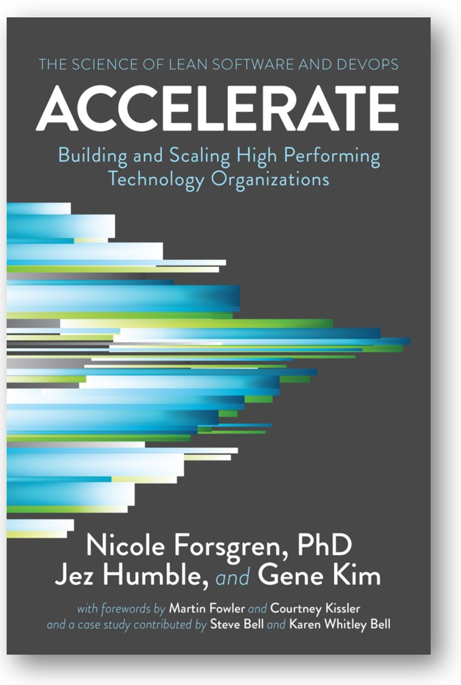
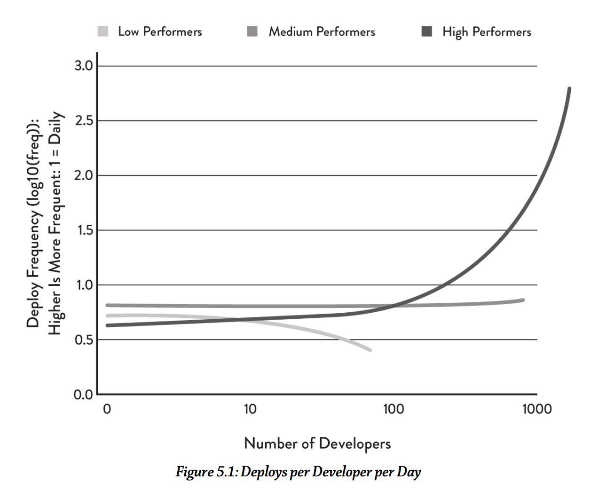
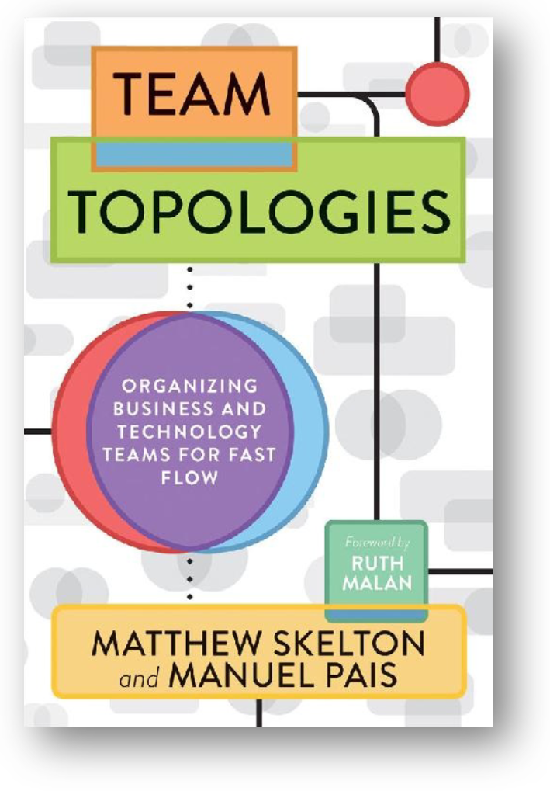

Очень трудно разделить саму разработку и создание этой разработки: часто
упоминается, что «команда сама организует свою работу». Команда тут
рассматривается как оргзвено, и само высказывание требует уточнения.

Когда команда обсуждает организацию/создание себя как системы, то
агенты-люди в ней выступают в других ролях: ролях создателей
организации, то есть инженеров предприятия, менеджеров
(организаторов-лидеров). Люди, обсуждающие свою организацию по созданию
целевой системы, тоже выполняют практики системной инженерии, но для
организации как системе-создателю в цепочке создания целевой системы.
Если вспомнить материал о цепочках создания, то всё будет не так просто:
и саму команду-оргзвено разработчиков как «создателей себя» тоже кто-то
создал, и после создания команды с её создателями будет отношение
надзора (там ведь тоже monitoring, continuous development, continuous
delivery таких команд), чтобы команда продолжала выполнять своё
назначение, ради которого она была создана, а не ушла в автономное
плавание со своими собственными целями и перестала заниматься
разработкой для достижения и поддержания успешности системы!

Так, команда разработчиков, предоставленная сама себе, обязательно хочет
расти не только в мастерстве, но прежде всего в числе членов команды.
Любой агент хочет расти и размножаться, убирая неприятные сюрпризы со
своего пути --- это же эволюция! Но есть внешне задаваемые довольно
контринтуитивные пределы роста. В принципе, архитектура самых разных
систем похожа, она борется всяко с проявлениями в разных системах уже
упомянутого закона Амдала: весь прирост производительности от увеличения
числа работников съедается на увеличенное время координации между ними.
Скажем, если у вас близится сдача, то добавление сотрудников только
отдалит срок сдачи: время уйдёт не только на то, чтобы ввести новичков
(даже одного новичка!) в курс дела, потом исправить неизбежные
новичковые ошибки, но и на поддержание коммуникации внутри
модуля-команды.

Более того, эксперименты
показывают^[<https://www.qsm.com/risk_02.html>],
что оптимальный размер команды оказывается неожиданно маленьким: он
ближе к пяти участникам команды, чем к двадцати. В софтверном проекте
команды из 5 и из 20 человек пишут 100 тысяч строк кода примерно за три
месяца. При этом команда из 20 человек справляется примерно на неделю
раньше чем команда из 5 человек, но ошибок делает в пять раз больше. Это
как раз следствие сложной коммуникации, которая по закону Конвея
проходит по поводу разных частей программы не в одном мозге, а через
разные мозги, а по закону Амдаля она ещё и съедает производительность
многих вычислителей.

Так, нарезка системы на крупные модули со слабой связанностью и
предписание интерфейсов для связи между ними делается архитекторами
системы, которые явно учитывают необходимость обратного манёвра Конвея.
Дальше по факту совместно работают две команды архитекторов:

-   Команда архитекторов предприятия делает архитектуру организации,
    обеспечивающую нарезку всего предприятия::оргзвено::модуль на
    максимально автономные (чтобы получилась архитектура со слабым
    зацеплением, loosely coupled architecture)
    команды::оргзвено::модуль. Внимание архитекторов направлено на
    конструкцию, способ деления её на модули и способ связи между
    модулями задают важные организационные свойства: высокую
    производительность предприятия в целом, масштабируемость предприятия
    в целом, возможность быстрого изменения структуры предприятия в
    целом (evolvability).
-   Команда архитекторов целевой системы задаёт функции для каждой
    команды: модуль для сервиса в какой предметной области/domain
    (практики, wokflow) должна делать (continuous, это не «сделать»)
    команда в рамках обеспечения квазиоптимальных значений архитектурных
    характеристик целевой системы в целом. При этом целью будет
    максимально точно определить bounded context в части проектных
    описаний/design и domain в части выделенной части мира, для которого
    будет будет разрабатываться командой их часть системы.

Тем самым модули становятся более автономными системами, и целевая
система начинает напоминать не столько традиционную систему с общим
владением её командами («все занимаются всем»), но систему систем (SoS),
где команды владеют отдельными автономными модулями в окружении других
модулей. Такие системы систем оказываются сложней устроены, их трудней
понять, но они лучше адаптируются к быстро меняющимся условиям
окружения, лучше масштабируются, быстрее создаются, ибо команды не
задерживают друг друга в бесконечных согласованиях: по одному модулю
принимает решение каждая команда самостоятельно, а не собираются для
этого несколько команд.

Основные принципы современных концепций предприятия и архитектурных
решений для предприятий и их команд, как всегда, можно подсмотреть в
литературе по организации программных разработок, но помним о том, что
речь идёт о безмасштабных принципах, которые приложимы для практически
всех видов систем. Требуется время, чтобы эти принципы были адаптированы
к другим видам прикладной инженерии (часто они будут в другой
терминологии, так что без понимания их сути использование этих
архитектурных паттернов будет трудно распознать).

Ещё раз, чтобы подчеркнуть мысль: системная инженерия --- это практика
ведения инженерной работы для всех систем в цепочке создания. Принципы
её, конечно, адаптируются для каждой отдельной предметной области, но
применяются ко всей цепочке создания. Если вы создаёте целевую систему
нового типа (хоть бактерию, хоть мастерство, хоть программную систему,
хоть сообщество, хоть страну), для которой приходится создать инструмент
и систему автоматизации проектирования, а также организовать множество
команд для создания всего этого, вы будете применять одни и те же
принципы. Поэтому в рамках проекта и создание целевой системы, и
создание инструментария, и создание команд, и маркетинг как создание
сообщества лояльных клиентов --- это всё инженерная деятельность.
Обсуждаются все эти вопросы вместе, с использованием одних и тех же
принципов, одни и тех же идей --- в том числе таких, как закон Конвея и
обратный манёвр Конвея.

Это означает, что многие вопросы нельзя вот так прямо разделить на «вот
это разработка, пусть думают прикладные инженеры-технари/domain
engineers и их системные инженеры-архитекторы/system architects», «вот
это менеджерский вопрос организации разработок, пусть думают
менеджеры/managers и их ответственные за развитие как инженеры
предприятия/enterprise engineers и архитекторы предприятия/enterprise ».

Вопросы создания команд разработчиков (их будет много для одной
системы!), создания «команды команд» для системы в целом, а также
вопросы разработки самой системы в целом и отдельных частей и «фич»
системы, которые выполняют отдельные команды --- они более чем тесно
связаны. Принципы этой связи нужно знать и инженерам, и менеджерам при
всей разнице «их систем» (тех типов систем, которыми они непосредственно
занимаются).

Книги, которые мы рекомендуем, это не чисто «книги по менеджменту» с их
вечным обсуждением «авторитарного стиля менеджмента» или чего-то
подобного «про людей в организациях». Нет, это книги по инженерии как
таковой, с учётом цепочек создания: нужно создать множество самых разных
систем, чтобы на выходе всех этих цепочек получилась целевая система.

Подробно самые разные аспекты работы в современной разработке софта
описаны в книге Accelerate (2017)^[Есть русский перевод,
<https://www.litres.ru/dzhez-hambl/uskoryaysya-nauka-devops/>, но мы
рекомендуем всё-таки читать оригинал], но предупреждаем:
читать это нужно как относящееся к самым разным видам систем:

В книге приводится довольно много контринтуитивных принципов организации
современной инженерной практики, которая подтверждается результатами
исследований. Вот, например, один из графиков в этой книге:

Он показывает, что в высокопроизводительных организациях (high
performers) при росте числа разработчиков число завершённых частей
системы, готовых для сборки (deploys, включение в состав готовой
системы) растёт линейно, или даже более чем линейно --- за счёт всех
этих практик архитектуры, ограничивания размера выполняемой работы и
т.д. В организациях умеренной производительности скорость от добавления
разработчиков остаётся примерно одинаковой. А вот в организациях
низкопроизводительных (в книге показывается, что они не используют
современной инженерной практики, а придерживаются старинного «водопада»)
с добавлением людей в команду производительность быстро падает: они не
могут решить проблемы работы «команды команд» («бригады бригад», команды
проекта в целом).

Так что классическим (прикладным, самым разным по специальностям)
инженерам, оказывается, надо знать и менеджмент как прикладную инженерию
организаций, просто для организации собственного труда: она оказывается
общей дисциплиной для всех видов инженерии! Это примерно как «общее
фортепиано» в музыкальных училищах: на каком бы инструменте (скрипке,
трубе, органе) ты ни специализировался, тебе всё равно нужно уметь
играть на фортепиано. Так и тут: на какой бы ты инженерии не
специализировался, тебе всё равно нужно уметь разобраться с организацией
работы команды разработчиков, а также тем, как и почему из команд
разработчиков собирается полная организация.

Так что содержание курса «Системный менеджмент» и нашего курса
«Системная инженерия» неожиданно сильно пересекается. Ровно так же, как
пересекается содержание курсов «Программная инженерия корпоративного
софта» (в разработке, но большинство книг в нашем курсе как раз про
это --- как пример для инженерии в целом, так что внимательное изучение
предложенной литературы как раз познакомит вас с содержанием такого
курса) и курса «Системный
менеджмент»^[<https://system-school.ru/systems-management>],
ведь современные организации поддерживаются как раз современным
корпоративным софтом, и об этом как раз говорится в курсе «Системный
менеджмент» (включая объяснение того, как вместо программной разработки
использовать уже готовые универсальные моделеры в подходе
NoCode/LowCode).

Вот ещё одна книга, «Team Topologies» (2019) которая касается
организации труда разработчиков, и тоже увязывает инженерию команды как
части всей организации и прикладную инженерию целевой системы:

Книга кажется «всеохватной», но нет: она касается главным образом одного
аспекта, а именно командной организационной структуры, которая влияет на
производительность, то есть ускоряющего поток (работ, информации.
«Поток»/flow --- это общий термин для операционного менеджмента как
«эксплуатационной инженерии» организации, отсылающий к логистической
парадигме и lean management). Всё изложение крутится вокруг архитектуры,
закона Конвея и принципов рационального управления потоком, больше
известных как lean. Книга не закрывает всех аспектов, которые нужны для
успешных инженерных проектов. Скажем, предыдущая книга (Accelerate)
говорит о важности организационной культуры (предоставление автономии
командам, свобода разговора о проблемах, общий подход к обучению на
ошибках, а не обвинению в ошибках), а в Team Topologies этот вопрос
практически не затрагивается, книжка очень компактная. Практически не
рассматриваются и практики самой инженерии (сначала пишем тесты, а потом
проект системы, или наоборот? Пытаемся найти «единственную исходную
причину» для каждой проблемы, или нет?), не рассматриваются вопросы
финансирования, вопросы бизнес-стратегии (зачем вообще возиться с
созданием и поддержкой команд?!).

Объяснительная теория потока и практик lean второго поколения (то есть
для разработки, а не для машиностроительных заводов) собрана в книжке
2011 года «The Principles of Product Development»:

Это всё вариации подхода Lean, который появился ещё в 1988 году, но для
физических потоков заготовок в машиностроении. Эти принципы были
осмыслены как принципы управления очередями (очереди --- это плохо, это
затор на пути потока продуктов к покупателям, и одновременно это затор
на пути встречного потока денег от покупателей через производителя к
источникам сырья, то есть другим производителям). И эти принципы
управления очередями были взяты из самых разных других дисциплин.

Эту линию рассуждений про «поток» развивает подход «TameFlow»,
затрагивающий одновременно четыре потока (работ, денег, информации и
психологический/well-being)^[<https://tameflow.com/>].
Авторы этого подхода уделяют довольно много внимания тому, как добиться
того, чтобы разработчики не только быстро работали (и тут им помогают
хорошо известные принципы теории ограничений Голдратта, мы не касаемся
их в нашем курсе, поскольку выяснилось, что все наши студенты хорошо с
ними знакомы), но и были счастливы в этой работе, отсюда много внимания
работе с людьми, а не только с практиками собственно разработки.

Более подробно, как организовывать разработку в части системного
менеджмента, рассказывается в курсе системного менеджмента.
