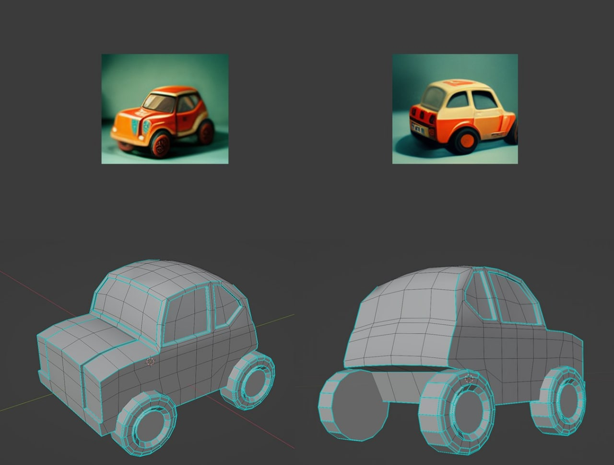

Каким образом добиться точности в проектировании/design? В
программировании это будет не только design, но и написание кода как
«проектирование с достаточной для изготовления точностью». В инженерии
железа это будет design, а аналог «кода» в программировании ---
информационная модель. В русскоязычной практике могут различать
«конструирование» как разработку форм деталей (частей системы, которые
не собирают из более мелких деталей) и «проектирование» как разработку
на основе уже известных деталей и более крупных частей (подсборок,
сборок). В любом случае, залогом успеха является доведение абсолютно
недетального описания какой-то функции («забивало») части системы до
уровня детальности, подразумевающего (по возможности, ибо этого ещё не
везде добились, не везде «токарь» стал «станком с ЧПУ» или
«3D-принтером», а слесарь-сборщик «промышленным роботом-сборщиком»)
автоматического изготовления системы, «перевода из битов в атомы».

Ключевых трендов тут два:

-   Многочисленные проверки модели инкремента. Если есть какие-то
    ошибки, то их нужно обнаруживать рано. Инкремент маленький, поэтому
    ошибки обнаруживать относительно легко.
-   Изготавливаемое изделие не надо трогать руками, ибо каждые
    человеческие руки привносят ошибки. Автор видел вязаный свитер
    машинной вязки, на котором была ввязана абсолютно чёткая и ровная
    надпись контрастными нитками: «Твоя бабушка так не свяжет». Люди
    добавляют неточность!

Многочисленность проверок начинается с того, что разработчик не
принимает решения лично. Так же, как архитектура может быть представлена
как набор архитектурных решений, так и проект системы (design в
классической инженерии, или в программировании исходный код, в инженерии
предприятия это могут быть скрипты маршрутизации работ, и т.д.) может
быть представлен как набор решений разработчика. Поэтому делаем «сдвиг
влево»: чужие глаза делают проверку текста прямо во время проектирования
очередного инкремента системы, а не после его окончания, когда принято
уже множество решений. Для этого сажаем за моделер сразу двух
разработчиков! Эта практика стала известна под названием pair
programming, она пришла из подхода eXtreme programming как результат
идеи «если что-то хорошо, то мы доводим это до экстремума». Там
рассуждали так: если кто-то посмотрит код программы кроме программиста,
то это хорошо. Доводим до экстремума: за одной клавиатурой и экраном
должно сидеть двое, поэтому в любой момент времени на код будут смотреть
как минимум две пары глаз! Заметьте, что это отличие от идеи совместной
разработки прикладного инженера и технолога по изготовлению (design for
manufacturing), когда за CAD/САПР/моделером сидят конструктор детали и
заводской инженер-технолог, хорошо знающий свой станочный парк. Или
инженер-программист сидит и пишет программу вместе с экспертом в
предметной области, для поддержки которой делается эта программа. Нет,
это именно два разработчика: один проверяет другого, даёт советы по
альтернативным решениям (например, предлагает альтернативные концепции
системы или помогает пройти развилку в уже имеющихся альтернативах,
напоминает о каких-то ограничениях в части интересов внешних проектных
ролей и т.д.). Удивительно, но парное программирование, реализованное на
практике, не привело к тому, что производительность команды, в которых
оно применялось, упала вдвое. Она была меньше, но не так значительно,
чтобы это было легко заметить без специальных исследований (а
исследований было довольно много).

Тренд тут был в том, что парное программирование стали брать на себя
моделеры, поддерживающие мышление
разработчика^[<https://ailev.livejournal.com/1515735.html>].
В простейшем моделере, который представляет из себя редактор текстов,
можно вставить проверку орфографических и грамматических ошибок. В чуть
более сложном --- предлагать даже дописывать слова. И это реализовано
даже в телефонах. Иногда это ведёт к ошибкам, но чаще наоборот,
исправляет ошибки. В более сложных моделерах можно проверить
синтаксические ошибки, связанные с форматом записи: проверить синтаксис
языка программирования. В программировании разработка ведётся в IDE
(interactive development environment, аналог CAD-систем в классической
«железной» инженерии), которые представляют собой некоторые «микроядра»,
в которые можно вставить плагины для самых разных проверок в разных
языках программирования. Простейшие проверки --- синтаксические, но есть
и более сложные проверки, например, на потенциальные угрозы
безопасности. Программный код также будет проверен на соблюдение
архитектурных принципов (скажем, проверка выполнения запрета на вызов
каких-то функций «мимо» предписанного API), есть инструменты и для этого
(они описаны в книгах по архитектуре программ).

Но дальше пришли системы искусственного интеллекта, которые так и
получили имя «парный программист». К первым таким системам относятся
GitHub
Copilot^[<https://github.com/features/copilot>]
и Amazon CodeWhisperer^[Июнь 2022,
<https://techcrunch.com/2022/06/23/amazon-launches-codewhisperer-its-ai-pair-programming-tool/>],
которые встраиваются в программистские IDE как плагины. Можно ожидать,
что аналогичные плагины «парных программистов» появятся и в CAD
«железных инженеров».

Чего ожидать дальше? Ещё меньше человеческих рук на пути от идеи к
детальной модели, готовой к изготовлению. Например, вот уже работает
цепочка:

-   Сгенерировать «неживым художником» типа DALL-E
    2^[<https://openai.com/dall-e-2/>]
    или
    Midjourney^[<https://www.midjourney.com/home/>]
    множество двумерных эскизов системы (prompt engineering, мы
    рассказывали об этом в первом разделе курса).
-   Сгенерировать начальное приближение для 3D-CAD и дальше только
    дорабатывать. Например, это делает сервис
    Kaedim^[<https://www.kaedim3d.com/>],
    хотя пока не прямо для 3D-CAD, но уже для видеоигр.
-   Распечатать результат на 3D-принтере, затем собрать промышленным
    роботом.

Вот пример результата первых двух шагов такой
цепочки^[<https://t.me/c/1262388142/7665>]:

Такой подход к генерации проектных решений на базе какой-то выученной
«большой языковой моделью» модели не только языка, но и разных моделей
каких-то предметных областей, описываемых на языке, становится всё более
и более популярным.

Вот пример такой не слишком обычной инженерии, как инженерия диджейского
сета (последовательности треков на танцевальной вечеринке, или на
радиостанции)^[<https://vk.com/wall2449939_4256>]:
музыкальный сервис узнаёт вкусы диджея, предлагая ему послушать самые
разные треки и отметить те, которые ему подходят, а затем генерирует
диджейский сет, на основании этих предпочтений. Это общий инженерный
ход. Скажем, можно выяснить предпочтения того же дизайнера автомобилей,
а затем сгенерировать ряд автомобильных форм, которые будут отвечать
этим предпочтениям. Это можно рассматривать и как использование
«рекомендательных сервисов», и как использование «парных разработчиков»
(программиста, инженера-конструктора, промышленного дизайнера или
дизайнера видеоигр, диджея и т.д.). Конечно, требования к результату в
«развлечениях» будут пониже, чем в инженерии ракетных систем или
разработке корпоративного софта, но прогресс тут довольно быстр.

Одна из проблем на этом пути --- это планирование каких-то
последовательностей преобразований моделей, ибо нейронные сети плохо
планируют (хорошо «воображают» статичный результат, но плохо планируют
цепочки действий). Поэтому трудно ожидать, что распечатанный на
3D-принтере итог работы будет автоматически собран (это ведь требует
планирования действий робота, которому ставят задачу люди). Но и это
постепенно решается, эксперименты вполне
успешны^[<http://ai.googleblog.com/2022/08/towards-helpful-robots-grounding.html>].

И тут нужно заметить, что само понятие «сборка» в современной инженерии
отходит на второй план: если используется 3D-печать, то можно
использовать вместо набора простых деталей одну сложную деталь, и сборка
тогда включает в себя меньшее число более простых операций (плюс для
меньшего числа деталей более простая логистика, а каждое соединение не
нужно отдельно проверять). При поломке можно напечатать новую деталь, а
не ремонтировать старую. Что можно так напечатать? В ракете Terran 1
компании Relative Space печатается сейчас 85% ракеты (по весу), а
цель ---
95%^[<https://www.relativityspace.com/>].
Печать ракеты (как бы странно это ни звучало) идёт 60 дней, а деталей в
этой ракете в сто раз меньше, чем в обычной ракете. Это минимум в сто
раз меньше возможных ошибок при сборке! А цена? В сто раз меньше
проверок по сборке, в сто раз меньше логистики на сборке, в сто раз
меньше возможных конфликтов конфигурации. Плюс можно каждую следующую
ракету делать чуть лучше, чем предыдущую, просто печатая улучшенные
детали для этих ракет. Непрерывная разработка, непрерывная интеграция,
непрерывное введение в эксплуатацию работают и в аэрокосмосе.
