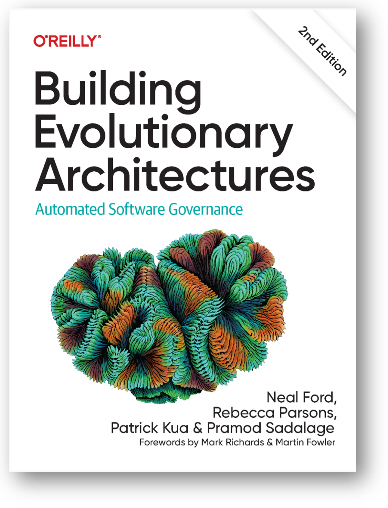

Архитектор --- это на древнегреческом «главный строитель», arkitekton,
αρχι-(arkhi-, «главный») +‎ τέκτων (téktōn, «строитель»). Он определял
что и как строить, а также следил за рабочими-строителями. Дальше
понятие архитектуры перешло во все остальные виды инженерии, при этом
понятие непрерывно менялось и было удивительно трудно определяемым, хотя
во всех этих понятиях оставалось указание на архитектуру как определение
структуры (структура --- это понимание, как система разделена на части,
прямая отсылка к системности), определение чего-то важного, чем бы оно
ни было (Ralf Johnson), а также принятие решений по основным принципам
организации системы (ибо выяснилось, что не всегда понятно про части
системы, но можно сформулировать принципы появления этих частей.
Например, так устроен интернет, и именно такое определение было дано в
ISO 42010:2011).

В 2017-2022 году понятие архитектуры, архитектурной практики и роли
архитектора претерпели значительные изменения, прежде всего в
программной инженерии, а дальше это изменение будет всё больше и больше
ощущаться во всех остальных видах инженерии (с лагом примерно 10 лет):

-   Архитектор начал заниматься не всем важным, а только тем важным, что
    входило в его concerns/«предметы интереса»/«важные характеристики»,
    к которым отнесли всезвозможные -ости/-ilities. Эти архитектурные
    характеристики иногда называют «нефункциональными требованиями», но
    это не требования, а предметы интереса (требования вообще по факту
    исчезли из инженерии), но даже не это плохо: плохо использование
    слова «нефункциональные», никто ведь не хочет заниматься чем бы то
    ни было, у чего нет функции/назначения. И это не «требования
    качества», потому как никакого отношения к качеству у этих
    характеристик нет, это оказались совершенно особенные предметы
    интереса, архитектурные.
-   Задачей архитектора стало нахождение архитектурных решений
    (architectural decisions), которые стали пониматься, как решения,
    гарантирующие оптимальные значения архитектурных характеристик (а не
    функциональных характеристик, связанных с domain). Тем самым задачи
    архитектора чётко были отделены от задач
    разработчиков/developers/прикладных инженеров для domain: прикладные
    инженеры делают систему, которая обеспечивает функциональность для
    самых разных проектных ролей, а системные архитекторы принимают
    решения, которые направляют деятельность разработчиков так, чтобы
    достичь оптимума/баланса в архитектурных характеристиках.
-   Изменился сам состав архитектурных характеристик. Так, по John Ralf
    в архитектуру входило всё важное, что бы это ни было. Важное
    определялось как то, что трудно менять: при альтернативном
    прохождении развилки в какой-то концепции системы пришлось бы
    переделывать всю систему. Скажем, принимается решение использовать
    реактивный двигатель, а не турбореактивный двигатель --- и всё,
    самолёт нужно переделывать, вот такое решение называлось
    архитектурным, и требования для него (скажем, скорость самолёта,
    которая связана со звуковым барьером, возможность преодолеть который
    зависит от типа двигателя) назывались тоже архитектурными. Вот такие
    решения сейчас оказались связанными с функциями системы в её
    предметной области и стали решениями разработчиков. А у архитектора
    появилась архитектурная характеристика evolvability/развиваемость,
    которая как раз и означает возможность «изменять трудноизменяемое»:
    гарантирует, что архитектура системы позволяет легко менять даже
    важные решения разработчиков.

Ключевым вопросом работы архитектора стали вопросы, связанные с
постоянно идущими изменениями в разработке. Система оказалась постоянно
эволюционирующей, жизненный цикл не однократным, «водопад» исчез,
окружение системы оказалось постоянно меняющимся, сценарии использования
поэтому плывущими, разработчики стали выпускать непрерывно уточняющиеся
версии систем, и не раз в пару лет (как все уже привыкли), а по
нескольку раз в день (до десятка раз, в случае программных систем).
Архитектура должна была такое позволить.

Более того, архитектура сама стала изменяться, и в архитектурной
практике появились разделы по изменению архитектуры в тот момент, когда
система уже эксплуатируется. Это верно не только для программного
обеспечения, но и для автомобилей, для космических кораблей: одни
конструкции заменяются другими, каждый новый корабль может выходить по
немного обновлённому проекту, но иногда эти обновления более чем
радикальны (достаточно посмотреть, как проектируется Starship компании
SpaceX, какие радикальные там принимаются решения в ходе разработки,
насколько отличаются друг от друга выпускаемые прототипы, как изменяются
архитектуры спутников SpaceX по мере их выпуска. Например, в этих
спутниках появилась лазерная межспутниковая связь, но в момент начала
запуска спутниковой группировки её ещё не было. Это был рабочий момент,
а не прекращение работы предыдущей версии спутников и начало работы
новых. Нет, конструкция всей группировки менялась по ходу эксплуатации).

Итак, архитектор в том числе стал принимать решения о том, на какие
части надо разбить систему, чтобы принятие разработчиками решений по
переделке системы не приводило к катастрофе, а переделки были
возможными. Более того, эти решения оказалось необходимым изменять,
поскольку в ходе переделки системы менялось понимание того, какой баланс
значений архитектурных характеристик был предпочтителен.

Вообще, сама идея о том, что архитектура должна помогать системе быть
легкоизменяемой в разработке, а не наоборот, класть в основу что-то
неизменяемое, а ещё идея о том, что архитектура сама по себе должна
меняться по ходу разработки и даже уже эксплуатации, а не определяться
поближе к началу проекта как что-то «основное и незыблемое» --- вот эта
идея была в инженерии достаточно революционна. Впервые подробно эта идея
изложена в книжке 2017 года «Building Evolutionary Architectures» на
примере программной архитектуры для корпоративного программного
обеспечения (софт для поддержки работы предприятий --- бухгалтерия,
маркетинг и т.д.), а в декабре 2022 года вышло второе издание книги,
предмет продолжает быстро развиваться:

В этой книге обращается внимание на то, что архитектура не
разрабатывается сейчас «после требований, но до
изготовления/строительства», а тоже меняется по мере того, как постоянно
меняются требования (это 2017 год, требования ещё были довольно
распространены, но признавалось, что «они постоянно меняются») и ещё
отслеживаются изменения в самой разработке. В книге подробно
обсуждается, что evolvability/развиваемость системы становится
существенной архитектурной характеристикой/предметом архитектурного
интереса, и архитектура связана не только с принципами организации самой
системы, но и с принципами организации её создателя через закон Конвея и
обратный манёвр Конвея. Закон Конвея --- это что структура системы
обязательно отразит оргструктуру предприятия-создателя, а обратный
манёвр Конвея --- что вы должны разработать лучшую структуру системы, а
потом изменить структуру предприятия-создателя системы так, чтобы она
отражала разработанную лучшую структуру системы. Если не выполнить
обратного манёвра Конвея, то через закон Конвея организационная
структура обязательно приведёт к ухудшению разработанной лучшей
структуры, и система будет неуспешна.
