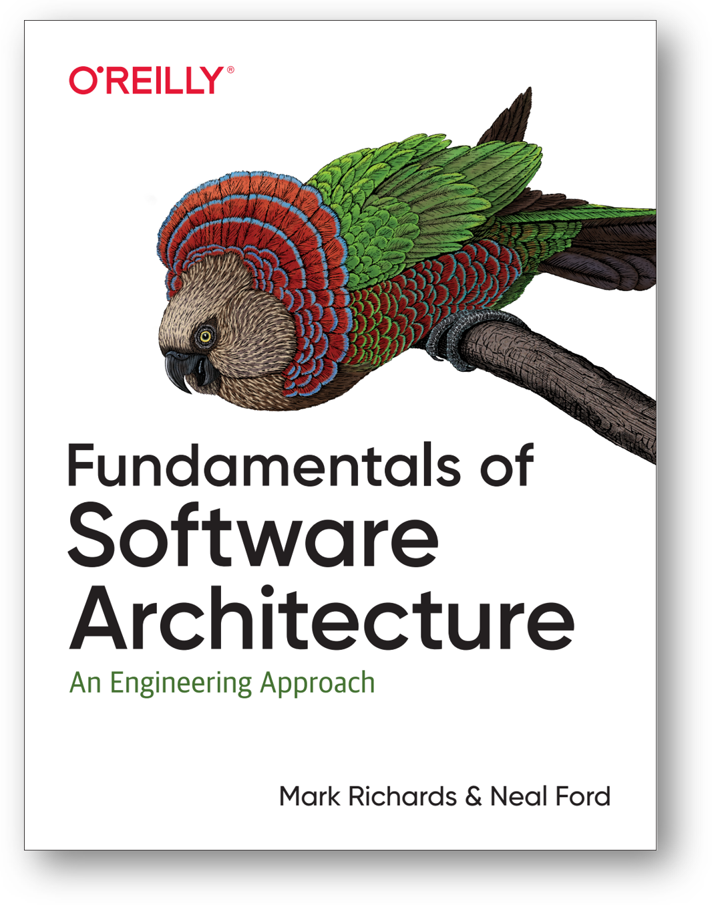
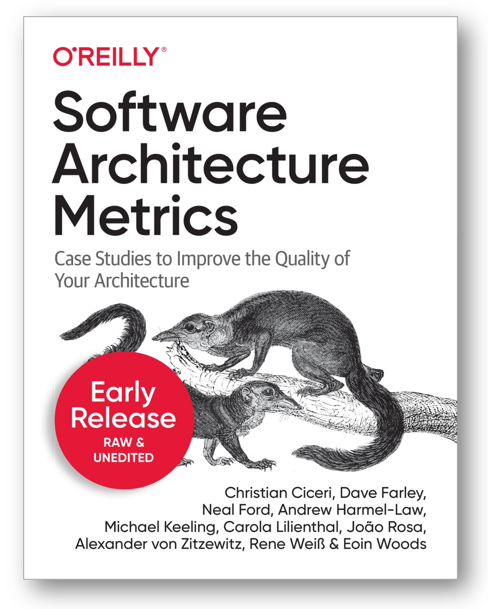

Окончательно новый подход к архитектуре на примере программной
архитектуры для корпоративного софта был сформулирован в книге
«Fundamentals of Software Architecture», 2020. Ещё раз повторим обложку
этой книги, ибо она наиболее полно раскрывает на сегодня современный
подход к архитектурной работе как отдельной практике (эта книга была в
предыдущем разделе была дана, когда объяснялось, что «всё в
инженерии --- это прохождение развилок», это было обобщение первого
закона архитектуры из этой книги):

В этой книге чётко говорится о различении прикладных разработчиков
(developers) и архитекторов (architect): предметы интереса разработчиков
лежат в реализации функциональности каким-то кодом, а интересы
архитектора очень специфические архитектурные: важные/архитектурные
характеристики, которые относятся не столько к функциональности системы
в её предметной области, сколько к общим характеристикам работы и
создания (характеристики не только времени эксплуатации, но и времени
создания!), которые делают систему успешной или неуспешной. Скажем, если
система отлично справляется со своими функциями, но вам недоступна
(плохие значения характеристики доступности/availability), то систему
нельзя считать успешной. Когда-то на заре интернета поисковые системы
были реализованы на огромных серверах Sun, но поскольку к ним обращались
одновременно тысячи пользователей, они по факту были недоступными:
ответа от них было нельзя дождаться. Это как попасть в город со
знаменитым музеем на один день, и обнаружить, что в этот музей очередь
на пять дней! Вроде музей есть, и работает, но из-за очереди нельзя
попасть! И дальше начинаются разговоры о том, что легко спутать
производительность и доступность (скажем, музей в городе может
пропустить за день сколько хочешь человек, очереди нет и в принципе быть
не может, но только работает этот музей по субботам 2 часа с 14 часов до
16 часов, а в другое время просто закрыт).

Этих характеристик оказалось множество, и для многих видов систем они
оказались более-менее повторяющимися. Вот какой-то их приблизительный
перечень (взят как раз из упомянутой книги, и там строго-настрого
предупреждается, что в каждой организации эти архитектурные
характеристики будут трактоваться по-своему):

Операционные (времени эксплуатации системы) предметы интереса, которые
пересекаются во многом с предметами интереса ответственных за
изготовление, ремонт и эксплуатацию (в программной инженерии это DevOps,
и многочисленные варианты XOps):

Доступность/availability: часы работы системы (скажем, 24 часа в сутки 7
дней в неделю, и на сколько она может закрываться на профилактику,
ремонт, отдых персонала)

-   Непрерывность/continuity: оргвозможность восстановиться после
    какой-то катастрофы (наводнение, удар молнии, война).
-   Производительность/performance: включает и устойчивость к постоянной
    нагрузке, и устойчивость к пиковым нагрузкам (часто выделяют как
    отдельный предмет интереса --- эластичность/elasticity), и частоту
    обращений к функциям системы, и время ответа на запросы, и
    требования к запасу мощности. Удовлетворение ожиданий по
    производительности само по себе будет отдельным приключением в
    разработке, может потребовать экстраординарных решений в части
    архитектуры.
-   Возможность восстановления/ recoverability: с какой скоростью в
    случае катастрофы всё восстановится? Бэкапы, дублирование
    оборудования --- это всё тут.
-   Надёжность и безопасность/reliability and safety: если что-то
    поломается, то это никому не должно повредить (никто не должен быть
    покалечен или убит, или никто не должен потерять большие деньги).
-   Устойчивость/robustness (у «железных» инженеров чаще resilience) ---
    возможность хоть как-то работать и обрабатывать неизбежные ошибки в
    критических ситуациях, когда произошли довольно крупные поломки
    (скажем, пропало интернет-соединение, или выключилось энергопитание,
    или пошёл дым из компьютерного блока).
-   Масштабируемость/возможность наращивать производительность по мере
    возрастания числа пользователей или интенсивности их запросов.

Характеристики времени создания:

-   Конфигурируемость/configurability --- возможность пользователю
    поменять конфигурацию системы самому через удобный пользовательский
    интерфейс.
-   Расширяемость/extencibility --- насколько легко добавлять новую
    функциональность.
-   Устанавливаемость/installability --- насколько легко устанавливать
    систему в самых разных вариантах использования.
-   Повторное использование/leverability and reuse --- насколько легко
    переиспользовать систему в разных проектах.
-   Локализация/localization --- поддержка множества языков, единиц
    измерения, часовых поясов
-   Сопровождаемость/maintainability --- как легко обслуживать систему
    по ходу её эксплуатации?
-   Переносимость/portability --- как легко перенести систему в другое
    окружение (например, на другую платформу, программное обеспечение на
    другую операционную систему).
-   Поддерживаемость/supportability --- уровень технической поддержки,
    который ожидается для системы: как быстро отзываются, что могут
    поправить, сколько стоит.
-   Возможность апгрейда/upgradability --- как легко и быстро перейти с
    одной версии системы на другую, будут ли вообще доступны следующие
    версии.

Этих характеристик, конечно, много больше. Например, прайвеси/privacy,
безопасность/security, которые как предметы интереса архитектор имеет
общие со специалистами по безопасности. ISO 25010 Product Quality
Characteristics архитектурные характеристики называет характеристиками
качества, и предлагает свой
список^[<https://www.perforce.com/blog/qac/what-is-iso-25010>],
но первым пунктом там стоит «1. Functional suitability», как «уместность
функциональности», то есть насколько система выполняет ожидаемые от неё
функции. И вот это предмет заботы прикладных инженеров. А вот остальные
группы характеристик там как раз архитектурные. И тут нужно сказать, что
каждая «сводная характеристика» тут разбивается на множество.

Так, часто поминается «возможность положиться на систему»/dependability
как набор более дробных характеристик: availability, reliability,
maintainability, durability, safety and security как один вариант, или
availability, reliability, safety, integrity (сопротивление к
несанкционированным изменениям), maintainability, и ещё бывают разные
другие варианты.

Современный тренд --- это работа с метриками для каждой характеристики.
Для программного обеспечения эти метрики замеряются специальными
тестами, которые называют **функция соответствия/fit** **function**
(термин взят из эволюции: система развивается в виде последовательных
своих версий в ходе длинного проекта). Fit function это по сути тест,
только не на безошибочность выполнения функции (такие тесты делают
разработчики), а на безошибочность выполнения решений архитектора (в
надежде, что эти решения ведут к успеху: у архитектора тоже гипотезы, а
не полная уверенность! Он тоже будет менять свои решения по ходу
разработки!).

Лучший способ разобраться со всеми этими характеристиками --- это
понять, как они мониторятся (постоянно измеряются) в ходе проекта. Для
программных проектов на эту тему написана отдельная книжка «Software
Architecture Metrics», 2022:

Если же у вас другие виды систем и/или какие-то другие метрики, то
напомним про существование книги «How to Measure Anything: Finding the
Value of Intangibles in Business», 2014:

Архитектор в своей работе думает ровно об этих архитектурных
характеристиках системы основное своё время, примерно так же, как
прикладной инженер думает о функциональных характеристиках. Он лично
беседует со всеми внешними проектными ролями, чтобы разобраться, какие
значения этих характеристик должны быть, чтобы система была успешна.
Хороший совет: сосредоточиться не на всех этих характеристиках/предметах
интереса, а только на реально необходимых для успеха системы! Например,
ограничиться всего тремя предметами архитектурного интереса, а остальные
отбросить. Это рекомендация книги «Fundamentals of Software
Architecture», но со всеми оговорками, что это число и сам состав
отобранных архитектурных характеристик сильно зависит от конкретной
ситуации в проекте. И дальше нужно принять архитектурные решения,
которые позволяют для достижения успешности системы удовлетворить именно
эти наиболее важные архитектурные интересы, а не вообще все (что
невозможно). Для этого архитектор (равно как и разработчик) много
общается с внешними проектными ролями и понимает ситуацию, в которой
происходит эксплуатация и разработка системы (они связаны через закон
Конвея).
