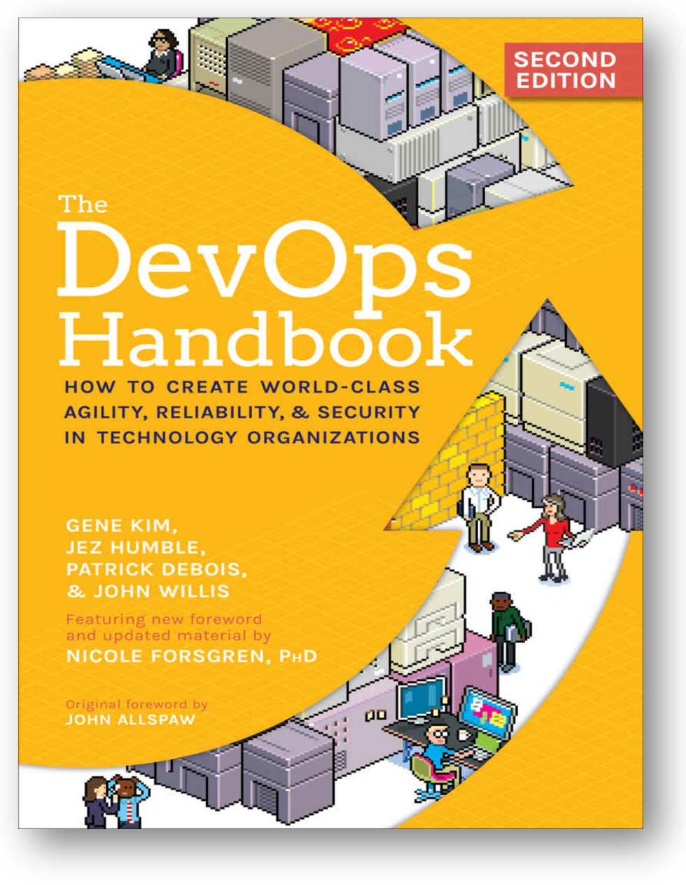

Как всегда, современное состояние практик системной инженерии нужно
смотреть не в «железной» инженерии или каких-то прикладных «не очень
инженерных» её видах типа инженерии организаций (менеджмент) или
мастерства (образование), но в программной инженерии. Управление
жизненным циклом ещё лет пять назад в программной инженерии и системной
инженерии считали почти согласованными между собой, и даже более-менее
успешно велись работы по унификации стандартов управления жизненным
циклом: стандарты практик жизненного цикла «железной» и «программной»
инженерий (ISO 15288 и ISO 12207) стремились сделать как можно более
похожими друг на друга, но тут оказалось, что если продолжать следовать
этим стандартам, то невозможно вести крупные программные проекты типа
«информационная система транснациональной корпорации», где надо
поддержать вебсайт интернет-магазина с личными кабинетами миллионов
пользователей, поддержать финансовый учёт и контроллинг, поддержать
управление запасами и работу кадровиков, поддержать собственно
проектирование и производство продукции, поддержать свод всего этого для
самых разных подразделений компании, раскиданной по многим континентам,
и ещё при этом никогда не сбоить и не останавливаться на переналадку.
Так что в программной инженерии пришлось много экспериментировать и
менять разделение труда.

Вместо «управления жизненным циклом» оказалось, что есть множество
маленьких инкрементов разных фич, которые огромное число команд как-то
замысливают, проектируют, реализуют, тестируют и потом сами принимают
решение о том, чтобы выпустить этот инкремент пользователям. Множество
крохотных жизненных циклов, переплетённых в непрерывную разработку,
результаты которой непрерывно интегрируются (сборка из деталей,
«изготовление»), а потом непрерывно вводятся в эксплуатацию. Это всё
вместе пытались называть «гибкая разработка», но слово быстро
обессмыслилось, ибо акцент был на разработчиках и путались «разработка»
в широком смысле слова (вся инженерная практика до момента эксплуатации,
а то и с эксплуатацией) и в узком (разработка функциональности системы в
отличие от архитектурной практики и управления жизненным циклом). Все
проблемы и решения исходили из того, что поменялась главным образом
практика ввода в эксплуатацию, этот ввод перестал быть конечной точкой,
это конвейер (трубопровод, pipeline), который никогда не останавливается
и выносит всё новые и новые изменения огромного числа взаимосвязанных
сервисов пользователям.

Практика, которая заменила традиционное однократное «управление
жизненным циклом» на «управление прохождением инкрементов системы от
разработчиков к пользователям» получила название DevOps: работа на стыке
между разработчиками и службой эксплуатации. DevOps было признано
неудачным названием (ибо в эту практику включили и обеспечение
тестирования, и мониторинг, и управление конфигурацией, и много чего
ещё), и ещё было много путаницы от начальной формулировки целей DevOps
(Developers, Operations) как «устранение противоречий между
разработчиками и службой эксплуатации/системными операторами».
Разработчики начали осваивать agile-разработку и стали готовы выдавать
не одну версию системы в год (ну вот примерно как сейчас выходит версия
операционной системы Android или iOS), а одну версию системы в день (ну
вот примерно как сейчас выходят версии операционной системы Windows,
чуть ли не каждый день какое-то обновление). Системные операторы при
выходе каждой новой версии должны были её развернуть, оттестировать,
аккуратно перенести в неё пользовательские данные, а потом иметь вал
запросов от пользователей по поводу устранения новых ошибок, которые
разработчики явно не спешили устранять, ибо они были заняты уже новыми
фичами. Поэтому DevOps как решение проблем («ответственные разработчики
взялись помочь системным операторам и создали DevOps»), иногда
понималось ещё и как «теперь разработчики у нас ещё и системные
операторы, эти службы объединили!». Но жизнь пошла не так, и вы можете
наблюдать сегодня самые разные ситуации (в том числе и в разработке
«железа», например в ракетостроении):

-   «DevOps» (разработчики-операторы) назвали себя только некоторые из
    разработчиков, которые пошли к системным операторам. Остальные
    разработчики остались там, где работали (но работали они при этом
    по-новому, в предыдущих разделах курса об этом много говорилось). В
    любом случае, DevOps оказались клеем между разработчиками,
    архитекторами и пользователями систем, выделились в отдельную
    службу.
-   Разработчики обнаружили, что операторы вручную нажимают кнопки там,
    где можно было всё автоматизировать. Они пришли в ужас и разработали
    новый софт, который автоматизировал все операции, которые делали
    раньше операторы и по интеграции инкрементов в целую систему, и по
    инженерному обоснованию успешности системы (прежде всего
    разнообразное тестирование, включая и функциональные тесты и тесты
    на соблюдение архитектурных решений/fit functions, и включая
    многочисленные варианты тестирования на надёжность, типа случайного
    отключения крупных частей системы, чтобы проверить работоспособность
    в условиях катастрофы --- chaos engineering, а ещё мониторинг
    защиты/security), они отстроили мониторинг уровня дефектов в
    системе, они собирали отклики пользователей, и так далее: по факту
    они сделали довольно мощную инфраструктуру этого самого
    конвейера/трубопровода от многочисленных команд разработчиков, за
    которыми присматривают архитекторы к пользователям системы.
    Операторы по факту перестали существовать, появился термин IaC
    (infrastructure-as-code)^[<https://en.wikipedia.org/wiki/Infrastructure_as_code>],
    когда под это движение DevOps подстроились инженеры компьютерной
    аппаратуры и конфигурирование и настройка компьютеров стала
    происходить без нажатия на физические кнопки, а специальными
    программами.
-   Похожие практики получили название SRE (site reliability
    engineering, инженерия надёжности сайта, причём необязательно именно
    веб-сайта), такая практика появилась даже раньше DevOps, в 2003 году
    в Гугле. После осознания роли автоматизации это всё было
    переименовано в
    NoOps^[<https://ailev.livejournal.com/1367897.html>],
    похожие практики стали появляться в самых разных инженериях (MLops,
    DataOps и т.д.). Появились конференции DevOps, учебные курсы DevOps,
    люди начали себя называть DevOps, если они работали в этой роли в
    инженерии.

Вот учебник «The DevOps Handbook» (второе издание, 2021), в котором
рассказывается о практике DevOps:

Целью практики DevOps заявляется поддержка постоянного введения в
эксплуатацию (continuous delivery). По факту же это существенно
модифицированная практика управления жизненным циклом, преобразованная
для ситуации непрерывной разработки, непрерывного принятия архитектурных
решений и непрерывного введения в эксплуатацию. Отсутствует собственно
«жизненный цикл» с его стадиями, система развивается, а не
замысливается-проектируется-изготавливается-испытывается-вводится в
эксплуатацию-эксплуатируется. **«Жизненный цикл» остался только там, где
в головах по-прежнему идея «водопада».** Например, в госпроектах: там
вся система финансирования выстроена ровно под это, «что заказали, то и
получили». Это неважно, что сама инженерия может быть устроена вполне
по-современному, обсуждение с менеджерами и заказчиками будет всё равно
«водопадным», то есть будут и требования, и разовые (а не постоянные)
инженерные обоснования и «всё как раньше, только лучше». Увы, раньше не
было всё лучше: было дорого и медленно. Жизнь поменялась (в 2003 году
вышел agile manifesto и появился в Гугле SRE, первая конференция по
DevOps прошла в 2009 году), сегодня DevOps это «практика по умолчанию» в
программной инженерии, и потихоньку распространяется на другие виды
инженерии. Суть: много-много мелких изменений системы, каждое из которых
как можно быстрее интегрируется в систему таким образом, чтобы общее
качество продукта не упало (причём выяснилось, что качество продукта при
этом ещё и растёт).
