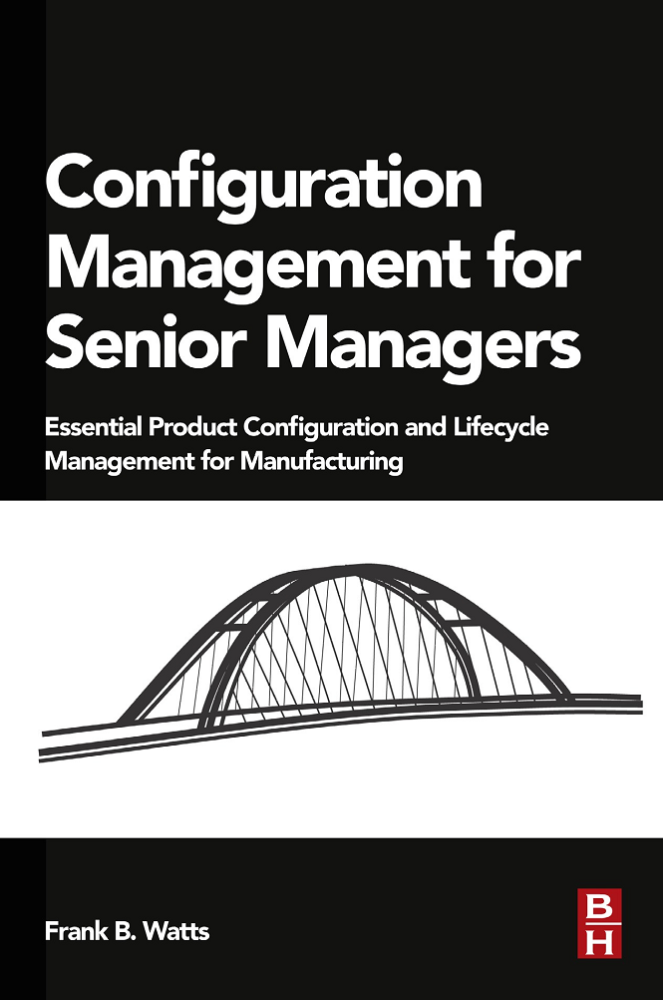

Современную практику непрерывного ввода в эксплуатацию DevOps и её
вариант для разового ввода в эксплуатацию --- практику управления
жизненным циклом (lifecycle management) отличают от практик управления
работами/операционного менеджмента (work management, operations
management --- эксплуатационная инженерия предприятия). Их различение
уже рассматривалось в курсе методологии, ибо жизненный цикл можно
считать как поведением/процессом, состоящим из функциональных
практик/деятельностей (описываемых как ответ на вопрос «зачем и как
делается», инженерный аспект), так и поведением/процессом, состоящим из
«конструктивных» работ (описываемых как ответ на вопрос «кто и когда
делает», логистический/операционный аспект). В нашем курсе мы говорили
при описании практики разработки о неразрывной связи современных практик
управления работами (в современном варианте Lean for development,
TameFlow и других методов управления потоком работ при разработке) и
практик организации непрерывного ввода в эксплуатацию.

Несмотря на то, что сегодня практически везде переходят на DevOps, во
многих и многих проектах остаётся ещё старинный вариант практики
управления жизненным циклом. При этом как специалисты DevOps любят
указать, что «наши методы подойдут и для организации водопадной
разработки, просто используйте их не все и творчески», так и специалисты
по управлению жизненным циклом любят заметить, что «для agile у нас тоже
отлично всё работает». Правильно же не обращать внимания на названия, а
обращать внимание на объяснительные теории, на которых базируются эти
практики --- а дальше смотреть на исследования по обоснованию этих
практик (упоминавшаяся уже книга «Accelerate» как раз базируется на
результатах исследований и подробно об этих исследованиях рассказывает).
Исследования обычно убедительно показывают, что интуитивные
представления о том, как надо работать, непродуктивны. Лучшие практики
контринтуитивны.

**Управление жизненным циклом** (lifecycle management) --- это практика
организации того, что в проекте будут в целом в правильном порядке
выполнены практики (функциональные объекты) как работы (конструктивные
объекты) со всеми появляющимися в ходе проекта **конфигурационными
единицами**, и ни одна из этих конфигурационных единиц при этом не будет
забыта. Неявно предполагается, что жизненный цикл это «жизненный цикл
одной системы», поэтому разговор про управление жизненным циклом
получается при непрерывной инженерии много сложней из-за постоянной
невязки того, что происходит в жизни и того, как об этом привыкли
говорить. Классическая практика управления жизненным циклом, которую
стремительно сейчас обновляют для учёта непрерывности инженерии (выхода
за пределы понимания разработки, направленной на однократный ввод в
эксплуатацию), состоит из следующих **подпрактик**:

-   **определение вида/модели жизненного цикла.** Эта тема была подробно
    разобрана в курсе «Методология», в системной инженерии как
    нормативной дисциплине говорится о том, что вид жизненного цикла
    (иногда это называют «процесс разработки») нужно выбрать явно и
    организовать работы всех участников проекта в соответствии с ним. В
    разработке софта сегодня предпочитают разные варианты гибкой
    разработки/agile, в разработке киберфизических систем на сегодня
    превалируют разные варианты V-модели и идут многочисленные разговоры
    о неизбежности принятия гибких методов разработки «железа», в
    инженерии предприятия сегодня говорят о стратегировании и циклах
    непрерывного совершенствования, а в других сферах на эту тему особо
    не разговаривают, и этот «неразговор» --- большая ошибка. Даже если
    модель жизненного цикла де-факто формулируется как «не
    интересоваться, какие у нас основные альфы и как мы планируем и
    отслеживаем изменения основных альф», это нужно проговорить в
    проекте явно, выбор даже такой «никакой» модели жизненного цикла
    должен быть сделан явно. Если вы начинаете новую разработку, то не
    факт, что вам удастся сразу реализовать то разделение труда и
    преодолеть ограничения однократного прохождения «водопадного»
    жизненного цикла, который по факту будет идти как описано у нас в
    курсе (догадки как гипотезы, много инкрементов как кусочки работ),
    но наверняка будет содержать много лишнего (типа обязательной
    разработки требований и связанного с этим «испорченного телефона»,
    подготовка отчётности, которую никто не читает), отсутствия многих
    практик DevOps (ничего «непрерывного», строгий «водопад»: всё по
    очереди, небольшое количество автоматизации, ибо «у нас особый
    случай, автоматизировать пока нельзя»). Людей в проекте затем нужно
    научить выбранному методу работы.
-   **рассмотрение метода (способа ведения** **прикладных** **работ,
    берётся от инженеров).** Стандарты, регламенты работ,
    нормативно-справочная информация --- это всё тут. Чем больше это
    похоже на заводскую разработку по военным проектам, тем больше
    становится этот раздел: есть ложное впечатление, что чем больше в
    проекте описано, тем лучше качество продукта. Оказывается, это не
    так. Качество продукта обеспечивается быстрым внесением изменений,
    непрерывным улучшением, а не дословным выполнением стремительно
    устаревающих инструкций. Иногда эту практику совмещают с практикой
    compliance (проверка соответствия), но часто compliance выводится из
    практики управления жизненным циклом.
-   **конфигурационный/операционный учёт самих объектов**
    **работы/продуктов/артефактов** **и документированных их
    описаний/«данных жизненного цикла».** Это операционный учёт, часть
    менеджмента, ибо учётные единицы тут рассматриваются не
    содержательно, а чисто логистически: «взял физические объекты и
    данные на хранение, учёл и сохранил, ничего не потерял и не добавил,
    не исказил, нашёл по запросу и передал кому надо --- но что там
    внутри, неважно». Чисто продуктная/конструктивная ипостась, и чисто
    документарная ипостась в случае данных. Этот учёт часто объединяют
    (хотя иногда его выделяют в отдельную подпрактику) с
    администрированием изменений, чтобы учтённые продукты и данные не
    изменялись бесконтрольно: каждое потенциальное изменение состояния
    ранее утверждённой версии конфигурации системы и её описаний
    запрашивается, рассматривается и после принятия решения либо
    проводится, либо отвергается. В DevOps тоже рассматривают
    версионирование (для описаний) и управление конфигурацией (для
    целевой системы), на этом основана практика непрерывной интеграции
    (continuous integration, в любой момент времени есть готовый
    целостный вариант системы). Часть этой практики --- магистральная
    разработка/trunk-based development. Управление изменениями в виде
    независимого принятия решений какой-нибудь «комиссией по изменениям»
    экспериментально было показано, что не работает (см. подробности в
    книге «Accelerate»). Это очень контринтуитивно, но команда сама
    принимает решение, что ей добавлять в общий продукт. Нет
    долгоживущей версии baseline и трудной процедуры внесения в неё
    изменений. Более того, одновременно в работе (например, при
    A\|B-тестировании) могут находиться несколько версий системы, все
    они «главные», и все они «экспериментальные». В любой момент жизни
    системы она рассматривается не как окончательная конфигурация на
    базе окончательной версии описаний системы, полученных из
    разработки, но как «текущая», которая будет меняться много раз в
    день. Поиск конфигурационных коллизий --- тут.
-   **логистика рабочих продуктов** **и документов/данных** **с акцентом
    на передачу результатов очередным исполнителям в жизненном цикле.**
    Совместно с конфигурационным учётом и учётом изменений логистика
    оставляет в проекте коллективное понимание того, что в какой момент
    где находится, кем изменяется. Тут и физическая логистика (всякие
    конвейеры и склады) и в том числе предоставление данных тем, кому
    нужно, часто это называют **управление информацией/интеграция**
    **данных** **жизненного цикла.** Вот тут в DevOps обсуждается работа
    конвейера/трубопровода/pipeline и тут связка с операционным
    менеджментом, который помогает сделать «поток» быстрым.
-   в управлении жизненным циклом **тестирование и защиту/security**
    рассматривают как что-то внешнее, а в DevOps рассматривают
    налаживание этой инфраструктуры как составную часть практики:
    учитывают «сдвиг влево» у разработчиков и обеспечивают надлежащее
    выполнение тестов и практик защиты. Иногда даже пишут **DevSecOps**.
    Но в современном DevOps ещё и учитывается работа архитекторов как
    отдельная работа: как минимум, они предоставляют компьютерную
    инфраструктуру для разворачивания архитектурных фреймворков,
    предписанных архитекторами, и эксплуатируют их, но ещё они
    обеспечивают архитектурный мониторинг, проверяют выполнение fit
    functions.

Управление жизненным циклом имеет в жизни и много других имён, каждое из
которых имеет свои оттенки смысла. Так, часто оно проходит под именем
«управление конфигурацией и изменениями» (в котором не делается, правда,
акцента на выбор модели жизненного цикла и поэтому не обсуждается
непрерывная интеграция), иногда говорят об «управлении инженерной
документацией» (это уж совсем анахронизм, но в государственных проектах
это так, а также это может встречаться в сильно зарегулированных
инженерных практиках --- строительстве, авиации). Часто при разговоре об
«управлении инженерной документацией» теряется акцент на том, что
основная конфигурация --- это конфигурация как состав частей системы в
физическом мире, а документация с описаниями системы важна, но по
большому счёту вторична, она нужна только для того, чтобы создавать и
эксплуатировать саму систему. Ну и сама идея непрерывной разработки,
непрерывной интеграции, непрерывного ввода в эксплуатацию при этом
теряется абсолютно, ибо акцент только на описания, интеграция и ввод в
эксплуатацию отсутствуют.

Если отсутствует управление конфигурацией, то в проекте появляется
огромное количество так называемых «конфигурационных коллизий»: когда
одна часть системы и/или описание системы не соответствует другой. Вот
пример такой коллизии: «в информационной модели, которую отдали
строителям, тут сплошная стена. В информационной модели, которую отдали
монтажникам, через стену в этом месте идёт трубопровод. Что делать ---
разбивать свежепостроенную стену и пропускать трубопровод в этом месте,
или перепроектировать трубопровод, но стену не трогать?!». Или «на
совещании в середине прошлого месяца мы приняли решение делать ракету
диаметром 5 метров. А вы продолжаете после этого целый месяц
проектировать ракету диаметром 4.5 метров. Как это могло произойти?!».
Вот традиционный пример из программной инженерии: «Ваше приложение не
будет работать в нашей операционной системе, ибо оно пользуется
фреймворком, который наша версия операционной системы не поддерживает.
Нет, мы не планируем обновлять версию нашей операционной системы, это вы
сделайте что-нибудь со своим приложением».

Конфигурационные коллизии обходятся проекту очень дорого, они требуют
переделывать большие куски проектов, часто по нескольку раз. Советы типа
талебовского «не будь лохом», традиционные рекомендации «не надейся на
авось», «наведите порядок в проекте», пожелания «не прощёлкивать важные
события» --- они все чаще всего про недопущение конфигурационных
коллизий, то есть про постановку практики управления конфигурацией и
изменениями.

Являются ли конфигурационными коллизиями неизбежные для систем конфликты
между системными уровнями (один уровень требует скорости и лёгкости,
другой уровень готов выдать мощность для скорости, но за счёт тяжести)?
Это вопрос открытый. Мы считаем, что если достигнуто субоптимальное
проектное «расчётное» решение в рамках достижения какого-то
квазиустойчивого/неустроенного состояния (frustration, как это
обсуждалось в курсе «Системное мышление»), то это не конфигурационная
коллизия. Конфигурационная коллизия --- это когда противоречия настолько
сильно проявляются, что система становится неуспешна (скажем, актуальная
целевая система при заявленной «разовой водопадной разработке с
однократным вводом в эксплуатацию» не соответствует документированным
требованиям к этой системе: хотели сделать систему быстрой, поставили
тяжёлый аккумулятор, и удовлетворили требованию скорости, но не
требованию к массе системы, требуются ещё итерации в разработке, но их
нет, финансирование кончилось, проект окончен, система так и осталась
неуспешной).

Основные положения управления конфигурацией на примере бумажного
документооборота (скажем, нет современных решений типа «облачная система
получения сводных заказных спецификаций») в машиностроительном
предприятии на кругозорном уровне и даже без отсылок к стандартам
системного управления конфигурацией вроде стандарта именования
инженерных рабочих продуктов IEC 81346 (он хорош для отражения
нескольких разных способов разбиения системы на части, это обсуждалось в
курсе «Системное мышление»), хорошо раскрыты в короткой (188 страниц)
книге Frank Watts «Configuration Management for Senior
Managers»^[<https://www.amazon.com/Configuration-Management-Senior-Managers-Manufacturing/dp/B019NDYT9C/>]
(2015).

Существует и неофициальный русский перевод этой книги. Несмотря на
упомянутые недостатки (бумажный документооборот, нет использования
современных инженерных стандартов), эта книга содержит в себе довольно
много опыта управления конфигурацией в традиционных машиностроительных
производствах и популярно даёт представление об основных понятиях этой
практики. Книга оказывается очень полезна айтишникам, которые плохо
представляют себе, как устроено материальное производство (не то чтобы
современное, а вообще любое: сами программисты работают с кодом, который
превращается в программы --- и им неведомы проблемы реального
производственного мира. Много выпускников ШСМ находили книгу очень
полезной для развития инженерного кругозора).

Книга выделяет несколько подпрактик управления конфигурацией, выпячивая
понятия выпуска/release и передачи/hand-over рабочих продуктов, включая
выпуск и передачу данных. Эти понятия отличаются от delivery как запуск
в эксплуатацию. По факту книга ограничивается простым «собрать все части
системы без пропусков и лишних деталей и передать в комплекте кому-то
вовне предприятия», не идёт и речи о тестировании, защите и
безопасности, архитектурных тестах и всём прочем, о чём говорится в
DevOps. Знать эту книгу полезно, ибо вы не можете ждать десятка лет,
пока все «железные» инженеры проникнутся идеями DevOps.

Центральным понятием для управления конфигурацией в этой книге является
**выпуск/release**, в том числе **передача/hand-over** рабочих продуктов
(физических систем и их частей, а также документов с данными жизненного
цикла). Книга выделяет следующие подпрактики управления конфигурацией
(хотя в книге и говорится, что «управление жизненным циклом» это синоним
«управлению конфигурацией», но выбор модели жизненного цикла там не
обсуждается, это подпрактики именно конфигурационного учёта), и обратите
внимание, что в принятом способе работ изменения утверждаются
независимыми экспертами (управление изменениями идёт как отдельная
практика), это оказалось в непрерывной инженерии непродуктивно, и мы это
уже отмечали:

-   Выпуск/release рабочих продуктов, в том числе hand-over данных
    жизненного цикла. Это о том, как отслеживать целостность мегамодели
    и системы-в-железе, а также соответствие их версий друг другу. Если
    у вас есть три варианта архитектуры и четыре прототипа, то как
    узнать, что из этого было отвергнуто, а что продолжило
    дорабатываться и станет когда-нибудь окончательным вариантом
    системы.
-   Управление изменениями как 1. то, что происходит с запросами на
    изменения (запросы иногда заканчиваются изменениями
    проекта/design) 2. Сами изменения проекта/design (изменения иногда
    заканчиваются выпуском)
-   практика выпуска заказных спецификаций (BOM, bill of materials).
    Иногда это отдельные спецификации того, что будет заказано у внешних
    подрядчиков (приобретение/acquisition), иногда это полный список
    (свод) по всему проекту: сводная заказная спецификация. Конечно, это
    специфика главным образом машиностроения и промышленного
    производства, для других видов систем будет совсем другая
    терминология. Но это верно для всей книги: нужно уметь прочесть её
    содержание «безмасштабно», вычленить основные мысли про управление
    конфигурацией и зачем это нужно в самых разных проектах создания
    самых разных систем. В целом практика выпуска заказных спецификаций
    связана с выборкой из мегамодели данных жизненного цикла правильных
    с точки зрения организации логистики кусков, «нарезкой мира на
    передаваемые между исполнителями объекты работы», к которым дальше
    применяются логистические процедуры --- т.е. вычленить те части
    работы, которые перемещаются между инженерными организациями.
-   практика работы с вариантами (variant management). Часто выпускается
    не одна какая-то система серийно, но несколько вариантов системы, в
    том числе и каждый отдельный уникальный вариант (mass customization,
    например, каждый отдельный автомобиль или компьютер может идти в
    какой-то уникальной комплектации).

Книга Frank Watts даёт много интересных советов и по организации службы
управления конфигурацией на машиностроительном предприятии. Например,
даётся совет подчинять службу управления конфигурацией инженерам, а не
операционным менеджерам. Управление конфигурацией и управление жизненным
циклом в целом, а также DevOps --- это «серая зона» системной инженерии,
ибо с одной стороны речь идёт о принятии технических решений по поводу
целевой системы (разнообразные информационные модели системы), а с
другой стороны это управление/management, то есть решения по поводу
создателя (выделяемые создателем ресурсы на проведение работ по
выбранным «технарями» практикам). «Технари», повторимся, тут условны ---
это могут быть электромеханики, коучи, хореографы, политики,
программисты кто угодно, кто занимается целевой системой. А создателем и
его ресурсами занимаются менеджеры, в данном случае операционные
менеджеры, логисты. Поэтому управление жизненным циклом и DevOps
рассматривается неразрывно с практиками операционного менеджмента: их
цель построить такую систему разработки и производства, чтобы от момента
запроса на новую фичу до момента её получения клиентом проходило как
можно меньше времени. «Как можно меньше времени» --- это задача
операционного менеджмента.
