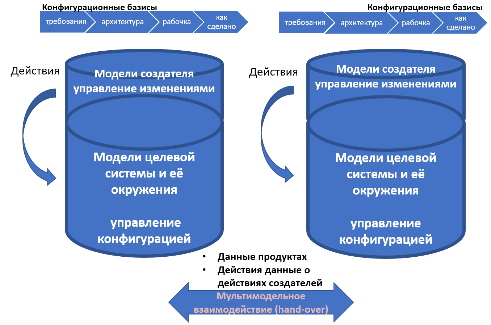

Практика управления данными условно может быть поделена на управление
данными продукта (делается при помощи систем PDM, product data
management), когда речь идёт о проектных базах данных, в которых
удерживается конфигурация целевой системы (включая промежуточные
состояния сырья, ведущие к появлению сначала частей системы, а затем и
всей готовой системы в целом) и управление данными жизненного цикла
(PLM, product lifecycle management), когда кроме данных о продукте
добавляются и данные о создателях (кто что делает). Помним, что если
кто-то что-то делает (данные об организации проекта и состоянии этой
организации), то обязательно есть то, над чем эти работы ведутся ---
рабочие продукты, в конечном итоге превращающиеся в целевую систему. Это
ведёт к появлению самых разных гибридных описаний. Тренд сегодня в том,
что к числу обязательных системных разбиений добавляют разбиения уже не
только самой целевой системы «как в PDM», но и прихватывающие
рассмотрение систем в цепочке создания (например, четвёртый аспект
рассмотрения системы по стоимости уже прихватывает не только стоимость
сырья и стоимость заказных компонент системы как продуктов, но и
стоимость выполнения работ, в том числе эксплуатационную стоимость ---
разбиение полной стоимости владения). А ещё кандидатом на обязательное
разбиение становится разбиение работ (WBS, work breakdown structure).
Формально PLM отличается от PDM как раз тем, что хранит конфигурацию не
только продукта (целевой системы), но и проекта (создателей в их
цепочке, в том числе конфигурацию работ). По факту PLM состоит обычно из
системы версионирования (репозитория), в которой хранится информация о
конфигурации продукта и issue tracker, в котором хранится конфигурация
работ. Например, для случая софта это может быть репозиторий Git и issue
tracker к нему, которые собраны в какой-то общий сервис вроде
GitHub^[<https://github.com/>] или
GitLab^[<https://about.gitlab.com/>]. В
случае «железного железа» (механические системы, не компьютерное железо)
это может быть сервис типа
OpenBom^[<https://www.openbom.com/>].

Последний тут тренд --- это переход от PLM систем к eXperience Platforms
(XP). Основная идея --- это показать выход за пределы традиционно
понимаемого жизненного цикла проекта, чтобы отразить происходящее до его
начала, равно как и после окончания (выход в другие масштабы времени,
необязательно эволюционный масштаб множества жизненных циклов с
изменением основных архитектурных решений системы, но хотя бы выход в
полный жизненный цикл, ибо PLM система в основном центрировалась на
разработке). Ещё одна проблема, которую решает переход от PLM системы к
XP --- это управление информацией, важной для внешних проектных ролей по
отношению к команде проекта (PLM прежде всего ориентировались на
поддержку команды проекта, и обычно не на всём жизненном цикле, а только
на стадии разработки). Так, UX (user eXperience) от UI (user interface)
отличается тем, что призывает поглядеть на user отнюдь не в тот момент,
когда он нажимает кнопки приложения на экране: его проблемы начинаются
сильно раньше и заканчиваются сильно позже, и момент нажатия на кнопки
там только часть происходящих событий у пользователя. Но в предметной
области UX не доходят до систем управления данными, не доходят до
управления конфигурацией, просто указывают на вот этот разворот в
понимании жизненного цикла как eXperience. Тем не менее в инженерии этот
тренд был подхвачен, и программный комплекс PLM ENOVIA плавно перешёл в
3DEXPERIENCE^[<https://www.3ds.com/products-services/enovia/products/>].
Теперь этот программный комплекс занимается управлением информацией
жизненного цикла в машиностроительных и строительных проектах
(указывается на применимость в 11 отраслях), и тоже смысл переименования
был в том, что он начал поддерживать работу с данными жизненного цикла
далеко за пределами стадии проектирования, как это было в ENOVIA. Но всё
же там в основе ровно то же самое, что и для PLM: репозиторий для
отслеживания версионирования конфигурации (конечно, с интерфейсами к
самым разным CAD/САПР системам, самым разным моделерам) и issue tracker
для управления изменениями.

ML (machine learning) сегодня хотят обозвать XL (eXperience learning),
ибо ML означает в жизненном цикле главным образом разработку моделей, а
XL должно включать и постановку задач на моделирование, и применение
моделей, и масштабирование и много чего
ещё^[<https://analyticsindiamag.com/move-over-ml-its-time-for-xl/>].
Ещё один пример --- это LMS (learning management system, аналог PLM для
систем образования, поддерживает решение проблем команды образовательных
организаций) стал сейчас LXP, learning eXperience platform, ибо
поддерживает решение проблем студента, а не только решение проблем
учителей^[<https://www.growthengineering.co.uk/what-is-learning-experience-platform/>].
Так что в современный курс системной инженерии мы вписываем и PDM, и
PLM, и eXperience (со второй большой буквой, чтобы отличить от просто
«опыта»). И это ещё не конец истории, поскольку появился и новый термин,
обращающий особое внимание на операционные данные (данные стадии
эксплуатации): цифровой двойник (digital twin) в его вариантах цифровой
модели, цифровой тени и истинного цифрового двойника. Но об этом в
текущем разделе курса будет немного дальше.

Главное, что нужно запомнить, что во всех этих системах увязываются
работы создателя и конструкция целевой системы: **все контрольные точки
(они нужны для операционного управления, то есть** **для управления
работами** **создателя** **по воплощению)** **порождаются для модели
проекта** **на** **основе** **модели продукта.** **Тут асимметрия: не из
работ по воплощению делается разбиение системы, а наоборот: работы по
созданию описания** **проекта/design** **делают описание целевой
системы, а из этого описания делается описание работ проекта/project.**
**Для каждой части системы предусматриваются типовые контрольные точки
(спроектирована, заказана, получена, смонтирована, проверена), а потом
просто уточняются моменты времени и работники, которые выполняют работы
для достижения этих контрольных точек.**

Моменты времени для контрольных точек расставляются исходя как из
технологической последовательности («сначала стены, потом крыша»), так и
из балансировки ресурсов («побыстрее» против «равномерной загрузки» ---
или в пике на стройке атомной станции вдруг обнаруживается 2700 человек,
и начинаются проблемы с туалетами, обедами, жильём, но всё идёт очень
быстро, или равномерно на станции работает каждый день примерно 700
человек, но не больше и не меньше --- стройка будет подольше, но и
многие проблемы пиковых авралов отсутствуют).

Проверка качества такого планирования может быть --- анимационными
роликами (имитационное моделирование). В них хорошо видно, как «забыли
завезти крупногабаритное оборудование вовремя, пришлось разбирать
свежевозведённую стену, чтобы затащить оборудование в помещение»).

Такая практика порождения контрольных точек из данных по продукту
получала разные названия, потому что люди из маркетинга очень хотели
иметь собственный фирменное наименование для такого «прогрессивного
способа» увязывания конфигурации продукта (3D-модели продукта для
киберфизических систем) и конфигурации работ.

При этом число D (dimension, «измерение» в описании) в итоговой
мегамодели потихоньку росло с начальных 6D. У Toshiba в конце нулевых в
софте для конструирования было 6D (хотя это уже давно забытый факт, но
технология называлась 6D), у НИАЭП в начале десятых годов 21 века было
радикальное Multi-D, в последние несколько лет популяризируется 8D как
самое броское в популяризации подхода, например 8D digital twin
experience от
SNC-Lavalin^[<https://www.youtube.com/watch?v=OjH1OPezfak>].
В 8D подходе всё ровно то же самое, что можно было услышать десяток лет
назад в презентациях по PLM, но слова другие --- digital twins, ибо
акцент уже не только на проектировании и сооружении, но и на
эксплуатации, поэтому engineering data дополняются asset data, а
конечная цель --- автономная (без человека, где-нибудь в абсолютно
безлюдной местности) эксплуатация на основе \"единственного источника
правды\", single source of truth (это мы повторяем материал курса
«Системное мышление», подраздел *«*Альтернативные варианты основных
видов разбиения системы на части»):

-   1D метаданные, документация (тексты)
-   2D чертежи (там, где «обычные двумерные чертежи» ещё есть, «родные
    файлы» из CAD/САПР)
-   3D информационные модели (это представление физической
    формы/геометрии/компоновки системы с указанием материалов и многих
    других характеристик)
-   4D «видеоролик» стройки/сборки в развёртке во времени, то есть к 3D
    добавляется план/schedule сооружения (стройки и монтажа) или сборки
-   5D это ресурсы, material status/cost, то есть добавляется стоимость
-   6D вот тут появляется operation, real time data (и мы перешли из
    «constructon time»/«enabling realm»/«времени создания» в «operation
    realm»/«operation time»/«время эксплуатации», и с этого места
    принято говорить, что речь идёт не о системе поддержки жизненного
    цикла/PLM, а цифровом двойнике/digital twin уже созданной физической
    системы)^[Тут, конечно, не нужно путать с 6D для
    экспоненциальных технологий от Peter Diamandis и Steven Kotler
    (exponential organizations должны быть digitised, deceptive,
    disruptive, dematerialized, demonetized, democratized, это
    Singularity University в 2016, когда модно было искать везде
    экспоненты и единорогов) ---
    <https://www.diamandis.com/blog/the-6ds>]
-   7D это live streaming, передача видеопотока работающей целевой
    системы и её окружения (с видеокамер, со спутника --- отдельно от
    real time data с датчиков, ибо это огромные объемы данных).
-   8D это уже аналитика, предсказания систем машинного обучения (ML
    predictive data)

Ключевое тут --- это собрать все данные под контроль конфигурации
(иногда это называют «управление информацией», иногда «интеграцией
данных жизненного цикла», иногда «непрерывная интеграция») так, чтобы
можно было проверить отсутствие конфигурационных коллизий в компьютерной
модели до того, как они проявятся в момент изготовления системы и уж тем
более эксплуатации системы. Если система имеет электропитание 12 вольт
(и это электропитание проектирует одна фирма), а осветительную лампочку
в неё запроектировали на 220 вольт (это делала другая фирма), то это
должно быть обнаружено ещё до покупки лампочки, до выдачи лампочки в
монтаж, до включения лампочки в актуальной системе. И особо повторим:
кроме интеграции данных жизненного цикла для продукта/целевой системы
нужно ещё интегрировать данные менеджерские, то есть данные по системам
создания, и тоже думать об отсутствии конфигурационных коллизий. И это
очень чувствительная для менеджеров и инженеров практика: в ней хорошо
видны не только банальные ошибки планирования, но и тщательно
запланированные злоупотребления.

Вот картинка, которая показывает более чем обычную ситуацию: две PLM
(или XP) системы в одном проекта, при этом они могут быть развёрнуты или
в разных подразделениях одной большой фирмы, или даже в разных фирмах,
когда разработка ведётся в рамках «производственной кооперации»/
«extended enterprise».

Картинка отражает обычное на сегодня состояние проекта, как это
понимается в классической «железной» системной инженерии,
предусматривающей «однократный ввод в эксплуатацию». Научитесь по таким
картинкам определять, что они «из прошлого десятилетия» (хотя могут быть
подготовлены вчера!). Какие признаки старого мировоззрения, старой
инженерии? На картинке же вроде правильные слова про «модели»,
правильные слова про управление конфигурацией, правильные слова про
системы? Но на ней приведены два водопада, начинается всё с требований
(а не use cases и другие современные способы описывать функциональность
системы), концепция системы и архитектура не разделены (хотя это частый
случай), рабочка и как сделано тоже последовательны (не каждое
отклонение немедленно вносится в рабочку, а сначала всё делаем, потом
вносим все изменения --- в уме рисовавшего диаграмму был «водопад»). Вы
должны распознавать всё это, ибо рядом с такими диаграммами будут
обязательно написаны слова про agile (это же модно! Все хотят быть
«гибкими» и «современными», а слово написать на эту тему нетрудно).

Но давайте разберёмся, о чём нам говорит такая диаграмма (она ведь
описывает положение дел, которое вам наверняка встретится в каком-нибудь
строительном проекте, или проекте создания электростанции). В каждой
системе есть и система версионирования продукта (отслеживание модели
целевой системы и её окружения, обычно репозиторий, относится к
управлению конфигурацией) и issue tracker (модели создателя, прежде
всего проводимых создателем работ по созданию его системы в цепочке
создания). Эти системы общаются между собой (обмениваются данными), и
тут нужно помнить: передавать между системами нужно не только информацию
о продукте (например, новую деталь или программный модуль с замечаниями
к ним), но и информацию о планируемой работе (например, указание на то,
что нужно посмотреть на свежеразработанные деталь или программный модуль
и прислать в ответ замечания).

Иногда управление конфигурацией относят именно к управлению инженерными
данными для целевой системы, а управление изменениями к управлению
данными о том, кто и что делает, то есть управлению операционными
данными для системы создания. Как ни разносить интеграцию данных
жизненного цикла по разным практикам, нужно просто понимать, что
конфигурационные коллизии нужно искать в мегамодели, которая описывает и
продукт/product и проект/project, и это нужно делать в условиях
множества не только продуктов-подсистем целевой системы и окружающих
систем в надсистеме, но и в условиях множества проектов, которые ещё
готовы как-то делиться инженерной информацией, но часто не готовы
делиться информацией о выполнении работ. Не забывайте, что кроме
управления конфигурацией вам нужно налаживать управление изменениями:
делать запросы на изменения (engineering change requests), рассматривать
эти запросы (проводить заседания комиссии по изменениям, CAB, change
advisory board), проводить разрешённые изменения (engineering change
order, «поручение на изменение»), а затем сообщать всем о том, что
изменение проведено (engineering change notice, «извещение об
изменении»), чтобы все участники проекта ориентировались на новый базис,
а не продолжали пользоваться старым.
