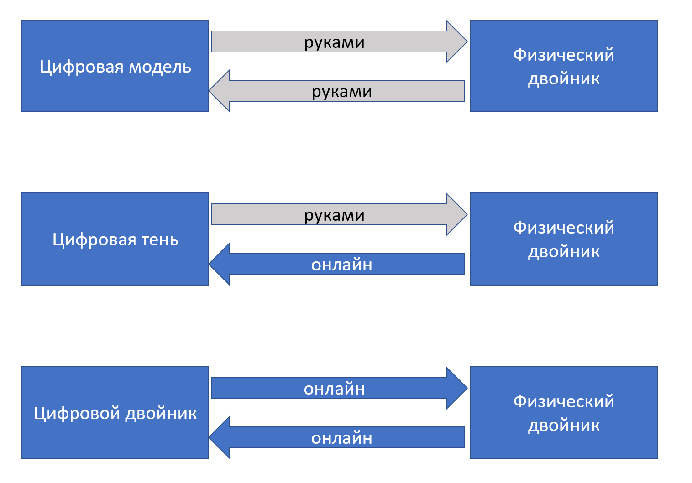

Системная инженерия потихоньку решает проблему DevOps: практики
разработки и практики эксплуатационной инженерии систем оказались
разобщены, ибо в ходе разделения труда одни инженеры проектировали и
изготавливали систему, а другие инженеры занимались её эксплуатацией
(настраивали для получения оптимальных режимов работы, загружали сырьём,
следили за отсутствием поломок, а если системами пользовались
люди-неинженеры, то помогали этим людям). Особенно ярко это проявилось у
системных администраторов программных систем и разработчиков программных
систем: у них был образ, когда разработчики перекидывают очередной релиз
на сторону сисадминов, а дальше сисадмины мучаются, пытаясь объяснить
пользователям, почему всё вдруг не работает, или работает не так хорошо,
как хотелось бы. Это примерно та же проблема, которая есть у официантов
и кухни: претензии клиентов слышат официанты, а повара делают своё дело,
полностью изолированные от клиентов. Движение DevOps было призвано это
изменить, и в программной инженерии даже наметился способ, которым это
изменение должно работать: операторы системы должны быть заменены
роботами, операторов не должно быть, DevOps решается как NoOps.
Кухня --- и сразу едоки, никаких официантов, с роботом не поскандалишь,
и робот заодно меньше ошибается и работает быстрее и дешевле.

В системной инженерии «железных систем» этот же тренд развивался как
движение «цифровых двойников», digital twins. Это именно двойники, то
есть они похожи друг на друга, а не «близнецы», ибо их природа разная:
физический двойник это и есть целевая система, а виртуальный/цифровой
двойник --- это операционная модель целевой системы. Путь к настоящему
цифровому двойнику занимает обычно несколько шагов, отражённых на
рисунке:

Сначала появляется цифровая модель физического двойника, которая не
связана с физическим двойником цифровой нитью. Цифровая модель
отличается от обычной мегамодели, используемой в инженерии (в PLM, ERP)
системах тем, что она содержит в себе какие-то данные и приложения,
работающие с так называемыми историческими данными, то есть данными
времени эксплуатации. Эти данные анализируются, и по ним принимаются
решения о том, как операционные инженеры должны изменить настройки
физического двойника, чтобы оптимизировать его работу. Импорт-экспорт
данных и с датчиков физического двойника и результатов расчётов
оптимальных режимов работы на модели происходят вручную.

Потом налаживается съём информации с датчиков физического двойника в
реальном времени через цифровую нить (в онлайн-режиме, постоянно, а не
руками и изредка). Цифровая модель начинает в любой момент времени
отражать важные характеристики физического двойника, и её называют уже
цифровой тенью.

Цифровой двойник --- это когда результаты работы цифровой тени в виде
предложений по настройкам физического двойника попадают в физического
двойника не «вручную», а тоже в режиме онлайн, то есть цифровая тень
онлайн начинает рулить физическим двойником, так что она уже не совсем
тень. Так что с этого момента говорим о полном цифровом двойнике, а не
модели или тени.

Так что цифровой двойник --- это автоматизация (гиперавтоматизация,
цифровая нить, цифровая трансформация и т.д.), которые доводятся до
стадии эксплуатации. Особый упор тут на физическое моделирование и
использование данных физического (имитационного) моделирования для
настройки эксплуатационных параметров системы.

Особо нужно отметить использование термина «цифровая трансформация».
Формально: «замещение бескомпьютерных технологий и ручной работы
компьютерными» или «замена более старых компьютерных технологий на
новые». То есть формально это ничего не значит, любые изменения в
работе, происходящие от замены чего-нибудь компьютерного.

Но неформально это означает организационные изменения (появление новых
практик работы, поддержанных оргструктурой организации и ресурсами, то
есть появление новых оргвозможностей/capabilities), необходимые для
интеграции данных жизненного цикла/ведения деятельности с использованием
цифрового двойника. И ключевое тут то, что мегамодель цифрового двойника
заходит в стадию эксплуатации/operations, а не только используется в
ходе разработки/development и изготовления/construction.

Концепт цифрового двойника, объединяемого цифровой нитью, оказался очень
удачным, и его начали использовать повсеместно вместо специализированных
PDM (систем версионирования продукта), PLM (в которых добавлен issue
tracker), eXperience platform (добавлены все стадии разработки, а также
изготовление). Его начали использовать и в машиностроении, и в медицине,
и в строительстве (и даже градостроении, ибо идут разговоры о «цифровом
двойнике умного города»), и в образовании --- идея захватила массы. В
частности, вы можете не только читать наш курс как учебник, но и
проходить курс в информационной системе Aisystant Школы системного
менеджмента. В принципе, её можно отнести к LXP (learning experience
platform)^[<https://www.growthengineering.co.uk/what-is-learning-experience-platform/>]:
поддерживается конфигурация учебных материалов, которые предъявляются
студентам, поддерживается конфигурация группы текущих активных студентов
(и прошлых тоже, это ведь в том числе и система версионирования!),
поддерживается учёт материалов, которые студенты уже прошли и хранятся
ответы студентов, но и после выпуска студента система продолжает
отслеживать его состояние, это оценка квалификации студента в момент
эксплуатации освоенного на курсах
мастерства^[<https://system-school.ru/qualification>].
Конечно, это пока не полноценный цифровой двойник (где в реальном
времени и без участия людей отслеживается информация о поведении бывшего
студента, а потом этому бывшему студенту даются рекомендации, как ему
оптимизировать свою «эксплуатацию»), но как минимум, это цифровая
модель, затрагивающая стадию эксплуатации.

Конечно, «цифровой двойник» --- это безмасштабная идея: говорить о
цифровых двойниках начали по отношению к каким угодно целевым системам
(мостам, городам, пациентам, студентам), и вся эта история про цифрового
двойника, провязанного цифровой нитью, только-только
начинается^[Подробней смотри серию публикаций
<https://ailev.livejournal.com/1549559.html>,
<https://ailev.livejournal.com/1548016.html>,
<https://ailev.livejournal.com/1550931.html>].

Что будет дальше? Дальше, конечно, выход за пределы поддержки одного «не
жизненного не цикла», захват времени эволюции (версионирование мутаций и
учёт эволюционной приспособленности/fit к окружению для вариантов).
