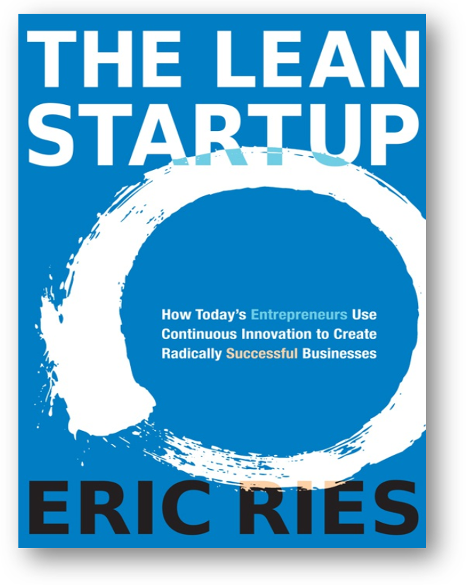

Есть довольно много разных мнений о том, что следует обосновывать при
создании систем, но большинство из них подразумевает однократное
обоснование, а не инкрементальное непрерывное обоснование того, что
делается:

-   Общую успешность системы (как в суде --- чёткий короткий вердикт об
    успешности. И если завтра система неуспешна --- это уже завтра, что
    с этим делать, непонятно).
-   Соответствие систем (надсистемы и целевой системы) потребностям и
    требованиям, пункт за пунктом. Проблема испорченного телефона не
    волнует, ожидается, что потребности и требования тоже обоснованы и
    «истина, подписанная заказчиком один раз, причём навсегда».
-   Соответствие работы создателя системы каким-то практикам
    (process-based) в надежде, что это приведёт к успешности системы.
    Эта идея стоит за самыми разными процессными стандартами серии ISO
    9000 и даже стандартами системной инженерии ISO 15288 и программной
    инженерии ISO 12207, уровнями зрелости процессов (если вы уже
    достигли зрелых процессов, то всё хорошо, улучшаться дальше некуда,
    а результаты автомагически должны быть успешными). Если вы вдруг
    создали вместо борща яичницу, но с соблюдением всех правил готовки и
    все шаги приготовления у вас записаны, то считаем результат
    успешным, хотя нужен был борщ (а яичница --- это была ваша гипотеза,
    которую вы уговорили подписать заказчика как требования, но дальше
    вы её готовили по всем правилам!).
-   ... и так далее.

Малопонятно, какой детальности должны быть обоснования. Например, хватит
ли обоснования «честное слово, всё будет в порядке!» в письменном виде
от генерального конструктора ракеты перед её вылетом на Марс? Или
всё-таки нужно проверить всё хотя бы на уровне крупных блоков ракеты?
Или всё до последнего винтика --- но как это сделать в собранной ракете?
А если у вас каждая ракета как экземпляр отличается от предыдущей
множеством улучшений --- это требует полного нового обоснования, или
часть предыдущих обоснований можно считать проделанной, и какую именно
часть, там ведь сложные взаимодействия по линии эмерджентности новых
фич, которые добавлены в ракету?

«Обосновывающее дело» стало ответом на эти вопросы: было признано, что
если у вас есть хорошо документированные свидетельства о том, что всё,
что можно, было испытано, что нельзя испытать, то хотя бы обсуждено
экспертами, то нельзя сделать никаких выводов, если не строить какую-то
структуру из взаимосвязанных **аргументов** для ответа на общий вопрос о
том, удалось ли сделать систему успешной. Всё остальное можно
рассматривать лишь как аргументирование в поддержку или опровержение
общей претензии на успешность системы. Свидетельства/улики поддерживают
или опровергают какие-то аргументы, а аргументы (все вместе их
рассматривают как «структурированный аргумент») поддерживают или
опровергают заявление об успешности.

Главная проблема в инженерных обоснованиях в отличие от судебных
доказательств, в том, что речь идёт обычно о будущем времени, а не о
произошедшем уже событии. «Виновен» это про прошлое, а вот «успешна» ---
это про то, что система в момент эксплуатации будет наносить
непоправимую пользу, на неё можно будет положиться, от неё можно будет
зависеть, и она не подведёт.

Обоснование тем самым представляется порождающей моделью, в которой мы
можем посмотреть на вероятное/возможное будущее. То есть мы строим
объяснительную порождающую излагаемую контрфактуально теорию, которая
должна дать оценку сюрприза (surprise, термин из байесовской
вероятности) неприятных событий при эксплуатации целевой системы в её
окружении^[<https://www.researchgate.net/publication/266656679_A_world_full_of_surprises_Bayesian_theory_of_surprise_to_quantify_degrees_of_uncertainty>].

Какие неприятные события? Прежде всего, это аварии: отказы в работе.
Аварии делим на проектные (которые учтены в проекте) и запроектные
(которые настолько неожиданны, что в проекте не учтены). Конечно, мало
кто реально считает байесовские вероятности и именно «байесовский
сюрприз», но в инженерных проектах реально пытаются обосновывать
поведение системы в будущих ситуациях не только нормальной работы, но и
ситуациях аварийных.

В инженерных обоснованиях тем самым занимаются рациональным (на основе
лучших известных нам методов принятия решений) принятием решений о том,
можно ли считать инженерный проект успешным и считать успешной целевую
систему, которая должна будет эксплуатироваться по итогам этого проекта.
Это начинается с обоснований/rationale при принятии проектных/design
(концепция системы --- «пишите комментарии с обоснованиями») и
архитектурных решений (обязательно писать в ADR обоснование), так и
продолжается проведением самых разных тестов и выводов на основе этих
тестов (это обсуждается в DevOps/SRE, равно как и в классической
«железной» инженерии).

В больших дорогих проектах «железной» системной инженерии в серьёзно
зарегулированных областях (авиастроение, строительство, ракетостроение,
военная инженерия и т.д.) обоснование занимает огромное количество
времени и выполняется более-менее строго, за это получают зарплату
надзорные органы (и часто говорят, что они получают зарплату за то,
чтобы хоть что-то найти --- поэтому даже если всё в порядке, они
что-нибудь найдут и потребуют исправить).

Делаются **претензии/claims** на выполнение требований (это же
регулируемая государством инженерия, без требований вам не дадут ничего
сделать, «испорченный телефон» входит в условия работы), которые не
нужно путать с самими требованиями/requirements. Основное отличие
претензий от требований в том, что в требованиях модальность
деонтическая (долженствования, то есть используются слова «должен»,
«рекомендуется», «может» и т.д.), а в претензиях --- алетическая
(существования, то есть используются слова «быть» или «будет», причём в
английском это is или will be, а в русском этих слов может и вовсе не
быть, разве что в каком-то совсем уж канцелярите будет «является» или
«будет»). Скажем,

-   **требование:** для модуля М напряжение на выходе q **всегда**
    **должно** **быть** больше или равным напряжению на выходе r для
    всех наборов входных напряжений.
-   **претензия:** для модуля М напряжение на выходе q **всегда** больше
    или равно напряжению на выходе r для всех наборов входных
    напряжений.

Эти рассуждения весьма распространены в однократных жизненных циклах
классической старомодной системной инженерии. В современной инженерии
модальность не деонтическая, а доксическая (веры): для модуля М
напряжение на выходе q **всегда** **ожидается** больше или равным
напряжению на выходе r для всех наборов входных напряжений.

И вот эту претензию выполнения одного требования, в том числе претензию
выполнения всех требований, всех требований и всех потребностей и
обосновывают **аргументами/arguments**, в поддержку которых предъявляют
**свидетельства/доказательства/evidence.** Например, свидетельством о
выполнении претензии из предыдущего абзаца могла бы быть таблица самых
разных входных напряжений и приведённые для них замеры напряжений
выходов q и r, а аргумент --- «мы проверили довольно много вариантов
входных напряжений, и для всех них оказалось, что напряжение на выходе q
больше или равно напряжению на выходе r». Или свидетельством был бы
предоставленный образец модуля, для которого нам бы пришлось для
построения аргумента самим провести замеры выходов для самых разных
входных напряжений и тем самым самим подготовить таблицу.

Идея инженерных обоснований с использованием «обосновывающего дела»
(assurance case) в том, что **документируются** (в программной инженерии
ведутся логи/«журналы»)

-   и свидетельства (результаты испытаний и сам факт их проведения,
    экспертные заключения и т.д.),
-   и аргументы (объяснения, которые кладутся в основу заключения о
    верности претензии)
-   и сами претензии, которые считаются верными или нет (то есть
    признали ли мы выполненными требования и потребности, или нет).

Проблема в том, что претензия обычно говорит о выполнении требования в
тех ситуациях, когда невозможно представить какие-то достаточно
убедительные формальные основания, и прежде всего это
ситуации-в-будущем, то есть в момент эксплуатации. В предыдущем примере
мы могли убедиться, что претензия вполне обоснована на момент проведения
замеров. Но будет ли она обоснована, когда модуль M улетит в космос и
будет там работать в невесомости и вакууме после всех механических
перегрузок, которые у него будут на взлёте? Или после попадания молнии в
корпус ракеты, которая несёт модуль M? Но тут ещё важно, что сама ракета
и модуль М будут меняться от экземпляра к экземпляру, мы выходим за
рамки традиционной водопадной идеи об однократного прохождении
жизненного цикла системы.

С гипотезами всё ещё хуже, ибо нельзя «доказать верность гипотезы»,
можно лишь её опровергнуть, это общий вывод попперианской науки и, как
всё более и более становится очевидным, «попперианской инженерии».
Наиболее чётко это сформулировано в книге «The Lean startup», 2011 (есть
и русский перевод):

Предпринимательство (создание работающей бизнес-модели, то есть
понимание того, как инженерия целевой системы будет приносить доход
больший, чем расходы на эту инженерию) тут показано как идущее по пути
непрерывного уточнения гипотез и непрерывных попыток их обосновать
сначала «умственно» на основе инженерных представлений об окружении
будущей системы, а затем обязательно в эксперименте-тестировании. Идея
тут в том, что испытания жизнью (как в эволюции! Тебя проверяют на
соответствие окружающей среде не специальными испытаниями, а просто
жизнью --- выжил и успел размножиться и вырастить детей, значит хорош.
Не успел --- ну, не успел. В биологии это «умер», в техноэволюции ---
«давайте что-то переделаем и продолжим») это самые главные испытания, и
инженерное обоснование базируется на том, что потребители и все
остальные внешние проектные роли довольны системой.

То, что в жизнь входит решение проблемы DevOps через
непрерывный/continuous ход разработки и поставки её результатов,
ситуацию с верой в однократное обоснование в виде слушаний перед судом
осложняет ещё больше: оказывается невозможным провести каждый раз
полноценное доказательство того, что продукт работоспособен. Скажем, мы
меняем в огромном самолёте винтик в кресле пассажира, формально это ведь
изменит конфигурацию! Должны ли мы провести полноценные лётные испытания
после этого? А если поменяли двигатель? А если поменяли крыло? Если мы
сертифицировали какую-то конфигурацию операционной системы на выполнение
всех требований безопасности (тут «требования», ибо деонтическая
модальность со стороны регуляторов: «должны», и в проекте это «должны»
не обсуждается!), а потом поменяли три каких-то модуля в связи с
замеченными в них потом ошибками --- считаем ли, что это уже другая
версия операционной системы, и она опять должна пройти все
сертификационные проверки? Мы проверили, что тренировочный центр для
собак сумел научить пять собак подавать лапу и не кусаться почём зря.
Считаем ли, что этот центр сможет учить этому всех остальных собак? А
если в нём заменили после проверки половину инструкторов? А если
заменили всех инструкторов? А если речь идёт не о следующем дне после
проверок и испытаний, а о нескольких годах после? В DevOps обоснование
успешности системы проходит другим способом, предусматривающим
проведение экспериментов (включая A\|B
тестирование^[<https://en.wikipedia.org/wiki/A/B_testing>]
новых фич) и внесение изменений в систему (как функциональных изменений,
так и архитектурных).

Ещё одно осложнение связано с принципиальной многоуровневостью
оптимизации межуровневых конфликтов, которую пытается решить
предлагаемая целевая система. Это означает, что обосновывать нужно
выполнение каких-то требований и потребностей на многих уровнях, в том
числе учитывать и отдалённые во времени последствия, то есть решения по
обоснованию придётся принимать отнюдь не только по проверочным (целевой
системы) и приёмочным (надсистемы) испытаниям, но и возможно придётся
разбираться со многими уровнями проверок и приёмок, и ещё строить общий
аргумент для вывода о многоуровневости в успешности системы (что
выглядит успешным для одного уровня, может выглядеть абсолютно
неуспешным для другого уровня: вас не отпустили в отпуск с работы и
заставили проработать лишнюю неделю, и для уровня организации это успех,
а вот для вас лично --- не очень. Считать ли проект организации по
организации вас на работу вместо отпуска прошедшим обоснования? Вроде бы
и требование выполнено --- вы не ушли в отпуск, и потребность
организации удовлетворена, она смогла закончить какой-то проект. Но вы
крайне недовольны и уже договорились о переходе в другую фирму, от
которой не ожидаете таких «успешных проектов». Считаем ли мы до сих пор
результаты проекта по вашей задержке на работе обоснованными, проект
успешным?).

Понятно, что в этих ситуациях всё равно придётся принять решение, и
практика ведения обосновывающего дела предписывает документировать не
только разные свидетельства/evidence, которые нужны для принятия решения
о рациональной обоснованности претензии/claim, но и сам способ
обоснования того, как было принято решение, то есть вид
аргумента/argument.
